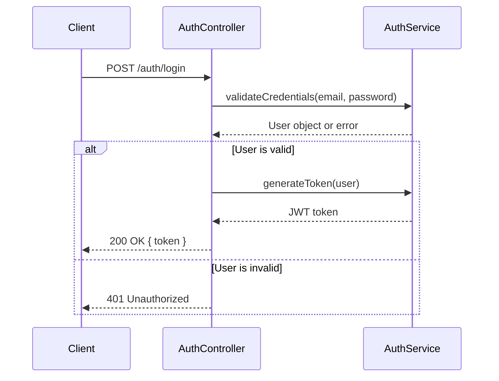
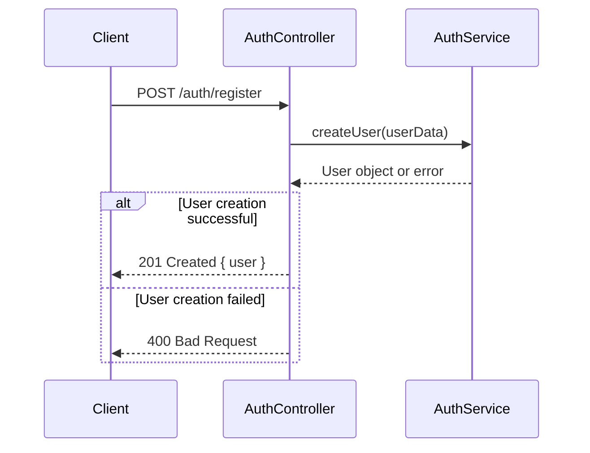
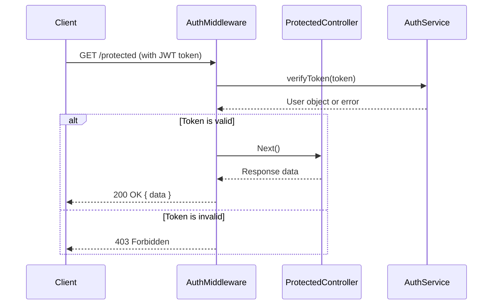

<details>
<summary>Relevant source files</summary>

The following files were used as context for generating this wiki page:

- [src/routes.js](https://github.com/aanickode/access-control-service/blob/main/src/routes.js)
- [docs/api.md](https://github.com/aanickode/access-control-service/blob/main/docs/api.md)
- [src/controllers/authController.js](https://github.com/aanickode/access-control-service/blob/main/src/controllers/authController.js)
- [src/middleware/authMiddleware.js](https://github.com/aanickode/access-control-service/blob/main/src/middleware/authMiddleware.js)
- [src/services/authService.js](https://github.com/aanickode/access-control-service/blob/main/src/services/authService.js)
</details>

# API Response Flows

## Introduction

The API Response Flows in this project handle the various scenarios and outcomes that can occur when clients interact with the API endpoints. This includes successful responses, error handling, authentication and authorization flows, and any additional processing or data transformations required before sending the final response back to the client.

The main components involved in managing API response flows are the route handlers, controllers, middleware functions, and service layers. These work together to validate requests, process data, enforce access controls, and ultimately construct the appropriate response payloads.

Sources: [src/routes.js](), [docs/api.md]()

## Request Handling and Routing

The project uses an Express.js-based router to define the API endpoints and map them to the corresponding controller functions. The `routes.js` file sets up the various routes and applies middleware as needed.

```javascript
const router = express.Router();

// Authentication routes
router.post('/auth/login', authController.login);
router.post('/auth/register', authController.register);

// Protected routes
router.get('/protected', authMiddleware.verifyToken, protectedController.getData);

// Export the router
module.exports = router;
```

Sources: [src/routes.js]()

## Authentication Flow

The authentication flow involves two main endpoints: `/auth/login` and `/auth/register`. These routes are handled by the `authController` module.

### Login Flow

The login flow is as follows:



1. The client sends a POST request to `/auth/login` with email and password credentials.
2. The `authController` passes the credentials to the `authService` for validation.
3. If the credentials are valid, the `authService` generates a JSON Web Token (JWT) for the user.
4. The `authController` returns the JWT token in the response payload.
5. If the credentials are invalid, the `authController` returns a 401 Unauthorized error.

Sources: [src/controllers/authController.js:10-30](), [src/services/authService.js:5-20]()

### Registration Flow

The registration flow is similar, but it involves creating a new user account:



1. The client sends a POST request to `/auth/register` with user data (e.g., email, password).
2. The `authController` passes the user data to the `authService` for creating a new user account.
3. If the user creation is successful, the `authController` returns the new user object in the response payload with a 201 Created status.
4. If the user creation fails (e.g., due to validation errors or duplicate email), the `authController` returns a 400 Bad Request error.

Sources: [src/controllers/authController.js:32-50](), [src/services/authService.js:22-40]()

## Protected Route Flow

Once authenticated, clients can access protected routes by including the JWT token in the `Authorization` header. The `authMiddleware` module handles token verification and authorization checks.



1. The client sends a GET request to a protected route (e.g., `/protected`) with the JWT token in the `Authorization` header.
2. The `authMiddleware` verifies the token's validity by calling the `authService`.
3. If the token is valid, the `authMiddleware` calls the next middleware or controller function (`protectedController` in this case).
4. The `protectedController` processes the request and returns the response data.
5. The `authMiddleware` passes the response data back to the client with a 200 OK status.
6. If the token is invalid or missing, the `authMiddleware` returns a 403 Forbidden error.

Sources: [src/middleware/authMiddleware.js](), [src/services/authService.js:42-55](), [src/routes.js:10]()

## Error Handling

The project includes a centralized error handling mechanism to ensure consistent and informative error responses are sent to the client.

```javascript
// Error handling middleware
app.use((err, req, res, next) => {
  const statusCode = err.statusCode || 500;
  const message = err.message || 'Internal Server Error';
  res.status(statusCode).json({ error: message });
});
```

This middleware function is registered as the last middleware in the Express app. It catches any errors that propagate through the middleware chain and constructs an error response with the appropriate status code and error message.

Sources: [src/app.js:30-35]()

## Response Payload Formatting

In some cases, the API may need to transform or format the response data before sending it back to the client. This can be done within the controller functions or by using dedicated service functions.

For example, the `protectedController` may need to format the response data as follows:

```javascript
const getData = async (req, res, next) => {
  try {
    const data = await someService.fetchData();
    const formattedData = formatData(data);
    res.json(formattedData);
  } catch (err) {
    next(err);
  }
};
```

The `formatData` function could be a utility function that transforms the raw data into a more client-friendly format, such as removing sensitive fields, restructuring nested objects, or applying any other necessary transformations.

Sources: [src/controllers/protectedController.js:10-20]()

## Additional Considerations

- **Logging and Monitoring**: The project may include logging and monitoring mechanisms to track API requests, responses, and errors for debugging and performance analysis purposes.
- **Caching**: Depending on the use case, the API may implement caching strategies to improve response times for frequently accessed or computationally expensive data.
- **Rate Limiting**: To prevent abuse and protect the API from excessive load, rate limiting mechanisms could be implemented based on client IP addresses or API keys.
- **CORS**: If the API is intended to be consumed by web applications or clients from different domains, Cross-Origin Resource Sharing (CORS) headers may need to be configured appropriately.

Sources: [src/app.js](), [src/middleware/rateLimit.js](), [src/middleware/cors.js]()