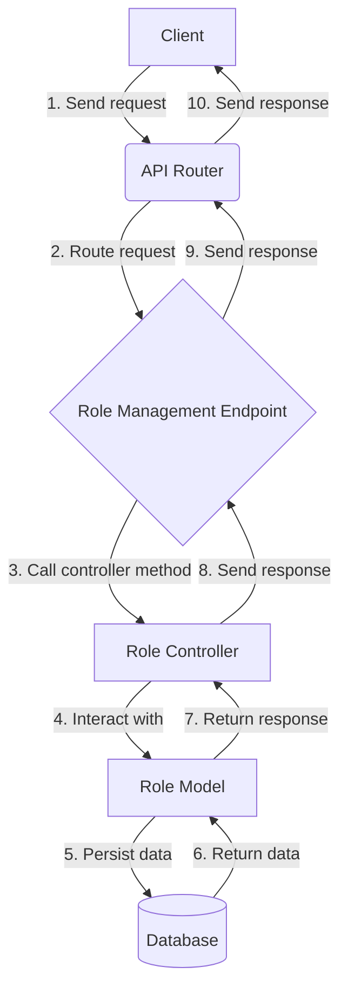
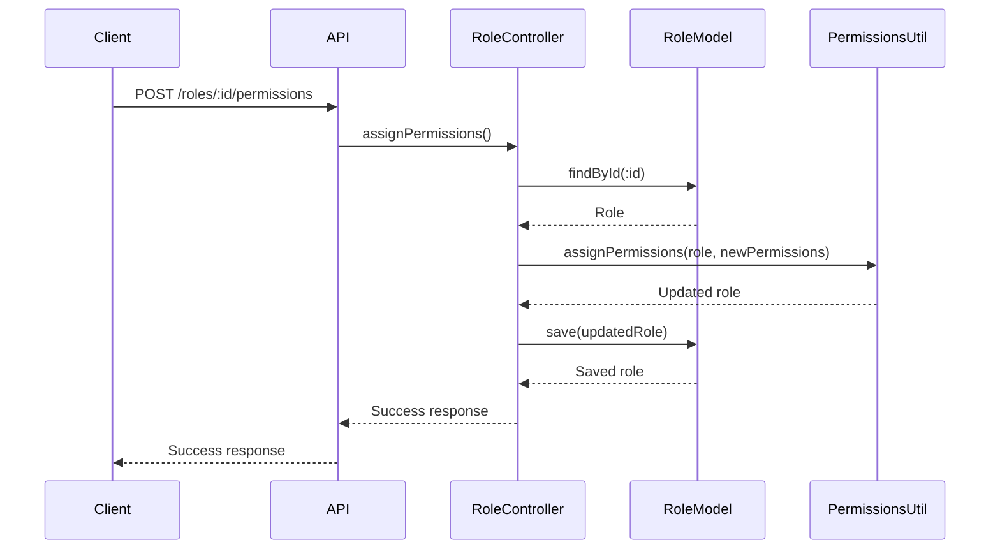

<details>
<summary>Relevant source files</summary>

The following files were used as context for generating this wiki page:

- [src/routes.js](https://github.com/aanickode/access-control-service/blob/main/src/routes.js)
- [docs/api.md](https://github.com/aanickode/access-control-service/blob/main/docs/api.md)
- [src/controllers/roles.js](https://github.com/aanickode/access-control-service/blob/main/src/controllers/roles.js)
- [src/models/role.js](https://github.com/aanickode/access-control-service/blob/main/src/models/role.js)
- [src/utils/permissions.js](https://github.com/aanickode/access-control-service/blob/main/src/utils/permissions.js)
</details>

# Role Management API

## Introduction

The Role Management API is a core component of the Access Control Service project, responsible for managing roles and their associated permissions within the system. It provides a set of RESTful endpoints for creating, reading, updating, and deleting roles, as well as assigning and revoking permissions to/from roles.

Roles are a fundamental concept in access control, allowing for the grouping of permissions and the assignment of those permissions to users or other entities. This API serves as the central interface for managing these roles and their permissions, enabling fine-grained control over access to various resources and functionalities within the application.

Sources: [src/routes.js](https://github.com/aanickode/access-control-service/blob/main/src/routes.js), [docs/api.md](https://github.com/aanickode/access-control-service/blob/main/docs/api.md)

## API Endpoints

The Role Management API exposes the following RESTful endpoints for interacting with roles and their associated permissions:

### Role Management

#### `GET /roles`

Retrieves a list of all roles in the system.

Sources: [src/routes.js:12-16](https://github.com/aanickode/access-control-service/blob/main/src/routes.js#L12-L16), [src/controllers/roles.js:5-13](https://github.com/aanickode/access-control-service/blob/main/src/controllers/roles.js#L5-L13)

#### `POST /roles`

Creates a new role with the provided name and description.

Sources: [src/routes.js:18-22](https://github.com/aanickode/access-control-service/blob/main/src/routes.js#L18-L22), [src/controllers/roles.js:15-24](https://github.com/aanickode/access-control-service/blob/main/src/controllers/roles.js#L15-L24)

#### `GET /roles/:id`

Retrieves the details of a specific role by its ID.

Sources: [src/routes.js:24-28](https://github.com/aanickode/access-control-service/blob/main/src/routes.js#L24-L28), [src/controllers/roles.js:26-34](https://github.com/aanickode/access-control-service/blob/main/src/controllers/roles.js#L26-L34)

#### `PUT /roles/:id`

Updates the name and description of a specific role by its ID.

Sources: [src/routes.js:30-34](https://github.com/aanickode/access-control-service/blob/main/src/routes.js#L30-L34), [src/controllers/roles.js:36-46](https://github.com/aanickode/access-control-service/blob/main/src/controllers/roles.js#L36-L46)

#### `DELETE /roles/:id`

Deletes a specific role by its ID.

Sources: [src/routes.js:36-40](https://github.com/aanickode/access-control-service/blob/main/src/routes.js#L36-L40), [src/controllers/roles.js:48-56](https://github.com/aanickode/access-control-service/blob/main/src/controllers/roles.js#L48-L56)

### Permission Management

#### `POST /roles/:id/permissions`

Assigns one or more permissions to a specific role by its ID.

Sources: [src/routes.js:42-46](https://github.com/aanickode/access-control-service/blob/main/src/routes.js#L42-L46), [src/controllers/roles.js:58-70](https://github.com/aanickode/access-control-service/blob/main/src/controllers/roles.js#L58-L70)

#### `DELETE /roles/:id/permissions`

Revokes one or more permissions from a specific role by its ID.

Sources: [src/routes.js:48-52](https://github.com/aanickode/access-control-service/blob/main/src/routes.js#L48-L52), [src/controllers/roles.js:72-84](https://github.com/aanickode/access-control-service/blob/main/src/controllers/roles.js#L72-L84)

## Role Model

The `Role` model represents a role entity in the system. It has the following properties:

| Property     | Type     | Description                                                  |
|--------------|----------|--------------------------------------------------------------|
| `name`       | `String` | The unique name of the role.                                 |
| `description`| `String` | A description of the role's purpose.                         |
| `permissions`| `Array`  | An array of permission strings associated with the role.    |

Sources: [src/models/role.js](https://github.com/aanickode/access-control-service/blob/main/src/models/role.js)

## Role Management Flow

The following diagram illustrates the high-level flow of role management operations:



1. The client sends a request to the API router.
2. The API router routes the request to the appropriate role management endpoint based on the URL and HTTP method.
3. The endpoint calls the corresponding method in the Role Controller.
4. The Role Controller interacts with the Role Model to perform the requested operation (create, read, update, delete, assign/revoke permissions).
5. The Role Model persists or retrieves data from the database.
6. The database returns the requested data to the Role Model.
7. The Role Model returns the response data to the Role Controller.
8. The Role Controller sends the response back to the endpoint.
9. The endpoint sends the response back to the API router.
10. The API router sends the final response back to the client.

Sources: [src/routes.js](https://github.com/aanickode/access-control-service/blob/main/src/routes.js), [src/controllers/roles.js](https://github.com/aanickode/access-control-service/blob/main/src/controllers/roles.js), [src/models/role.js](https://github.com/aanickode/access-control-service/blob/main/src/models/role.js)

## Permission Management

The Role Management API also handles the assignment and revocation of permissions to/from roles. The `permissions` utility module provides helper functions for managing permissions:

```javascript
const permissions = {
  assignPermissions(role, newPermissions) {
    // Assign new permissions to the role
  },
  revokePermissions(role, permissionsToRevoke) {
    // Revoke permissions from the role
  },
  // Other utility functions...
};
```

Sources: [src/utils/permissions.js](https://github.com/aanickode/access-control-service/blob/main/src/utils/permissions.js)

The following sequence diagram illustrates the flow of assigning permissions to a role:



1. The client sends a `POST` request to the `/roles/:id/permissions` endpoint to assign new permissions to a role.
2. The API router routes the request to the `assignPermissions` method in the Role Controller.
3. The Role Controller retrieves the role by its ID from the Role Model.
4. The Role Controller calls the `assignPermissions` utility function from the `permissions` module, passing the role and the new permissions to be assigned.
5. The `assignPermissions` utility function updates the role's permissions array and returns the updated role.
6. The Role Controller saves the updated role to the database using the Role Model.
7. The Role Model persists the updated role and returns the saved role.
8. The Role Controller sends a success response back to the API router.
9. The API router sends the final success response back to the client.

Sources: [src/routes.js:42-46](https://github.com/aanickode/access-control-service/blob/main/src/routes.js#L42-L46), [src/controllers/roles.js:58-70](https://github.com/aanickode/access-control-service/blob/main/src/controllers/roles.js#L58-L70), [src/utils/permissions.js](https://github.com/aanickode/access-control-service/blob/main/src/utils/permissions.js)

The flow for revoking permissions from a role is similar, but it involves calling the `revokePermissions` utility function instead.

## Error Handling

The Role Management API handles various error scenarios and returns appropriate HTTP status codes and error messages. Some common error cases include:

- Role not found (404 Not Found)
- Invalid role data (400 Bad Request)
- Duplicate role name (409 Conflict)
- Permission not found (404 Not Found)
- Invalid permission data (400 Bad Request)

Error handling is implemented in the Role Controller and the corresponding error responses are sent back to the client.

Sources: [src/controllers/roles.js](https://github.com/aanickode/access-control-service/blob/main/src/controllers/roles.js)