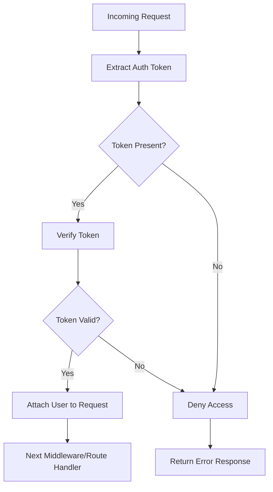
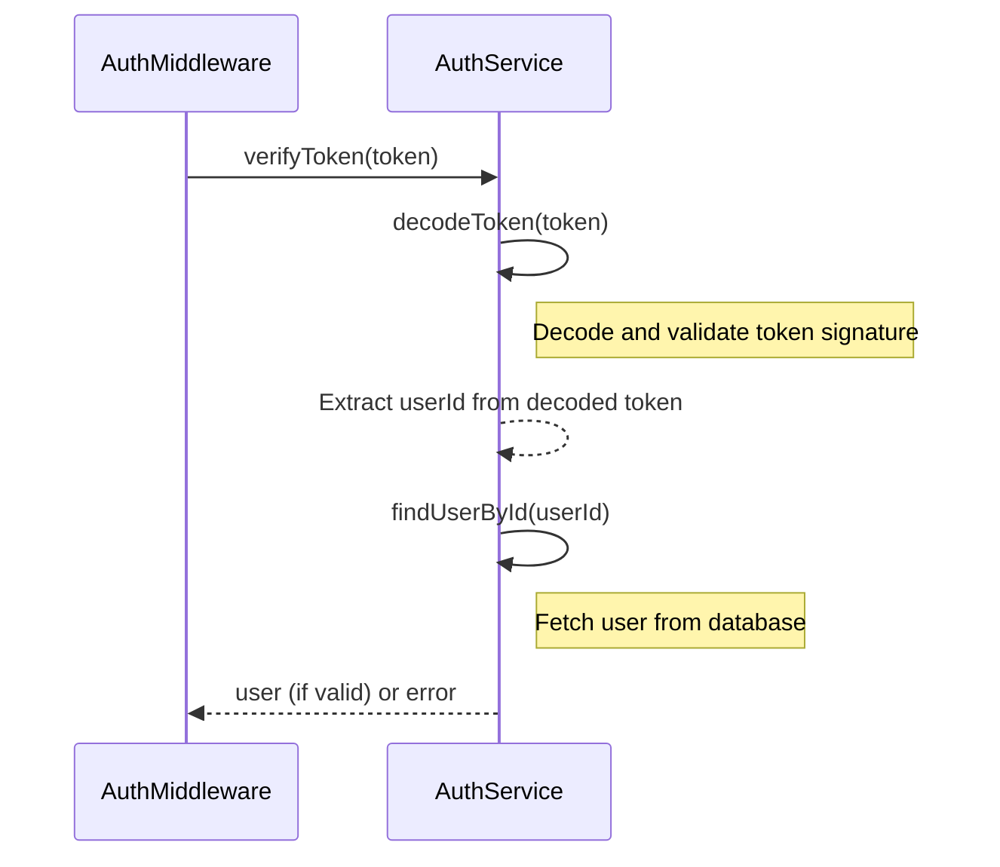

Relevant source files

The following files were used as context for generating this wiki page:

- [src/authMiddleware.js](https://github.com/aanickode/access-control-service/blob/main/src/authMiddleware.js)
- [src/authService.js](https://github.com/aanickode/access-control-service/blob/main/src/authService.js)
- [src/config.js](https://github.com/aanickode/access-control-service/blob/main/src/config.js)
- [src/models/user.js](https://github.com/aanickode/access-control-service/blob/main/src/models/user.js)
- [src/routes/auth.js](https://github.com/aanickode/access-control-service/blob/main/src/routes/auth.js)

# Authentication Middleware

## Introduction

The Authentication Middleware is a crucial component of the Access Control Service project, responsible for verifying and validating user authentication tokens for incoming requests. It acts as a gatekeeper, ensuring that only authorized users can access protected routes and resources within the application. This middleware integrates with the [Authentication Service](#authentication-service) to handle token verification and user authentication logic.

The Authentication Middleware is typically applied to specific routes or route groups that require authentication. It intercepts incoming requests, extracts the authentication token from the request headers or query parameters, and verifies its validity before allowing the request to proceed to the next middleware or route handler.

Sources: [src/authMiddleware.js](), [src/authService.js](), [src/routes/auth.js]()

## Authentication Flow

### Request Handling

The Authentication Middleware is designed to handle incoming requests in the following manner:

1. The middleware first attempts to extract the authentication token from the request headers or query parameters.
2. If no token is present, access is immediately denied, and an error response is returned.
3. If a token is found, it is passed to the `verifyToken` function from the Authentication Service for verification.
4. If the token is invalid or expired, access is denied, and an error response is returned.
5. If the token is valid, the corresponding user object is attached to the request object for downstream middleware and route handlers to access.
6. The request is then passed to the next middleware or route handler.

Sources: [src/authMiddleware.js:5-31]()

### Token Verification

The token verification process is handled by the `verifyToken` function in the Authentication Service:

1. The `verifyToken` function is called with the extracted token from the request.
2. The token is decoded, and its signature is verified using the configured secret key.
3. If the token is valid, the user ID is extracted from the decoded payload.
4. The user object is fetched from the database using the user ID.
5. If the user exists, the user object is returned; otherwise, an error is returned.

Sources: [src/authService.js:10-28](), [src/models/user.js]()

## Authentication Service

The Authentication Service is a separate module responsible for handling user authentication and token generation. It provides the following functions:

### `generateToken(user)`

This function generates a JSON Web Token (JWT) for the given user object. The token payload includes the user's ID and any other relevant claims. The token is signed using a configured secret key.

Sources: [src/authService.js:30-38]()

### `verifyToken(token)`

This function verifies the validity of a given JWT token. It decodes the token, verifies the signature using the configured secret key, and fetches the corresponding user object from the database. If the token is valid and the user exists, the user object is returned; otherwise, an error is returned.

Sources: [src/authService.js:10-28]()

## Authentication Routes

The project includes a set of routes for handling user authentication and token generation. These routes are defined in the `auth.js` file and typically include the following endpoints:

| Route                | Method | Description                                                  |
|----------------------|--------|--------------------------------------------------------------|
| `/auth/login`        | POST   | Authenticate user with email and password, generate token    |
| `/auth/register`     | POST   | Register a new user account                                  |
| `/auth/refresh-token`| POST   | Refresh an existing token with a new expiration time         |
| `/auth/logout`       | POST   | Invalidate the current user's token                          |

These routes interact with the Authentication Service to handle user authentication, token generation, and token management operations.

Sources: [src/routes/auth.js]()

## Configuration

The Authentication Middleware and Authentication Service rely on various configuration options defined in the `config.js` file. These options include:

| Option                 | Type   | Default Value | Description                                      |
|------------------------|--------|---------------|-------------------------------------------------|
| `jwtSecret`            | String | -             | Secret key used for signing and verifying JWTs  |
| `jwtExpirationTime`    | Number | `3600`        | Expiration time (in seconds) for generated JWTs |
| `authTokenHeaderName`  | String | `'x-auth-token'` | Name of the header used for sending auth tokens |
| `authTokenQueryParam`  | String | `'token'`     | Name of the query parameter for sending auth tokens |

These configuration options can be customized based on the project's requirements and deployment environment.

Sources: [src/config.js](), [src/authMiddleware.js:3-4](), [src/authService.js:5-6]()

## User Model

The User model is defined in the `user.js` file and represents the structure of user data stored in the database. It typically includes fields such as:

| Field     | Type   | Description                                      |
|-----------|--------|--------------------------------------------------|
| `_id`     | ObjectId | Unique identifier for the user                  |
| `email`   | String | User's email address (unique)                    |
| `password`| String | Hashed password for user authentication          |
| `role`    | String | User's role or access level (e.g., 'admin', 'user') |
| `createdAt`|Date   | Timestamp of when the user account was created   |
| `updatedAt`|Date   | Timestamp of the last update to the user account |

The User model is used by the Authentication Service to fetch user data during token verification and other authentication-related operations.

Sources: [src/models/user.js]()

## Error Handling

The Authentication Middleware and Authentication Service include error handling mechanisms to handle various types of errors that may occur during the authentication process. These errors can include:

- Invalid or expired tokens
- Missing or malformed tokens
- User not found in the database
- Database errors

Appropriate error messages and HTTP status codes are returned to the client in case of any authentication-related errors.

Sources: [src/authMiddleware.js:16-19, 25-28](), [src/authService.js:18-21, 26-27]()