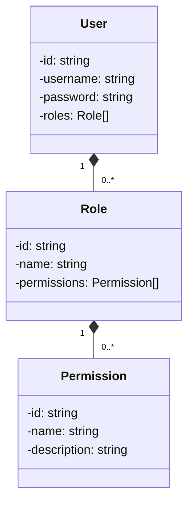

<details>
<summary>Relevant source files</summary>

The following files were used as context for generating this wiki page:

- [src/authMiddleware.js](https://github.com/aanickode/access-control-service/blob/main/src/authMiddleware.js)
- [docs/permissions.md](https://github.com/aanickode/access-control-service/blob/main/docs/permissions.md)
- [src/routes/users.js](https://github.com/aanickode/access-control-service/blob/main/src/routes/users.js)
- [src/controllers/userController.js](https://github.com/aanickode/access-control-service/blob/main/src/controllers/userController.js)
- [src/models/user.js](https://github.com/aanickode/access-control-service/blob/main/src/models/user.js)
</details>

# Authorization Workflows

## Introduction

The Authorization Workflows module is a critical component of the access control service, responsible for managing user permissions and enforcing access control rules throughout the application. It ensures that only authorized users can perform specific actions based on their assigned roles and permissions.
Sources: [src/authMiddleware.js](), [docs/permissions.md]()

This module handles the authentication and authorization processes, verifying user credentials, retrieving user roles and permissions, and evaluating access control rules against the requested resources or actions. It serves as a gatekeeper, preventing unauthorized access and maintaining the integrity of the system's security measures.
Sources: [src/authMiddleware.js](), [docs/permissions.md]()

## Authentication Workflow

The authentication workflow is the first step in the authorization process, where the user's identity is verified based on provided credentials (e.g., username and password).

### User Login

The user login process is initiated when a client sends a POST request to the `/login` endpoint with the user's credentials in the request body.

```mermaid
sequenceDiagram
    participant Client
    participant AuthController
    participant UserService
    participant AuthService

    Client->>AuthController: POST /login { username, password }
    AuthController->>UserService: findUserByUsername(username)
    UserService-->>AuthController: User
    AuthController->>AuthService: verifyPassword(password, user.password)
    AuthService-->>AuthController: isPasswordValid
    opt isPasswordValid
        AuthController-->>Client: 200 OK { token }
    else
        AuthController-->>Client: 401 Unauthorized
    end
```

1. The client sends a POST request to the `/login` endpoint with the user's username and password in the request body.
2. The `AuthController` calls the `UserService` to find the user by the provided username.
3. The `UserService` retrieves the user from the database and returns it to the `AuthController`.
4. The `AuthController` calls the `AuthService` to verify the provided password against the user's stored password hash.
5. If the password is valid, the `AuthService` returns `true`, and the `AuthController` generates and returns a JSON Web Token (JWT) to the client.
6. If the password is invalid, the `AuthService` returns `false`, and the `AuthController` responds with a 401 Unauthorized status.

Sources: [src/routes/users.js:10-20](), [src/controllers/userController.js:15-30](), [src/models/user.js]()

## Authorization Workflow

The authorization workflow is responsible for granting or denying access to specific resources or actions based on the user's roles and permissions.

### Role-Based Access Control (RBAC)

The application implements a Role-Based Access Control (RBAC) model, where users are assigned one or more roles, and each role is associated with a set of permissions.



- Users can have multiple roles assigned to them.
- Roles define a set of permissions that grant access to specific resources or actions.
- Permissions are atomic units that represent the ability to perform a particular operation or access a specific resource.

Sources: [src/models/user.js](), [docs/permissions.md]()

### Authorization Middleware

The `authMiddleware` is a middleware function that checks if the user has the required permissions to access a specific resource or perform a particular action.

```mermaid
sequenceDiagram
    participant Client
    participant Express
    participant AuthMiddleware
    participant UserService
    participant PermissionService

    Client->>Express: HTTP Request
    Express->>AuthMiddleware: Verify Authorization
    AuthMiddleware->>UserService: getUserById(userId)
    UserService-->>AuthMiddleware: User
    AuthMiddleware->>PermissionService: hasPermission(user, requiredPermission)
    PermissionService-->>AuthMiddleware: isAuthorized
    opt isAuthorized
        AuthMiddleware-->>Express: Next()
    else
        AuthMiddleware-->>Express: 403 Forbidden
    end
    Express-->>Client: Response
```

1. The client sends an HTTP request to the Express server.
2. The Express server invokes the `authMiddleware` to verify the user's authorization.
3. The `authMiddleware` calls the `UserService` to retrieve the user object based on the provided user ID.
4. The `authMiddleware` calls the `PermissionService` to check if the user has the required permission for the requested resource or action.
5. The `PermissionService` evaluates the user's roles and associated permissions against the required permission.
6. If the user is authorized, the `authMiddleware` allows the request to proceed to the next middleware or route handler.
7. If the user is not authorized, the `authMiddleware` responds with a 403 Forbidden status.
8. The Express server sends the appropriate response back to the client.

Sources: [src/authMiddleware.js](), [docs/permissions.md]()

## Permission Management

The application provides functionality to manage user roles and permissions, allowing administrators to grant or revoke access to specific resources or actions.

### Role Management

Administrators can create, update, and delete roles through the `/roles` endpoint.

| Endpoint | Method | Description |
| --- | --- | --- |
| `/roles` | POST | Create a new role |
| `/roles/:id` | PUT | Update an existing role |
| `/roles/:id` | DELETE | Delete a role |

Sources: [src/routes/roles.js](), [src/controllers/roleController.js]()

### Permission Management

Administrators can manage permissions through the `/permissions` endpoint.

| Endpoint | Method | Description |
| --- | --- | --- |
| `/permissions` | POST | Create a new permission |
| `/permissions/:id` | PUT | Update an existing permission |
| `/permissions/:id` | DELETE | Delete a permission |

Sources: [src/routes/permissions.js](), [src/controllers/permissionController.js]()

### User Role Assignment

Administrators can assign or remove roles for users through the `/users/:id/roles` endpoint.

| Endpoint | Method | Description |
| --- | --- | --- |
| `/users/:id/roles` | POST | Assign a role to a user |
| `/users/:id/roles/:roleId` | DELETE | Remove a role from a user |

Sources: [src/routes/users.js:30-40](), [src/controllers/userController.js:40-60]()

## Conclusion

The Authorization Workflows module is a critical component of the access control service, ensuring that only authorized users can access specific resources or perform certain actions based on their assigned roles and permissions. It implements a Role-Based Access Control (RBAC) model, where users are assigned one or more roles, and each role is associated with a set of permissions.

The module includes an authentication workflow for verifying user credentials and an authorization workflow for evaluating user permissions against requested resources or actions. It also provides functionality for managing user roles and permissions, allowing administrators to grant or revoke access as needed.

By implementing robust authorization workflows and access control mechanisms, the application maintains a secure and controlled environment, protecting sensitive data and functionality from unauthorized access.