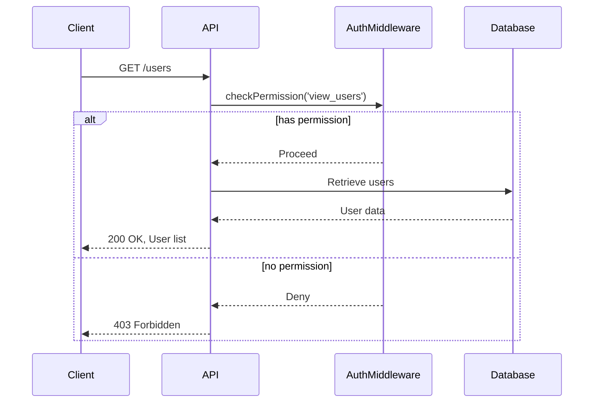
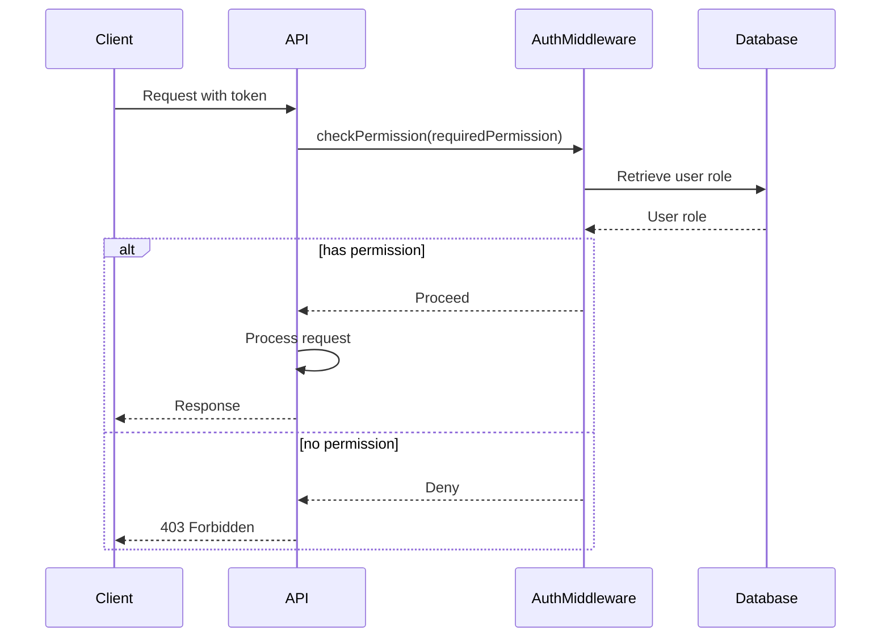

<details>
<summary>Relevant source files</summary>

The following files were used as context for generating this wiki page:

- [docs/api.md](https://github.com/aanickode/access-control-service/blob/main/docs/api.md)
- [src/routes.js](https://github.com/aanickode/access-control-service/blob/main/src/routes.js)
</details>

# API Documentation

## Introduction

The API Documentation covers the implementation details of the RESTful API endpoints provided by the access control service. This service manages user roles, permissions, and authentication tokens within the application. The API allows authorized clients to retrieve user information, create and view roles and permissions, and generate authentication tokens for users.

## API Endpoints

### GET /users

This endpoint retrieves a list of all registered users and their associated roles.

#### Sequence Diagram



#### Request

- Method: `GET`
- URL: `/users`
- Headers:
  - `Authorization`: Bearer token with `view_users` permission

#### Response

- Status: `200 OK`
- Body:
  ```json
  [
    { "email": "user1@example.com", "role": "admin" },
    { "email": "user2@example.com", "role": "editor" },
    ...
  ]
  ```

Sources: [src/routes.js:5-8]()

### POST /roles

This endpoint creates a new role with the specified permissions.

#### Request

- Method: `POST`
- URL: `/roles`
- Headers:
  - `Authorization`: Bearer token with `create_role` permission
- Body:
  ```json
  {
    "name": "manager",
    "permissions": ["view_users", "edit_users"]
  }
  ```

#### Response

- Status: `201 Created`
- Body:
  ```json
  {
    "role": "manager",
    "permissions": ["view_users", "edit_users"]
  }
  ```

Sources: [src/routes.js:10-16]()

### GET /permissions

This endpoint retrieves a list of all defined roles and their associated permissions.

#### Request

- Method: `GET`
- URL: `/permissions`
- Headers:
  - `Authorization`: Bearer token with `view_permissions` permission

#### Response

- Status: `200 OK`
- Body:
  ```json
  {
    "admin": ["view_users", "create_role", "view_permissions"],
    "editor": ["view_users"],
    "manager": ["view_users", "edit_users"]
  }
  ```

Sources: [src/routes.js:18-20]()

### POST /tokens

This endpoint generates an authentication token for a user with the specified role.

#### Request

- Method: `POST`
- URL: `/tokens`
- Body:
  ```json
  {
    "user": "user1@example.com",
    "role": "admin"
  }
  ```

#### Response

- Status: `201 Created`
- Body:
  ```json
  {
    "user": "user1@example.com",
    "role": "admin"
  }
  ```

Sources: [src/routes.js:22-28]()

## Data Model

The access control service uses an in-memory data store to manage users, roles, and permissions.

### Users

The `users` object stores user email addresses as keys and their associated roles as values.

```javascript
const users = {
  'user1@example.com': 'admin',
  'user2@example.com': 'editor',
  ...
};
```

Sources: [src/routes.js:7, 26]()

### Roles

The `roles` object stores role names as keys and their associated permissions as values.

```javascript
const roles = {
  'admin': ['view_users', 'create_role', 'view_permissions'],
  'editor': ['view_users'],
  'manager': ['view_users', 'edit_users']
};
```

Sources: [src/routes.js:14, 20]()

## Authentication and Authorization

The access control service uses a custom middleware function `checkPermission` to enforce role-based access control (RBAC) for API endpoints.

### Sequence Diagram



The `checkPermission` middleware function:

1. Extracts the user's role from the provided authentication token.
2. Checks if the user's role has the required permission.
3. If the user has the permission, the request is allowed to proceed.
4. If the user does not have the permission, a `403 Forbidden` response is sent.

Sources: [src/routes.js:3, 5, 10, 18]()

## Conclusion

The API Documentation covers the implementation details of the RESTful API endpoints provided by the access control service. It includes information about the available endpoints, their request and response formats, and the underlying data model and authentication/authorization mechanisms. This documentation should serve as a reference for developers working on or integrating with the access control service.