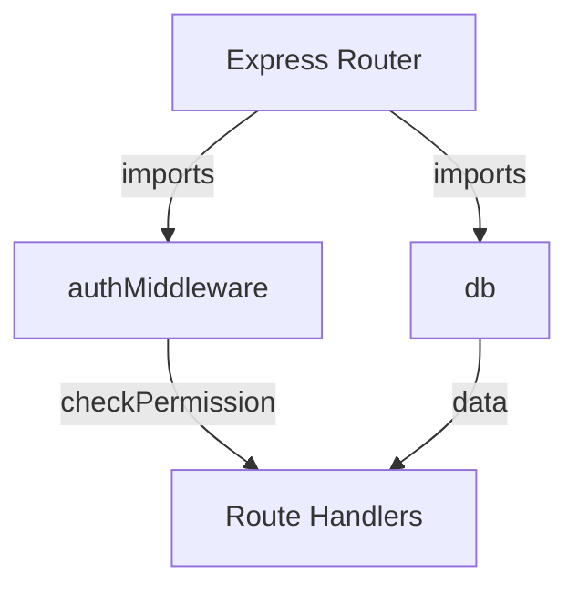
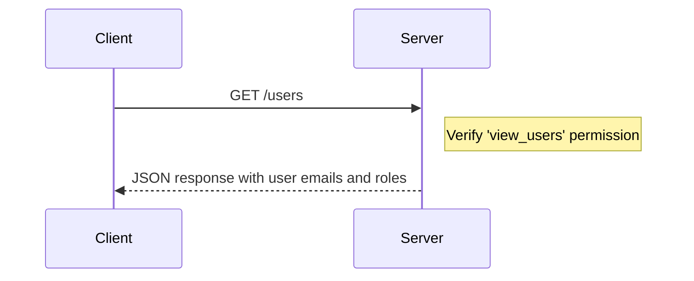
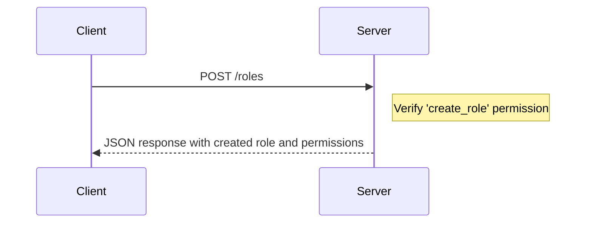
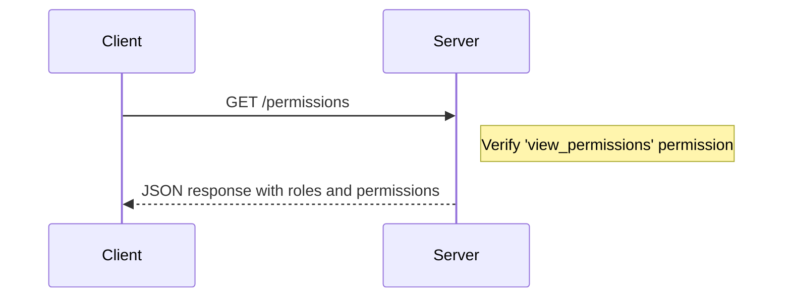
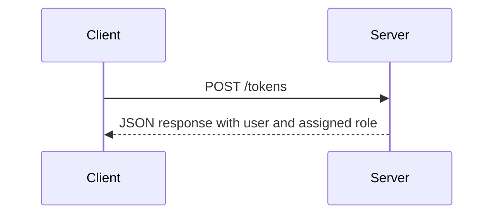
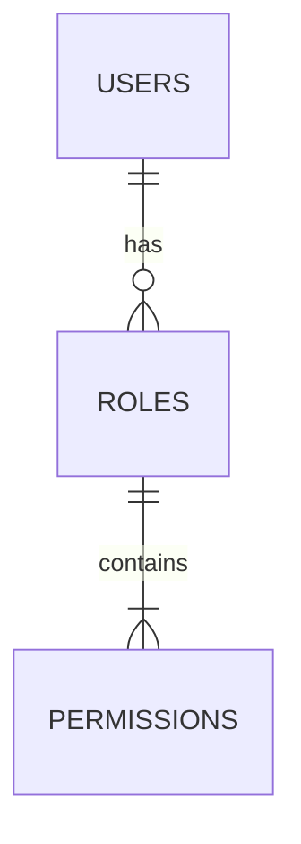

<details>
<summary>Relevant source files</summary>

The following files were used as context for generating this wiki page:

- [src/routes.js](https://github.com/aanickode/access-control-service/blob/main/src/routes.js)
- [docs/api.md](https://github.com/aanickode/access-control-service/blob/main/docs/api.md)
</details>

# API Documentation

## Introduction

This API documentation covers the implementation of an access control service within the project. The service provides endpoints for managing users, roles, and permissions, allowing authorized clients to perform CRUD operations on these entities. It serves as a centralized system for handling authentication and authorization within the application.

Sources: [src/routes.js](), [docs/api.md]()

## Routing and Middleware

The API routes are defined using the Express.js framework. The `routes.js` file sets up the different endpoints and their corresponding handlers.



The `checkPermission` middleware function from `authMiddleware.js` is used to enforce permission-based access control on certain routes. It checks if the requesting user has the required permission before allowing access to the protected route handlers.

Sources: [src/routes.js]()

## Endpoints

### GET /users

Retrieves a list of all registered users and their associated roles.



Required Permission: `view_users`

Response:

```json
[
  { "email": "user1@example.com", "role": "admin" },
  { "email": "user2@example.com", "role": "editor" }
]
```

Sources: [src/routes.js:6-9]()

### POST /roles

Creates a new role with the specified name and permissions.



Required Permission: `create_role`

Request Body:

```json
{
  "name": "manager",
  "permissions": ["view_users", "edit_users"]
}
```

Response:

```json
{
  "role": "manager",
  "permissions": ["view_users", "edit_users"]
}
```

Sources: [src/routes.js:10-17]()

### GET /permissions

Retrieves a list of all defined roles and their associated permissions.



Required Permission: `view_permissions`

Response:

```json
{
  "admin": ["view_users", "create_role", "view_permissions"],
  "editor": ["view_users"],
  "manager": ["view_users", "edit_users"]
}
```

Sources: [src/routes.js:18-21]()

### POST /tokens

Assigns a role to a user, effectively granting them the associated permissions.



No specific permission is required for this endpoint.

Request Body:

```json
{
  "user": "user3@example.com",
  "role": "editor"
}
```

Response:

```json
{
  "user": "user3@example.com",
  "role": "editor"
}
```

Sources: [src/routes.js:22-29]()

## Data Storage

The service uses an in-memory data store (`db.js`) to persist user, role, and permission information. In a production environment, this would likely be replaced with a more robust and persistent data storage solution, such as a database.



Sources: [src/routes.js:3]()

## Conclusion

The access control service provides a set of APIs for managing users, roles, and permissions within the application. It enforces permission-based access control on certain endpoints, ensuring that only authorized clients can perform sensitive operations. The service utilizes an in-memory data store for persisting data, but in a production environment, a more robust storage solution would be recommended.

Sources: [src/routes.js](), [docs/api.md]()