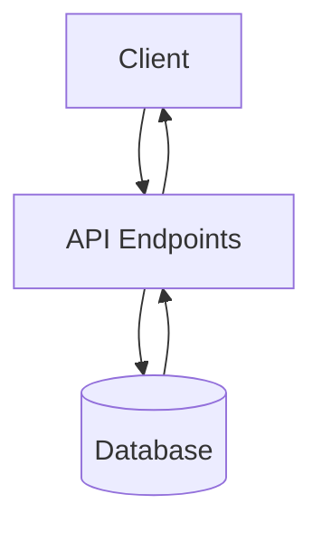
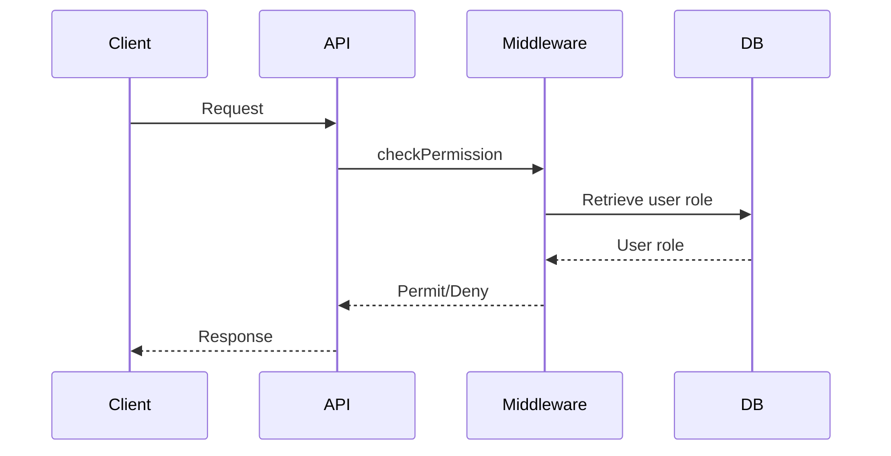
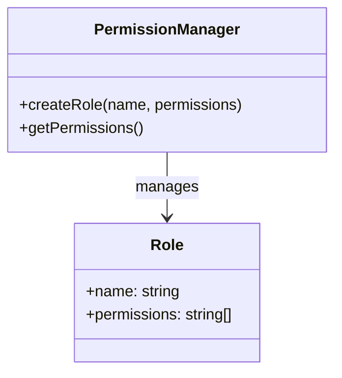
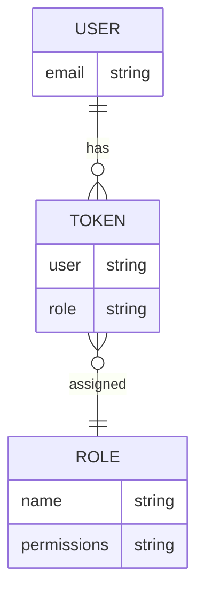

<details>
<summary>Relevant source files</summary>

The following files were used as context for generating this wiki page:

- [docs/api.md](https://github.com/aanickode/access-control-service/blob/main/docs/api.md)
- [src/routes.js](https://github.com/aanickode/access-control-service/blob/main/src/routes.js)
</details>

# API Documentation

## Introduction

The API Documentation covers the implementation of the RESTful API endpoints for an access control service. This service manages user roles, permissions, and authentication tokens within an application. The API allows authorized clients to retrieve user information, create and view roles and permissions, and generate authentication tokens for users.

Sources: [src/routes.js]()

## API Endpoints

### GET /users

This endpoint retrieves a list of all registered users and their associated roles.

#### Request

```
GET /users
```

#### Response

```json
[
  { "email": "user1@example.com", "role": "admin" },
  { "email": "user2@example.com", "role": "editor" },
  ...
]
```

#### Access Control

This endpoint requires the `view_users` permission.

Sources: [src/routes.js:6-8]()

### POST /roles

This endpoint creates a new role with a specified set of permissions.

#### Request

```
POST /roles
Content-Type: application/json

{
  "name": "editor",
  "permissions": ["edit_content", "publish_content"]
}
```

#### Response

```json
{
  "role": "editor",
  "permissions": ["edit_content", "publish_content"]
}
```

#### Access Control

This endpoint requires the `create_role` permission.

Sources: [src/routes.js:10-16]()

### GET /permissions

This endpoint retrieves a list of all defined roles and their associated permissions.

#### Request

```
GET /permissions
```

#### Response

```json
{
  "admin": ["view_users", "create_role", "view_permissions"],
  "editor": ["edit_content", "publish_content"],
  ...
}
```

#### Access Control

This endpoint requires the `view_permissions` permission.

Sources: [src/routes.js:18-20]()

### POST /tokens

This endpoint generates an authentication token for a user by associating them with a specific role.

#### Request

```
POST /tokens
Content-Type: application/json

{
  "user": "user1@example.com",
  "role": "admin"
}
```

#### Response

```json
{
  "user": "user1@example.com",
  "role": "admin"
}
```

#### Access Control

This endpoint does not require any specific permission.

Sources: [src/routes.js:22-28]()

## Data Flow

The API endpoints interact with a central data store (`db.js`) to manage user roles, permissions, and authentication tokens.



Sources: [src/routes.js]()

## Access Control Middleware

The API uses a middleware function `checkPermission` to enforce access control for certain endpoints based on the user's assigned role and permissions.



Sources: [src/routes.js:1,6,10,18]()

## Role and Permission Management

The API provides endpoints to create and manage roles and their associated permissions.



Sources: [src/routes.js:10-16,18-20]()

## User Authentication

The API allows clients to generate authentication tokens for users by associating them with a specific role.



Sources: [src/routes.js:22-28]()

## Configuration

The API does not expose any configurable options or settings in the provided source files.

## Conclusion

The API Documentation covers the implementation details of the RESTful API endpoints for managing user roles, permissions, and authentication tokens within an access control service. It outlines the available endpoints, their request/response formats, access control requirements, and the underlying data flow and architecture. Developers can use this documentation to integrate with and extend the access control functionality in their applications.