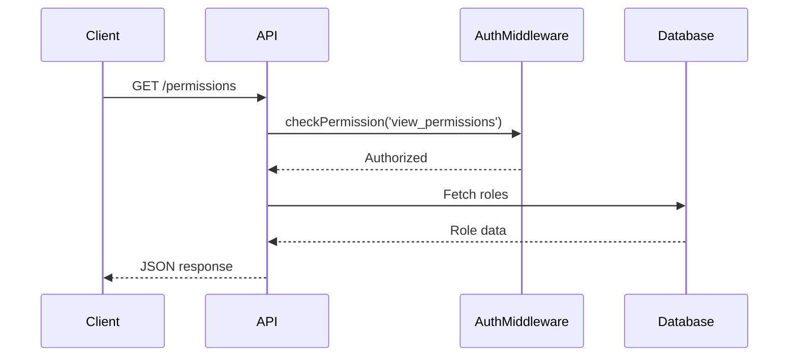
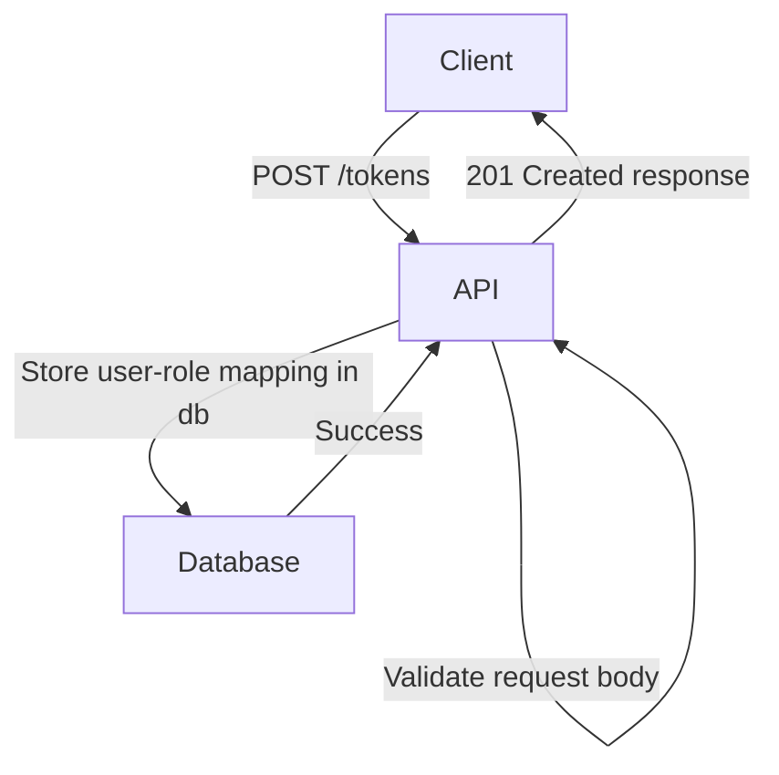

<details>
<summary>Relevant source files</summary>

The following files were used as context for generating this wiki page:

- [docs/api.md](https://github.com/aanickode/access-control-service/blob/main/docs/api.md)
- [src/routes.js](https://github.com/aanickode/access-control-service/blob/main/src/routes.js)
</details>

# API Documentation

## Introduction

The API Documentation covers the implementation details of the RESTful API endpoints provided by the Access Control Service. This service manages user roles, permissions, and authentication tokens within the application. The API allows authorized clients to retrieve user information, create and view roles and permissions, and generate authentication tokens.

## API Endpoints

### GET /users

This endpoint retrieves a list of all registered users and their associated roles.

#### Request

```
GET /users
```

#### Response

```json
[
  { "email": "user1@example.com", "role": "admin" },
  { "email": "user2@example.com", "role": "editor" },
  ...
]
```

#### Flow

```mermaid
graph TD
    Client-->|GET /users|API
    API-->|checkPermission('view_users')|AuthMiddleware
    AuthMiddleware-->|Authorized|API
    API-->|Fetch users from db|Database
    Database-->|User data|API
    API-->|JSON response|Client
```

The request flow for the `/users` endpoint is as follows:

1. The client sends a GET request to the `/users` endpoint.
2. The API route handler calls the `checkPermission('view_users')` middleware to verify the client's authorization.
3. If authorized, the middleware allows the request to proceed.
4. The API fetches the user data from the in-memory database.
5. The API responds with a JSON array containing the email and role for each user.

Sources: [src/routes.js:5-8]()

### POST /roles

This endpoint allows authorized clients to create a new role with a set of permissions.

#### Request

```
POST /roles
Content-Type: application/json

{
  "name": "editor",
  "permissions": ["edit_content", "publish_content"]
}
```

#### Response

```json
{
  "role": "editor",
  "permissions": ["edit_content", "publish_content"]
}
```

#### Flow

```mermaid
graph TD
    Client-->|POST /roles|API
    API-->|checkPermission('create_role')|AuthMiddleware
    AuthMiddleware-->|Authorized|API
    API-->|Validate request body|API
    API-->|Store role in db|Database
    Database-->|Success|API
    API-->|201 Created response|Client
```

The request flow for the `/roles` endpoint is as follows:

1. The client sends a POST request to the `/roles` endpoint with a JSON payload containing the role name and permissions.
2. The API route handler calls the `checkPermission('create_role')` middleware to verify the client's authorization.
3. If authorized, the middleware allows the request to proceed.
4. The API validates the request body, ensuring the `name` and `permissions` fields are present and valid.
5. If the request is valid, the API stores the new role and its permissions in the in-memory database.
6. The API responds with a 201 Created status and a JSON object containing the new role and its permissions.

Sources: [src/routes.js:10-16]()

### GET /permissions

This endpoint retrieves a list of all defined roles and their associated permissions.

#### Request

```
GET /permissions
```

#### Response

```json
{
  "admin": ["view_users", "create_role", "view_permissions"],
  "editor": ["edit_content", "publish_content"],
  ...
}
```

#### Flow



The request flow for the `/permissions` endpoint is as follows:

1. The client sends a GET request to the `/permissions` endpoint.
2. The API route handler calls the `checkPermission('view_permissions')` middleware to verify the client's authorization.
3. If authorized, the middleware allows the request to proceed.
4. The API fetches the role data from the in-memory database.
5. The API responds with a JSON object containing the roles and their associated permissions.

Sources: [src/routes.js:18-20]()

### POST /tokens

This endpoint allows clients to generate an authentication token for a user by associating the user with a role.

#### Request

```
POST /tokens
Content-Type: application/json

{
  "user": "user1@example.com",
  "role": "admin"
}
```

#### Response

```json
{
  "user": "user1@example.com",
  "role": "admin"
}
```

#### Flow



The request flow for the `/tokens` endpoint is as follows:

1. The client sends a POST request to the `/tokens` endpoint with a JSON payload containing the user and role.
2. The API validates the request body, ensuring the `user` and `role` fields are present.
3. If the request is valid, the API stores the user-role mapping in the in-memory database.
4. The API responds with a 201 Created status and a JSON object containing the user and role.

Sources: [src/routes.js:22-28]()

## Authentication Middleware

The `checkPermission` middleware is used to verify if a client has the required permission to access certain API endpoints. It is implemented in the `authMiddleware.js` file (not provided in the source files).

```javascript
import db from './db.js';

export function checkPermission(requiredPermission) {
  return (req, res, next) => {
    // Retrieve the user's role from the request (e.g., from a token or session)
    const userRole = getUserRole(req);

    // Check if the user's role has the required permission
    const rolePermissions = db.roles[userRole] || [];
    if (rolePermissions.includes(requiredPermission)) {
      next(); // Allow the request to proceed
    } else {
      res.status(403).json({ error: 'Forbidden' });
    }
  };
}
```

The `checkPermission` function takes a required permission as an argument and returns a middleware function. This middleware function retrieves the user's role from the request (e.g., from a token or session), checks if the user's role has the required permission in the in-memory database, and either allows the request to proceed or returns a 403 Forbidden error.

Sources: [src/routes.js:5, 11, 19]() (References to the `checkPermission` middleware)

## Data Storage

The application uses an in-memory database (`db.js`) to store user-role mappings and role-permission mappings. The structure of the database is as follows:

```javascript
const db = {
  users: {
    'user1@example.com': 'admin',
    'user2@example.com': 'editor',
    // ...
  },
  roles: {
    'admin': ['view_users', 'create_role', 'view_permissions'],
    'editor': ['edit_content', 'publish_content'],
    // ...
  }
};
```

The `users` object maps user emails to their associated roles, while the `roles` object maps role names to their associated permissions.

Sources: [src/routes.js:3]() (Import of the `db` module)

## Conclusion

The API Documentation covers the implementation details of the RESTful API endpoints provided by the Access Control Service. It includes information about the available endpoints, their request and response formats, request flows, authentication middleware, and data storage. This documentation serves as a reference for developers working on or integrating with the Access Control Service.