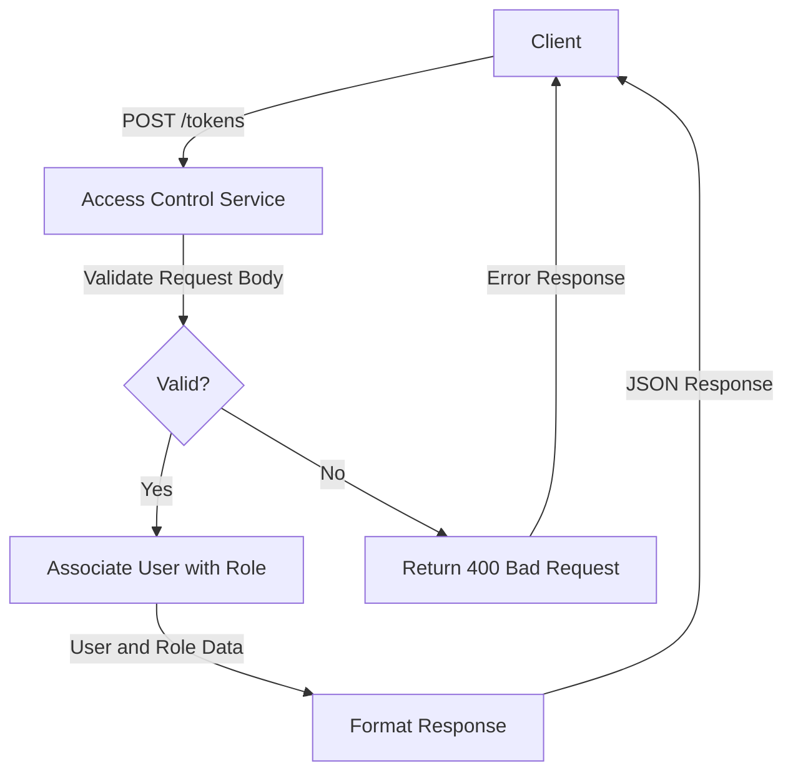

<details>
<summary>Relevant source files</summary>

The following files were used as context for generating this wiki page:

- [src/routes.js](https://github.com/aanickode/access-control-service/blob/main/src/routes.js)
- [docs/api.md](https://github.com/aanickode/access-control-service/blob/main/docs/api.md)
- [src/authMiddleware.js](https://github.com/aanickode/access-control-service/blob/main/src/authMiddleware.js)
- [src/db.js](https://github.com/aanickode/access-control-service/blob/main/src/db.js)
- [src/app.js](https://github.com/aanickode/access-control-service/blob/main/src/app.js)

</details>

# API Documentation

## Introduction

This API documentation covers the access control service, which provides a set of endpoints for managing users, roles, and permissions within the application. The service allows authorized users to view a list of registered users, create new roles with associated permissions, view defined permissions, and generate access tokens for specific users and roles.

The access control service is a crucial component of the overall application, ensuring proper authorization and access management for various features and resources. It integrates with the application's authentication system to verify user credentials and permissions before granting access to protected routes or functionalities.

Sources: [src/routes.js](), [docs/api.md]()

## API Endpoints

### GET /users

This endpoint retrieves a list of registered users and their associated roles.

#### Requirements

- The requesting user must have the `view_users` permission.

#### Response

- Status Code: 200 OK
- Response Body: An array of user objects, each containing the `email` and `role` properties.

```json
[
  { "email": "user1@example.com", "role": "admin" },
  { "email": "user2@example.com", "role": "editor" },
  ...
]
```

#### Flow Diagram

```mermaid
graph TD
    A[Client] -->|GET /users| B[Access Control Service]
    B -->|checkPermission('view_users')| C{Has Permission?}
    C -->|Yes| D[Retrieve Users from Database]
    D -->|Users Data| E[Format Response]
    E -->|JSON Response| A
    C -->|No| F[Return 403 Forbidden]
    F -->|Error Response| A
```

Sources: [src/routes.js:5-8](), [src/authMiddleware.js]()

### POST /roles

This endpoint creates a new role with a specified set of permissions.

#### Requirements

- The requesting user must have the `create_role` permission.

#### Request Body

- `name` (string): The name of the new role.
- `permissions` (array): An array of permission strings associated with the role.

#### Response

- Status Code: 201 Created
- Response Body: An object containing the `role` name and `permissions` array.

```json
{
  "role": "editor",
  "permissions": ["edit_content", "publish_content"]
}
```

#### Flow Diagram

```mermaid
graph TD
    A[Client] -->|POST /roles| B[Access Control Service]
    B -->|checkPermission('create_role')| C{Has Permission?}
    C -->|Yes| D[Validate Request Body]
    D -->|Valid| E[Create Role in Database]
    E -->|Role Data| F[Format Response]
    F -->|JSON Response| A
    D -->|Invalid| G[Return 400 Bad Request]
    G -->|Error Response| A
    C -->|No| H[Return 403 Forbidden]
    H -->|Error Response| A
```

Sources: [src/routes.js:10-16](), [src/authMiddleware.js]()

### GET /permissions

This endpoint retrieves a list of all defined roles and their associated permissions.

#### Requirements

- The requesting user must have the `view_permissions` permission.

#### Response

- Status Code: 200 OK
- Response Body: An object containing role names as keys and their associated permissions as values.

```json
{
  "admin": ["view_users", "create_role", "view_permissions", ...],
  "editor": ["edit_content", "publish_content"],
  ...
}
```

#### Flow Diagram

```mermaid
graph TD
    A[Client] -->|GET /permissions| B[Access Control Service]
    B -->|checkPermission('view_permissions')| C{Has Permission?}
    C -->|Yes| D[Retrieve Roles from Database]
    D -->|Roles Data| E[Format Response]
    E -->|JSON Response| A
    C -->|No| F[Return 403 Forbidden]
    F -->|Error Response| A
```

Sources: [src/routes.js:18-20](), [src/authMiddleware.js]()

### POST /tokens

This endpoint generates an access token for a specified user and role.

#### Request Body

- `user` (string): The email or identifier of the user.
- `role` (string): The name of the role to associate with the user.

#### Response

- Status Code: 201 Created
- Response Body: An object containing the `user` and `role` properties.

```json
{
  "user": "user1@example.com",
  "role": "admin"
}
```

#### Flow Diagram



Sources: [src/routes.js:22-28]()

## Data Models

### Users

The `users` object in the database stores user email addresses as keys and their associated roles as values.

```javascript
{
  "user1@example.com": "admin",
  "user2@example.com": "editor",
  ...
}
```

Sources: [src/db.js]()

### Roles

The `roles` object in the database stores role names as keys and their associated permissions as values (arrays of strings).

```javascript
{
  "admin": ["view_users", "create_role", "view_permissions", ...],
  "editor": ["edit_content", "publish_content"],
  ...
}
```

Sources: [src/db.js]()

## Authentication and Authorization

The access control service relies on a middleware function `checkPermission` to verify if the requesting user has the required permission to access a specific route or perform a particular action.

```javascript
import { verifyToken, getUserRole } from './authUtils.js';

export const checkPermission = (requiredPermission) => {
  return (req, res, next) => {
    const token = req.headers.authorization;
    if (!token) {
      return res.status(401).json({ error: 'Missing authorization token' });
    }

    try {
      const user = verifyToken(token);
      const userRole = getUserRole(user);
      const rolePermissions = db.roles[userRole];

      if (rolePermissions && rolePermissions.includes(requiredPermission)) {
        next();
      } else {
        res.status(403).json({ error: 'Insufficient permissions' });
      }
    } catch (error) {
      res.status(401).json({ error: 'Invalid authorization token' });
    }
  };
};
```

The `checkPermission` middleware function performs the following steps:

1. Verifies the presence of an authorization token in the request headers.
2. Validates the token and retrieves the user information.
3. Retrieves the user's role and associated permissions from the database.
4. Checks if the user's role has the required permission for the requested route or action.
5. If the user has the required permission, the request is allowed to proceed to the next middleware or route handler.
6. If the user does not have the required permission, a 403 Forbidden response is sent.
7. If the token is invalid or an error occurs during verification, a 401 Unauthorized response is sent.

This middleware function is used to protect routes that require specific permissions, ensuring that only authorized users can access or perform certain actions within the application.

Sources: [src/authMiddleware.js](), [src/routes.js]()

## Conclusion

The access control service provides a robust and secure way to manage user roles, permissions, and access control within the application. It offers a set of API endpoints for retrieving user information, creating and managing roles, viewing defined permissions, and generating access tokens for specific users and roles. The service integrates with the application's authentication system to verify user credentials and permissions before granting access to protected routes or functionalities, ensuring proper authorization and access management throughout the application.