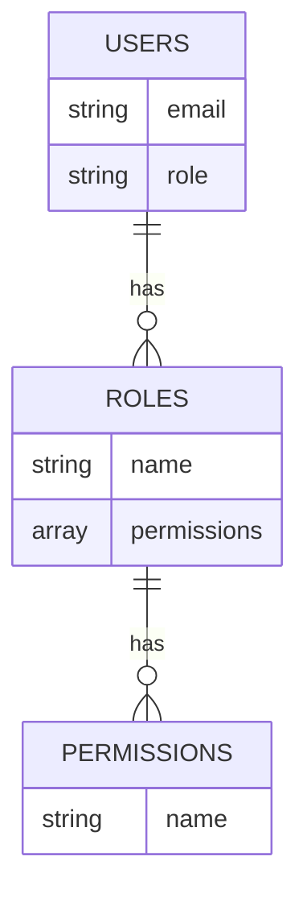
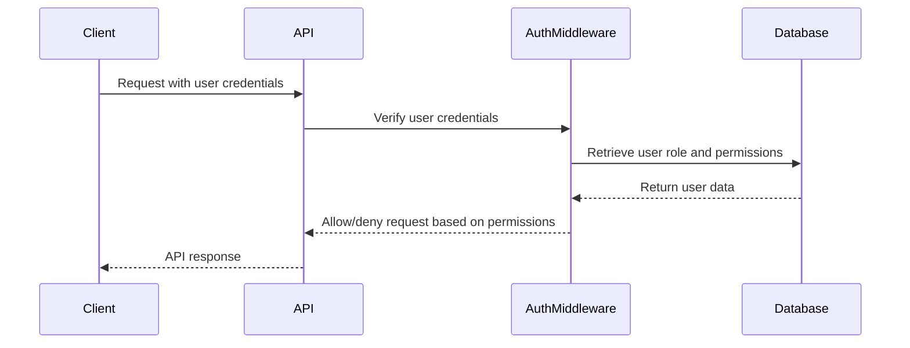

<details>
<summary>Relevant source files</summary>

The following files were used as context for generating this wiki page:

- [src/routes.js](https://github.com/aanickode/access-control-service/blob/main/src/routes.js)
- [docs/api.md](https://github.com/aanickode/access-control-service/blob/main/docs/api.md)
</details>

# API Documentation

## Introduction

This API documentation covers the access control service, which provides a set of endpoints for managing user roles, permissions, and authentication tokens within the application. The service allows authorized users to view, create, and manage roles, permissions, and user-role assignments.

Sources: [src/routes.js](), [docs/api.md]()

## API Endpoints

### GET /users

Retrieves a list of all registered users and their assigned roles.

#### Requirements

- The requesting user must have the `view_users` permission.

#### Response

```json
[
  { "email": "user1@example.com", "role": "admin" },
  { "email": "user2@example.com", "role": "editor" },
  ...
]
```

Sources: [src/routes.js:6-9]()

### POST /roles

Creates a new role with the specified name and permissions.

#### Requirements

- The requesting user must have the `create_role` permission.

#### Request Body

```json
{
  "name": "editor",
  "permissions": ["edit_content", "publish_content"]
}
```

#### Response

```json
{
  "role": "editor",
  "permissions": ["edit_content", "publish_content"]
}
```

Sources: [src/routes.js:11-18]()

### GET /permissions

Retrieves a list of all defined roles and their associated permissions.

#### Requirements

- The requesting user must have the `view_permissions` permission.

#### Response

```json
{
  "admin": ["view_users", "create_role", "view_permissions", ...],
  "editor": ["edit_content", "publish_content"],
  ...
}
```

Sources: [src/routes.js:20-22]()

### POST /tokens

Assigns a role to a user, effectively creating an authentication token for that user-role combination.

#### Request Body

```json
{
  "user": "user1@example.com",
  "role": "admin"
}
```

#### Response

```json
{
  "user": "user1@example.com",
  "role": "admin"
}
```

Sources: [src/routes.js:24-31]()

## Data Flow

The following sequence diagram illustrates the high-level data flow when a client interacts with the API endpoints:


1. The client sends a request to the API, including user credentials or an authentication token.
2. The API routes the request to the `authMiddleware` for permission checking.
3. The `authMiddleware` retrieves the user's role and associated permissions from the database.
4. Based on the required permissions for the requested endpoint, the `authMiddleware` allows or denies the request.
5. The API processes the request and returns the appropriate response to the client.

Sources: [src/routes.js]()

## Role-Based Access Control (RBAC) Model

The access control service follows a Role-Based Access Control (RBAC) model, where permissions are assigned to roles, and users are assigned one or more roles. This model separates the management of permissions from the management of user assignments, providing a flexible and scalable approach to access control.



- **Users** are identified by their email addresses and assigned one or more **Roles**.
- **Roles** have a unique name and a set of associated **Permissions**.
- **Permissions** are simple strings representing specific access rights or capabilities within the system.

Sources: [src/routes.js](), [docs/api.md]()

## Authentication and Authorization Flow

The following sequence diagram illustrates the authentication and authorization flow when a client interacts with the API:



1. The client sends a request to the API, including user credentials (e.g., email and password).
2. The API routes the request to the `authMiddleware` for authentication and authorization.
3. The `authMiddleware` verifies the user credentials and retrieves the user's role and associated permissions from the database.
4. Based on the required permissions for the requested endpoint, the `authMiddleware` allows or denies the request.
5. The API processes the request and returns the appropriate response to the client.

Sources: [src/routes.js]()

## Key Components

| Component | Description |
| --- | --- |
| `routes.js` | Defines the API routes and handles incoming requests. |
| `authMiddleware.js` | Middleware for authenticating users and checking permissions. |
| `db.js` | In-memory database for storing user, role, and permission data. |

Sources: [src/routes.js](), [docs/api.md]()

## Conclusion

The access control service provides a robust and flexible Role-Based Access Control (RBAC) system for managing user roles, permissions, and authentication tokens. It allows authorized users to view, create, and manage roles, permissions, and user-role assignments through a set of well-defined API endpoints. The service follows best practices in authentication and authorization, ensuring that only authorized users can access and perform specific actions within the application.

Sources: [src/routes.js](), [docs/api.md]()