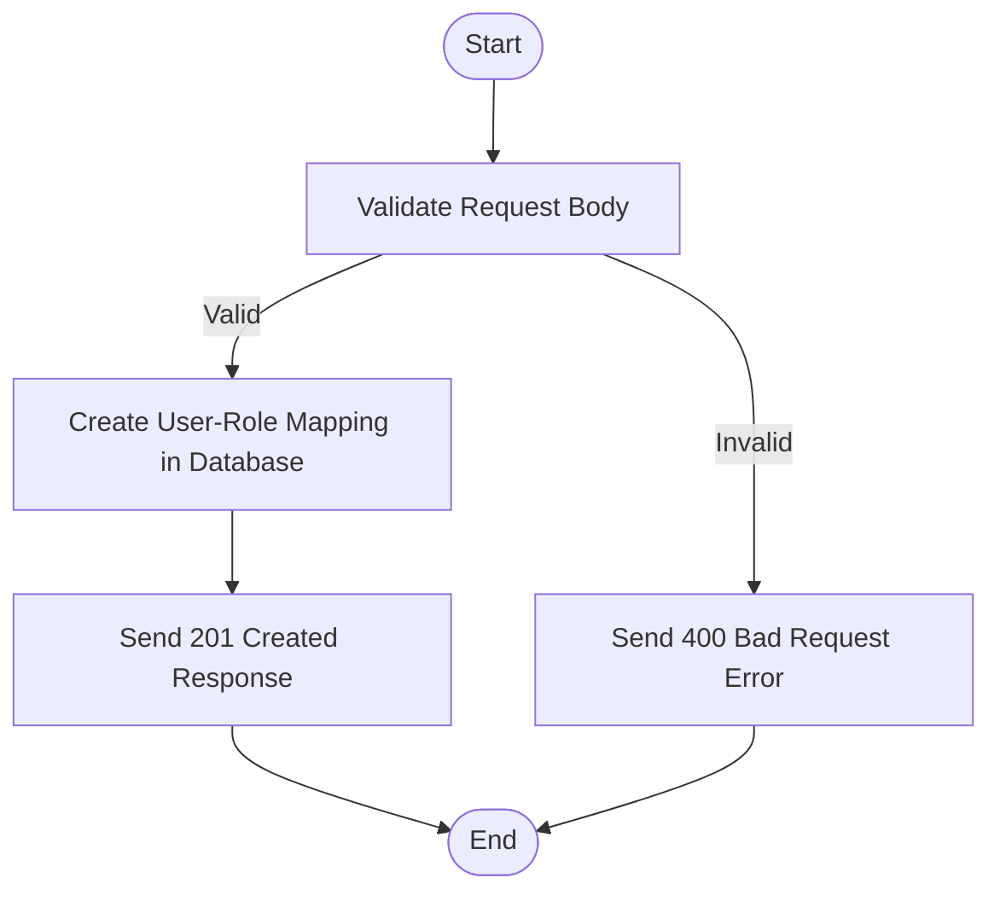

<details>
<summary>Relevant source files</summary>

The following files were used as context for generating this wiki page:

- [src/routes.js](https://github.com/aanickode/access-control-service/blob/main/src/routes.js)
- [docs/api.md](https://github.com/aanickode/access-control-service/blob/main/docs/api.md)
</details>

# API Documentation

## Introduction

This API documentation covers the implementation details and functionality of the Access Control Service within the project. The Access Control Service is responsible for managing user roles, permissions, and authentication tokens. It provides a set of RESTful API endpoints for retrieving user information, creating and viewing roles and permissions, and generating authentication tokens.

Sources: [src/routes.js](), [docs/api.md]()

## API Endpoints

### GET /users

This endpoint retrieves a list of all registered users and their associated roles.

#### Flow

```mermaid
flowchart TD
    Start([Start]) --> CheckPermission{Check "view_users" Permission}
    CheckPermission -->|Permitted| GetUsers[Get Users from Database]
    GetUsers --> MapUsers[Map Users to {email, role} Objects]
    MapUsers --> SendResponse[Send JSON Response]
    CheckPermission -->|Not Permitted| SendError[Send 403 Forbidden Error]
    SendResponse --> End([End])
    SendError --> End([End])
```

1. The `checkPermission` middleware function verifies if the user has the `'view_users'` permission.
2. If permitted, the function retrieves all user entries from the in-memory database (`db.users`).
3. The user entries are mapped to an array of `{ email, role }` objects.
4. The resulting array is sent as a JSON response.
5. If the user is not permitted, a 403 Forbidden error is sent.

Sources: [src/routes.js:6-9]()

### POST /roles

This endpoint allows creating a new role with a set of permissions.

#### Flow

```mermaid
flowchart TD
    Start([Start]) --> CheckPermission{Check "create_role" Permission}
    CheckPermission -->|Permitted| ValidateBody[Validate Request Body]
    ValidateBody -->|Valid| CreateRole[Create Role in Database]
    CreateRole --> SendResponse[Send 201 Created Response]
    ValidateBody -->|Invalid| SendError[Send 400 Bad Request Error]
    CheckPermission -->|Not Permitted| SendError[Send 403 Forbidden Error]
    SendResponse --> End([End])
    SendError --> End([End])
```

1. The `checkPermission` middleware function verifies if the user has the `'create_role'` permission.
2. If permitted, the function validates the request body, ensuring the `name` and `permissions` (an array) are provided.
3. If the request body is valid, a new role is created in the in-memory database (`db.roles`).
4. A 201 Created response is sent with the new role's `name` and `permissions`.
5. If the request body is invalid, a 400 Bad Request error is sent.
6. If the user is not permitted, a 403 Forbidden error is sent.

Sources: [src/routes.js:11-18]()

### GET /permissions

This endpoint retrieves all defined roles and their associated permissions.

#### Flow

```mermaid
flowchart TD
    Start([Start]) --> CheckPermission{Check "view_permissions" Permission}
    CheckPermission -->|Permitted| GetPermissions[Get Roles from Database]
    GetPermissions --> SendResponse[Send JSON Response]
    CheckPermission -->|Not Permitted| SendError[Send 403 Forbidden Error]
    SendResponse --> End([End])
    SendError --> End([End])
```

1. The `checkPermission` middleware function verifies if the user has the `'view_permissions'` permission.
2. If permitted, the function retrieves all role entries from the in-memory database (`db.roles`).
3. The role entries are sent as a JSON response.
4. If the user is not permitted, a 403 Forbidden error is sent.

Sources: [src/routes.js:20-23]()

### POST /tokens

This endpoint generates an authentication token by associating a user with a role.

#### Flow



1. The function validates the request body, ensuring the `user` and `role` are provided.
2. If the request body is valid, a new user-role mapping is created in the in-memory database (`db.users`).
3. A 201 Created response is sent with the `user` and `role`.
4. If the request body is invalid, a 400 Bad Request error is sent.

Sources: [src/routes.js:25-32]()

## Data Structures

### `db.users`

This is an in-memory object that stores user-role mappings. The keys are user identifiers (e.g., email addresses), and the values are the corresponding role names.

```javascript
{
  'user1@example.com': 'admin',
  'user2@example.com': 'viewer',
  // ...
}
```

Sources: [src/routes.js:7,29]()

### `db.roles`

This is an in-memory object that stores role definitions. The keys are role names, and the values are arrays of permission strings.

```javascript
{
  'admin': ['view_users', 'create_role', 'view_permissions'],
  'viewer': ['view_users', 'view_permissions'],
  // ...
}
```

Sources: [src/routes.js:16,22]()

## Authentication and Authorization

The Access Control Service uses a role-based access control (RBAC) model. Users are associated with roles, and roles are defined by a set of permissions.

The `checkPermission` middleware function is used to enforce authorization on certain API endpoints. It checks if the user's role has the required permission before allowing access to the endpoint.

```javascript
import db from './db.js';

export function checkPermission(requiredPermission) {
  return (req, res, next) => {
    const userRole = db.users[req.user];
    const permissions = db.roles[userRole] || [];
    if (permissions.includes(requiredPermission)) {
      next();
    } else {
      res.status(403).json({ error: 'Forbidden' });
    }
  };
}
```

1. The `checkPermission` function takes a `requiredPermission` string as an argument.
2. It retrieves the user's role from the `db.users` object.
3. It retrieves the permissions associated with the user's role from the `db.roles` object.
4. If the required permission is included in the user's role permissions, the request is allowed to proceed to the next middleware or route handler.
5. If the user does not have the required permission, a 403 Forbidden error is sent.

Sources: [src/routes.js:6,13,21](), [src/authMiddleware.js]()

## Conclusion

The Access Control Service provides a set of RESTful API endpoints for managing user roles, permissions, and authentication tokens. It uses an in-memory database to store user-role mappings and role definitions. The service implements a role-based access control (RBAC) model, where users are associated with roles, and roles are defined by a set of permissions. The `checkPermission` middleware function is used to enforce authorization on certain API endpoints based on the user's role and the required permission.