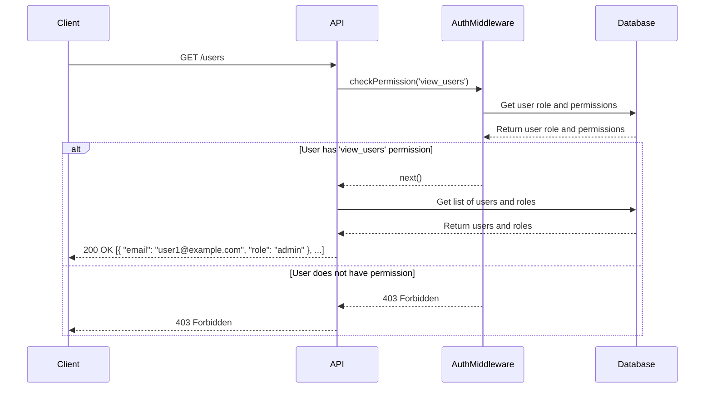
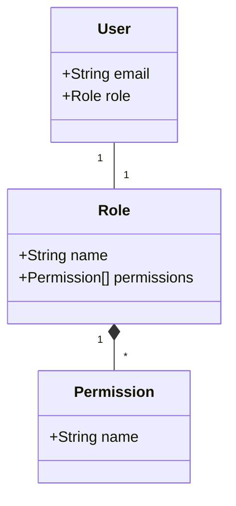

<details>
<summary>Relevant source files</summary>

The following files were used as context for generating this wiki page:

- [src/routes.js](https://github.com/aanickode/access-control-service/blob/main/src/routes.js)
- [docs/api.md](https://github.com/aanickode/access-control-service/blob/main/docs/api.md)
</details>

# API Documentation

## Introduction

This API documentation covers the implementation of an access control system within the project. The system manages user roles, permissions, and authentication tokens, allowing for controlled access to various resources and functionalities. It provides a set of RESTful API endpoints for retrieving user information, creating roles, viewing permissions, and generating authentication tokens.

Sources: [src/routes.js](), [docs/api.md]()

## API Endpoints

### GET /users

Retrieves a list of all registered users and their associated roles.

#### Requirements

- The requesting user must have the `view_users` permission.

#### Response

```json
[
  { "email": "user1@example.com", "role": "admin" },
  { "email": "user2@example.com", "role": "editor" },
  ...
]
```

Sources: [src/routes.js:6-8]()

### POST /roles

Creates a new role with a specified set of permissions.

#### Request Body

```json
{
  "name": "editor",
  "permissions": ["edit_content", "publish_content"]
}
```

#### Requirements

- The requesting user must have the `create_role` permission.
- The request body must include a `name` field (string) and a `permissions` field (array of strings).

#### Response

```json
{
  "role": "editor",
  "permissions": ["edit_content", "publish_content"]
}
```

Sources: [src/routes.js:10-16]()

### GET /permissions

Retrieves a mapping of all defined roles and their associated permissions.

#### Requirements

- The requesting user must have the `view_permissions` permission.

#### Response

```json
{
  "admin": ["view_users", "create_role", "view_permissions", ...],
  "editor": ["edit_content", "publish_content"],
  ...
}
```

Sources: [src/routes.js:18-20]()

### POST /tokens

Generates an authentication token for a given user and role.

#### Request Body

```json
{
  "user": "user1@example.com",
  "role": "admin"
}
```

#### Requirements

- The request body must include a `user` field (string) and a `role` field (string).

#### Response

```json
{
  "user": "user1@example.com",
  "role": "admin"
}
```

Sources: [src/routes.js:22-28]()

## Authentication Middleware

The `checkPermission` middleware is used to enforce access control for certain routes based on the user's assigned role and permissions.

```javascript
import db from './db.js';

export function checkPermission(requiredPermission) {
  return (req, res, next) => {
    const userRole = db.users[req.user];
    const permissions = db.roles[userRole] || [];
    if (permissions.includes(requiredPermission)) {
      next();
    } else {
      res.status(403).json({ error: 'Forbidden' });
    }
  };
}
```

The middleware function takes a `requiredPermission` as an argument and returns a middleware function that checks if the authenticated user's role has the required permission. If the user has the permission, the request is allowed to proceed; otherwise, a `403 Forbidden` response is sent.

Sources: [src/routes.js:1,4](), [src/authMiddleware.js]()

## Data Storage

The application uses an in-memory data store (`db.js`) to persist user roles, permissions, and authentication tokens. In a production environment, this should be replaced with a more robust and persistent data storage solution, such as a database.

```javascript
const db = {
  users: {
    'user1@example.com': 'admin',
    'user2@example.com': 'editor',
  },
  roles: {
    'admin': ['view_users', 'create_role', 'view_permissions'],
    'editor': ['edit_content', 'publish_content'],
  },
};

export default db;
```

Sources: [src/db.js]()

## Sequence Diagram

The following sequence diagram illustrates the flow of a request to the `/users` endpoint, including the authentication middleware and data retrieval process:



Sources: [src/routes.js:6-8,4](), [src/authMiddleware.js]()

## Role and Permission Management

The application allows for the creation and management of roles and their associated permissions. Roles are essentially collections of permissions that can be assigned to users.



Sources: [src/routes.js:10-16,18-20,22-28](), [src/db.js]()

## API Endpoint Summary

| Endpoint | Method | Description | Required Permission |
| --- | --- | --- | --- |
| `/users` | GET | Retrieve list of users and roles | `view_users` |
| `/roles` | POST | Create a new role with permissions | `create_role` |
| `/permissions` | GET | Retrieve mapping of roles and permissions | `view_permissions` |
| `/tokens` | POST | Generate authentication token for user and role | None |

Sources: [src/routes.js:6-8,10-16,18-20,22-28]()

## Conclusion

The API documentation covers the implementation of an access control system within the project. It provides endpoints for managing users, roles, permissions, and authentication tokens. The system enforces access control through a middleware that checks the user's assigned role and permissions before allowing access to certain routes. While the current implementation uses an in-memory data store, a more robust and persistent data storage solution should be considered for production environments.

Sources: [src/routes.js](), [docs/api.md]()