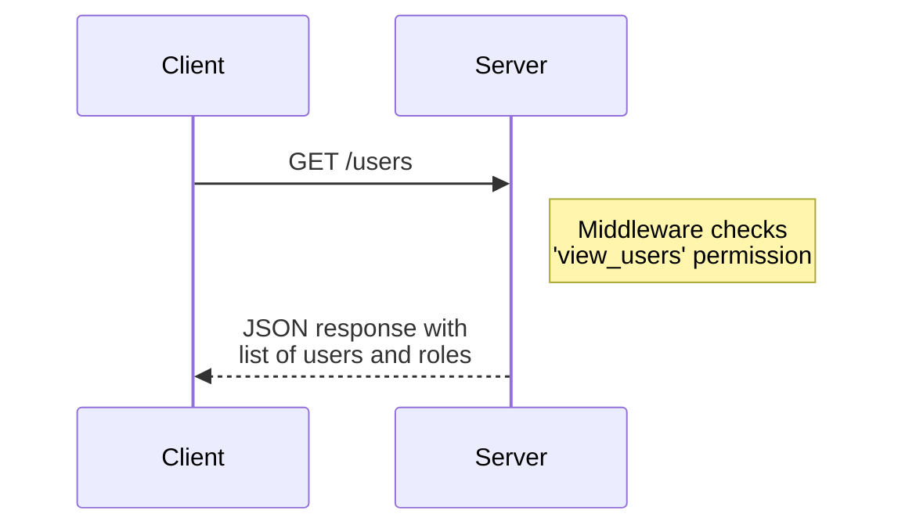
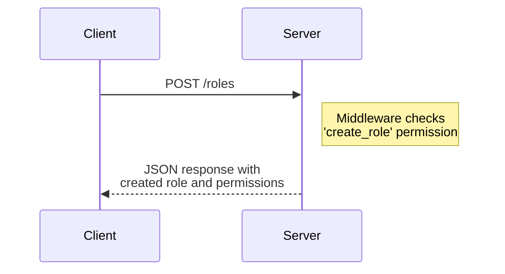
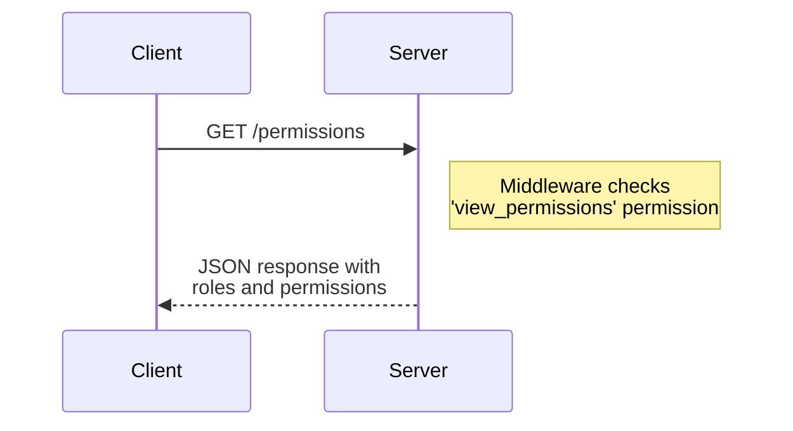
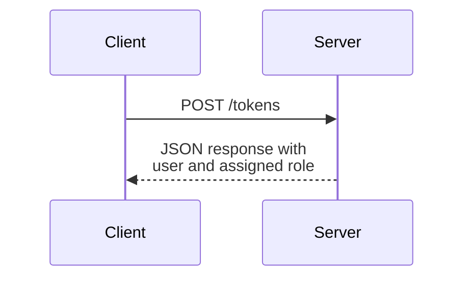

Relevant source files

The following files were used as context for generating this wiki page:

- [src/routes.js](https://github.com/aanickode/access-control-service/blob/main/src/routes.js)
- [docs/api.md](https://github.com/aanickode/access-control-service/blob/main/docs/api.md)

# API Documentation

## Introduction

The API Documentation covers the implementation details and architecture of the API routes and endpoints within the project. These routes handle various operations related to user management, role management, and access control. The API is built using Express.js, a popular Node.js web application framework.

Sources: [src/routes.js](https://github.com/aanickode/access-control-service/blob/main/src/routes.js)

## API Routes

### GET /users

This endpoint retrieves a list of all registered users and their associated roles.

- The `checkPermission` middleware is used to ensure that the client has the `'view_users'` permission before accessing this route.
- The response is a JSON array containing objects with `email` and `role` properties for each user.

Sources: [src/routes.js:5-8](https://github.com/aanickode/access-control-service/blob/main/src/routes.js#L5-L8)

### POST /roles

This endpoint allows creating a new role with a set of associated permissions.

- The `checkPermission` middleware is used to ensure that the client has the `'create_role'` permission before accessing this route.
- The request body must contain a `name` property (the role name) and a `permissions` array.
- If the request body is valid, a new role is created in the `db.roles` object, and a JSON response is sent with the role name and permissions.

Sources: [src/routes.js:10-16](https://github.com/aanickode/access-control-service/blob/main/src/routes.js#L10-L16)

### GET /permissions

This endpoint retrieves a list of all defined roles and their associated permissions.

- The `checkPermission` middleware is used to ensure that the client has the `'view_permissions'` permission before accessing this route.
- The response is a JSON object containing all roles and their associated permissions from the `db.roles` object.

Sources: [src/routes.js:18-20](https://github.com/aanickode/access-control-service/blob/main/src/routes.js#L18-L20)

### POST /tokens

This endpoint associates a user with a role, effectively granting the user the permissions of that role.

- No middleware is used for this route.
- The request body must contain a `user` property (the user identifier) and a `role` property (the role to assign to the user).
- If the request body is valid, the user is added to the `db.users` object with the specified role.
- A JSON response is sent with the user and assigned role.

Sources: [src/routes.js:22-28](https://github.com/aanickode/access-control-service/blob/main/src/routes.js#L22-L28)

## Data Models

### Users

The `db.users` object stores user information, mapping user identifiers (e.g., email addresses) to their assigned roles.

| Field | Type | Description |
| --- | --- | --- |
| email | string | User's email address (used as the key) |
| role | string | The role assigned to the user |

Sources: [src/routes.js:7](https://github.com/aanickode/access-control-service/blob/main/src/routes.js#L7), [src/routes.js:26](https://github.com/aanickode/access-control-service/blob/main/src/routes.js#L26)

### Roles

The `db.roles` object stores role definitions, mapping role names to an array of associated permissions.

| Field | Type | Description |
| --- | --- | --- |
| name | string | The name of the role (used as the key) |
| permissions | string[] | An array of permission strings associated with the role |

Sources: [src/routes.js:14](https://github.com/aanickode/access-control-service/blob/main/src/routes.js#L14)

## Conclusion

The API Documentation covers the implementation details and architecture of the API routes and endpoints within the project. It provides information about the available routes, their functionalities, request/response formats, and data models used for user and role management. The API is built using Express.js and includes middleware for access control based on permissions associated with roles.