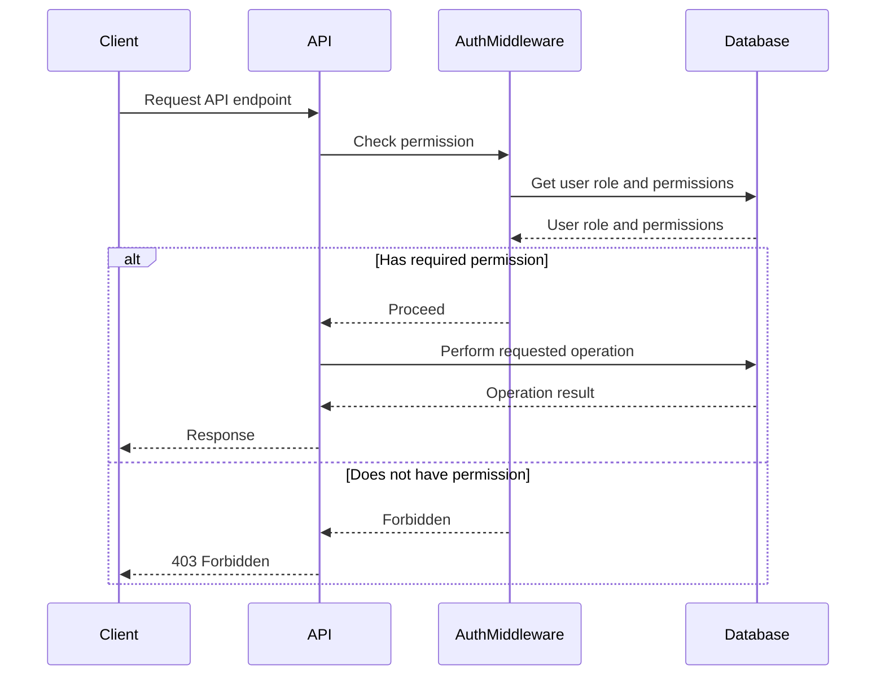

<details>
<summary>Relevant source files</summary>

The following files were used as context for generating this wiki page:

- [src/routes.js](https://github.com/aanickode/access-control-service/blob/main/src/routes.js)
- [docs/api.md](https://github.com/aanickode/access-control-service/blob/main/docs/api.md)
- [src/authMiddleware.js](https://github.com/aanickode/access-control-service/blob/main/src/authMiddleware.js)
- [src/db.js](https://github.com/aanickode/access-control-service/blob/main/src/db.js)
- [src/app.js](https://github.com/aanickode/access-control-service/blob/main/src/app.js)

</details>

# API Documentation

## Introduction

This API documentation covers the access control service, which provides a set of endpoints for managing users, roles, and permissions within the application. The service allows authorized users to view a list of registered users, create new roles with associated permissions, view defined permissions, and generate authentication tokens for users with specific roles.

The access control service is a crucial component of the overall project, ensuring proper authorization and access management for various application features and resources. It serves as a central authority for defining and enforcing access control policies.

Sources: [src/routes.js](), [docs/api.md]()

## API Endpoints

### GET /users

This endpoint retrieves a list of registered users and their associated roles.

#### Requirements

- The requesting user must have the `view_users` permission.

#### Response

- Status Code: 200 OK
- Response Body: An array of user objects, each containing the `email` and `role` properties.

```json
[
  { "email": "user1@example.com", "role": "admin" },
  { "email": "user2@example.com", "role": "editor" },
  ...
]
```

#### Flow Diagram

```mermaid
graph TD
    Client --> API[/users]
    API --> AuthMiddleware{Check Permission}
    AuthMiddleware -->|view_users| GetUsers[Get Users from DB]
    GetUsers --> API
    API --> Client
```

Sources: [src/routes.js:5-8](), [src/authMiddleware.js]()

### POST /roles

This endpoint allows authorized users to create a new role with a set of associated permissions.

#### Requirements

- The requesting user must have the `create_role` permission.
- The request body must contain a `name` property (string) and a `permissions` property (array of strings).

#### Request Body

```json
{
  "name": "editor",
  "permissions": ["edit_content", "publish_content"]
}
```

#### Response

- Status Code: 201 Created
- Response Body: An object containing the `role` (name) and `permissions` array.

```json
{
  "role": "editor",
  "permissions": ["edit_content", "publish_content"]
}
```

#### Error Responses

- Status Code: 400 Bad Request
  - If the request body is missing the `name` or `permissions` property, or if `permissions` is not an array.

#### Flow Diagram

```mermaid
graph TD
    Client --> API[/roles]
    API --> AuthMiddleware{Check Permission}
    AuthMiddleware -->|create_role| CreateRole[Create Role in DB]
    CreateRole --> API
    API --> Client
```

Sources: [src/routes.js:10-17](), [src/authMiddleware.js]()

### GET /permissions

This endpoint retrieves a list of all defined roles and their associated permissions.

#### Requirements

- The requesting user must have the `view_permissions` permission.

#### Response

- Status Code: 200 OK
- Response Body: An object where the keys are role names, and the values are arrays of permissions.

```json
{
  "admin": ["view_users", "create_role", "view_permissions"],
  "editor": ["edit_content", "publish_content"],
  ...
}
```

#### Flow Diagram

```mermaid
graph TD
    Client --> API[/permissions]
    API --> AuthMiddleware{Check Permission}
    AuthMiddleware -->|view_permissions| GetPermissions[Get Roles from DB]
    GetPermissions --> API
    API --> Client
```

Sources: [src/routes.js:19-21](), [src/authMiddleware.js]()

### POST /tokens

This endpoint generates an authentication token for a user with a specific role.

#### Requirements

- The request body must contain a `user` property (string) and a `role` property (string).

#### Request Body

```json
{
  "user": "user1@example.com",
  "role": "editor"
}
```

#### Response

- Status Code: 201 Created
- Response Body: An object containing the `user` and `role` properties.

```json
{
  "user": "user1@example.com",
  "role": "editor"
}
```

#### Error Responses

- Status Code: 400 Bad Request
  - If the request body is missing the `user` or `role` property.

#### Flow Diagram

```mermaid
graph TD
    Client --> API[/tokens]
    API --> ValidateInput{Validate Input}
    ValidateInput -->|Valid| GenerateToken[Generate Token]
    GenerateToken --> API
    API --> Client
    ValidateInput -->|Invalid| API
    API -->|Error 400| Client
```

Sources: [src/routes.js:23-30]()

## Data Models

### Users

The `users` object in the database stores user email addresses as keys and their associated roles as values.

```json
{
  "user1@example.com": "admin",
  "user2@example.com": "editor",
  ...
}
```

Sources: [src/db.js](), [src/routes.js:7,28]()

### Roles

The `roles` object in the database stores role names as keys and their associated permissions as values (arrays of strings).

```json
{
  "admin": ["view_users", "create_role", "view_permissions"],
  "editor": ["edit_content", "publish_content"],
  ...
}
```

Sources: [src/db.js](), [src/routes.js:14,20]()

## Authentication and Authorization

The access control service uses a middleware function `checkPermission` to enforce authorization for certain routes based on the user's role and required permissions.

```javascript
import db from './db.js';

export const checkPermission = (requiredPermission) => {
  return (req, res, next) => {
    const userRole = db.users[req.user];
    const permissions = db.roles[userRole] || [];

    if (permissions.includes(requiredPermission)) {
      next();
    } else {
      res.status(403).json({ error: 'Forbidden' });
    }
  };
};
```

The `checkPermission` middleware function takes a `requiredPermission` string as an argument and returns a middleware function. This middleware function checks if the user's role has the required permission by looking up the user's role in the `db.users` object and the associated permissions in the `db.roles` object. If the user has the required permission, the middleware calls `next()` to proceed to the route handler. Otherwise, it responds with a 403 Forbidden status.

Sources: [src/authMiddleware.js](), [src/routes.js:5,10,19]()

## Sequence Diagram

The following sequence diagram illustrates the flow of a typical API request and the interaction between the client, the API routes, the authentication middleware, and the database:



Sources: [src/routes.js](), [src/authMiddleware.js](), [src/db.js]()

## Conclusion

The access control service provides a set of API endpoints for managing users, roles, and permissions within the application. It enforces authorization based on user roles and required permissions, ensuring that only authorized users can perform certain actions. The service also allows for the creation of new roles and the generation of authentication tokens for users with specific roles.

By following the API documentation and adhering to the defined data models and authentication/authorization mechanisms, developers can integrate the access control service into their applications and ensure proper access management and security.

Sources: [src/routes.js](), [docs/api.md](), [src/authMiddleware.js](), [src/db.js]()