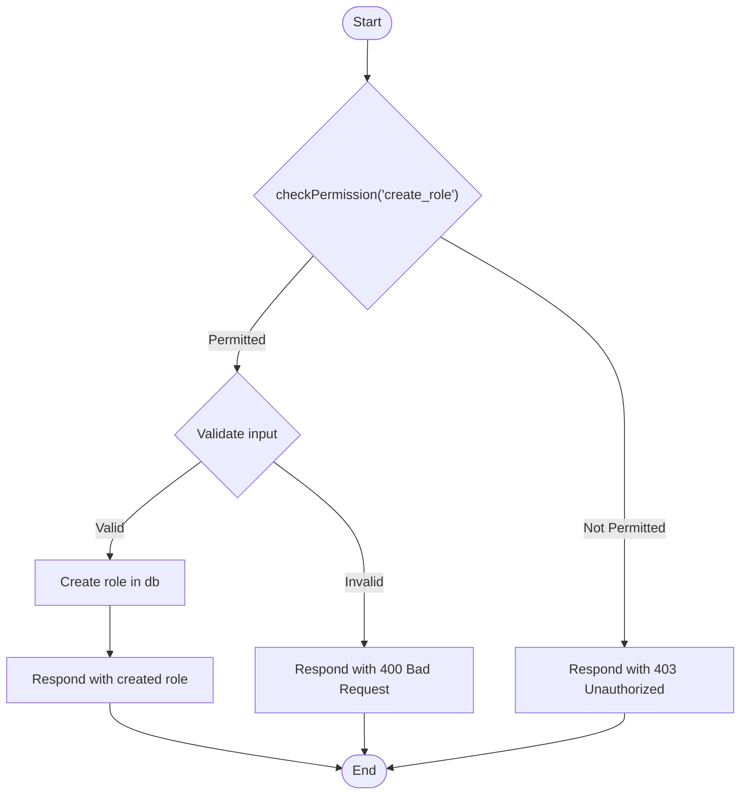
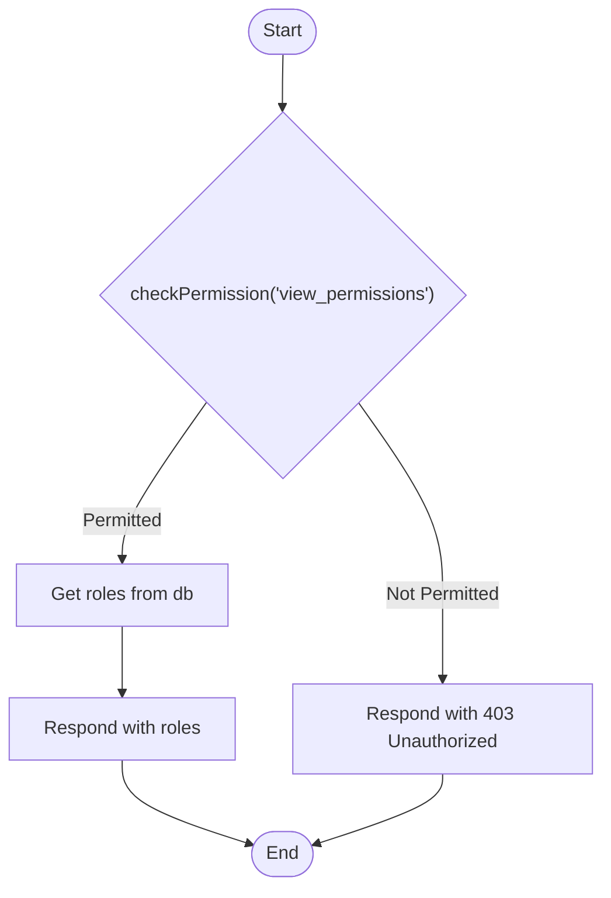
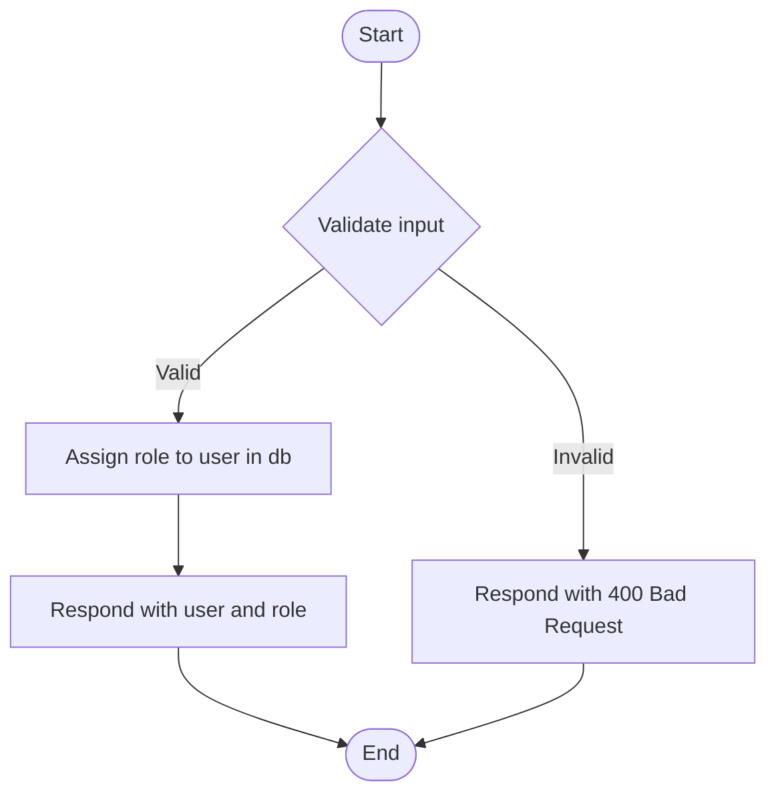
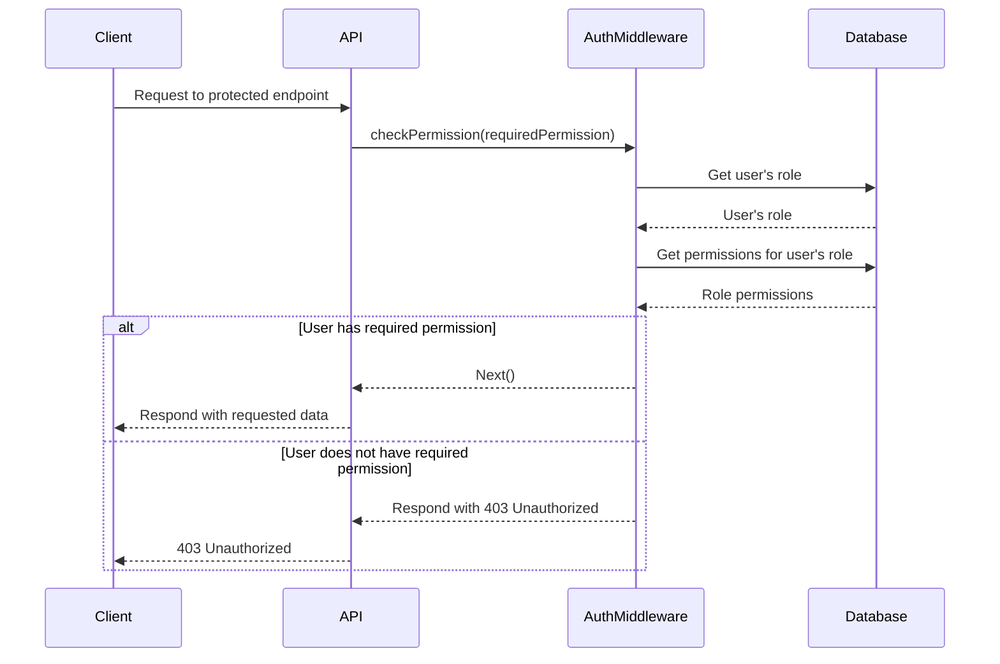

<details>
<summary>Relevant source files</summary>

The following files were used as context for generating this wiki page:

- [docs/api.md](https://github.com/aanickode/access-control-service/blob/main/docs/api.md)
- [src/routes.js](https://github.com/aanickode/access-control-service/blob/main/src/routes.js)
</details>

# API Documentation

## Introduction

The API Documentation covers the implementation details of the API endpoints and related functionality within the access control service. This service manages user roles, permissions, and authentication tokens, enabling controlled access to various resources or features based on defined roles and their associated permissions.

## API Endpoints

### GET /users

This endpoint retrieves a list of all registered users and their assigned roles.

#### Endpoint Flow

```mermaid
flowchart TD
    Start([Start]) --> CheckPermission{"checkPermission('view_users')"}
    CheckPermission -->|Permitted| GetUsers[Get users from db]
    GetUsers --> MapUsers{Map users to {email, role}}
    MapUsers --> RespondWithUsers[Respond with user list]
    RespondWithUsers --> End([End])
    CheckPermission -->|Not Permitted| Unauthorized[Respond with 403 Unauthorized]
    Unauthorized --> End([End])
```

Sources: [src/routes.js:5-9]()

### POST /roles

This endpoint allows creating a new role with a set of associated permissions.

#### Request Body

| Field       | Type     | Description                 |
|-------------|----------|-----------------------------
| `name`      | `string` | The name of the new role    |
| `permissions` | `array`  | The list of permissions for the role |

#### Endpoint Flow



Sources: [src/routes.js:11-17]()

### GET /permissions

This endpoint retrieves a list of all defined roles and their associated permissions.

#### Endpoint Flow



Sources: [src/routes.js:19-22]()

### POST /tokens

This endpoint assigns a role to a user, effectively creating an authentication token.

#### Request Body

| Field  | Type     | Description                  |
|--------|----------|------------------------------|
| `user` | `string` | The user's identifier (e.g., email) |
| `role` | `string` | The role to assign to the user |

#### Endpoint Flow



Sources: [src/routes.js:24-30]()

## Authentication Middleware

The `checkPermission` middleware is used to enforce role-based access control for certain API endpoints. It checks if the authenticated user has the required permission associated with their assigned role.



Sources: [src/routes.js:4]()

## Data Storage

The service uses an in-memory data store (`db.js`) to store user roles, permissions, and authentication tokens. In a production environment, this should be replaced with a persistent data storage solution, such as a database.


Sources: [src/routes.js:3,6,12,19,25]()

## Conclusion

The API Documentation covers the implementation details of the access control service's API endpoints, authentication middleware, and data storage. It provides a comprehensive understanding of the service's functionality, including user management, role creation, permission assignment, and authentication token generation.