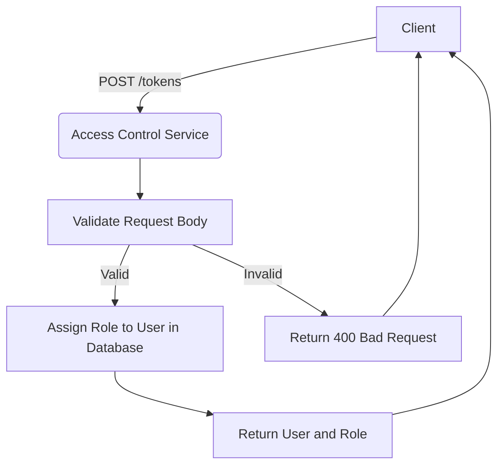
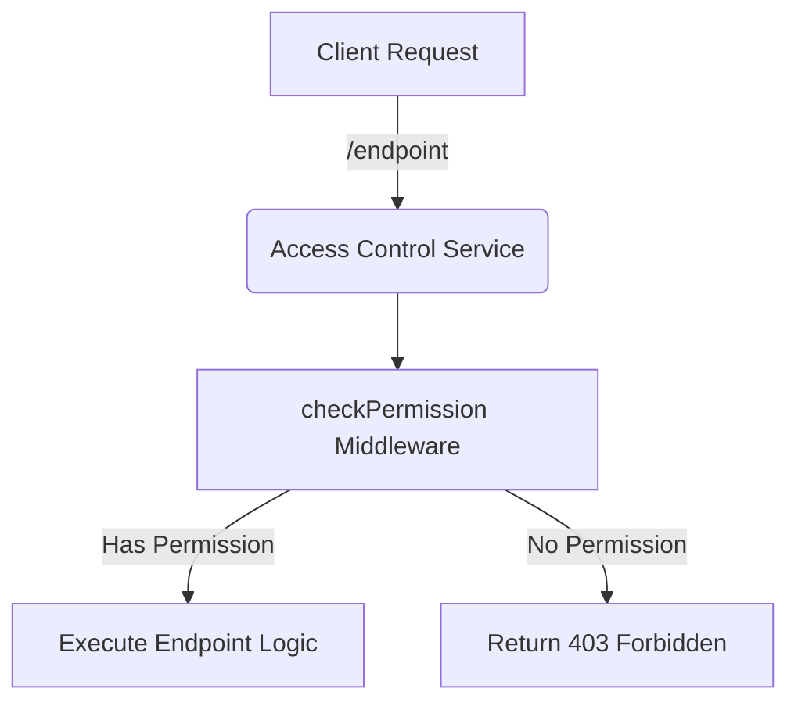
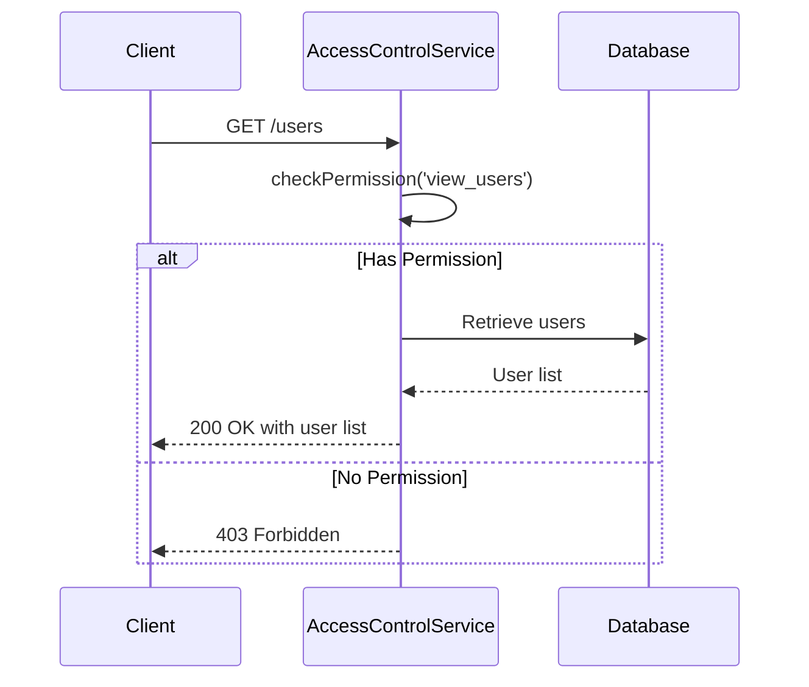
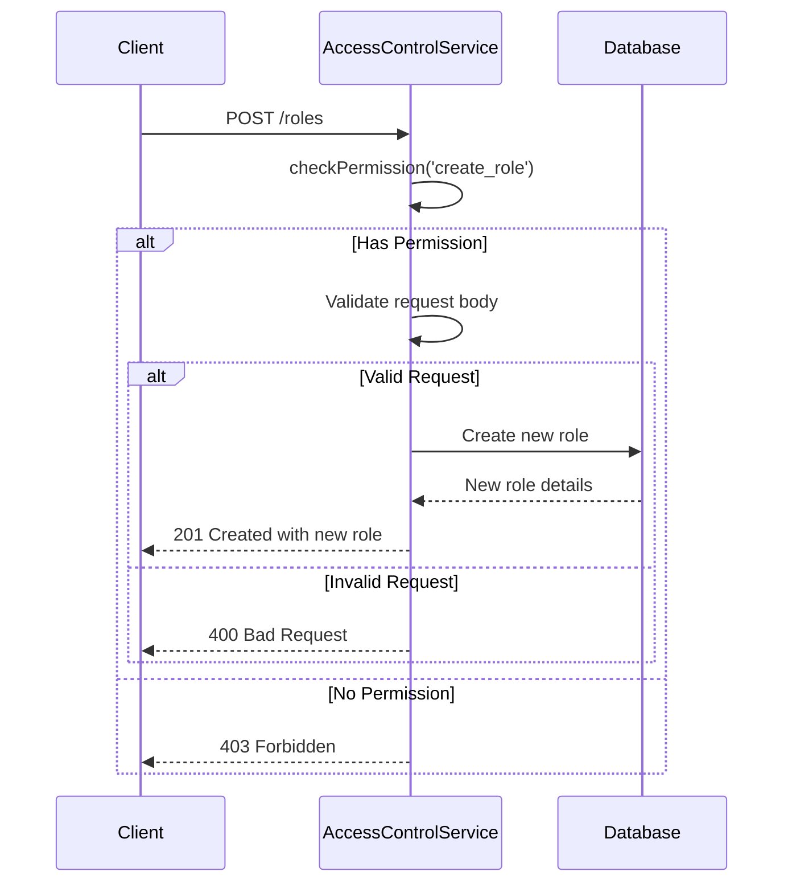

<details>
<summary>Relevant source files</summary>

The following files were used as context for generating this wiki page:

- [src/routes.js](https://github.com/aanickode/access-control-service/blob/main/src/routes.js)
- [docs/api.md](https://github.com/aanickode/access-control-service/blob/main/docs/api.md)
</details>

# API Documentation

## Introduction

This API documentation covers the implementation of an access control service within the project. The service provides a set of RESTful API endpoints for managing user roles, permissions, and authentication tokens. It allows authorized users to view and create roles, view permissions, and generate authentication tokens for specific users and roles.

Sources: [src/routes.js](), [docs/api.md]()

## API Endpoints

### GET /users

This endpoint retrieves a list of all registered users and their associated roles.

#### Requirements

- The requesting user must have the `view_users` permission.

#### Response

- `200 OK` with a JSON array containing user email and role objects.

```json
[
  { "email": "user1@example.com", "role": "admin" },
  { "email": "user2@example.com", "role": "editor" }
]
```

#### Flow

```mermaid
graph TD
    A[Client] -->|GET /users| B(Access Control Service)
    B -->|checkPermission('view_users')| C{Has Permission?}
    C -->|Yes| D[Retrieve Users from Database]
    D --> E[Return User List]
    E --> A
    C -->|No| F[Return 403 Forbidden]
    F --> A
```

Sources: [src/routes.js:5-9]()

### POST /roles

This endpoint allows authorized users to create a new role with a set of permissions.

#### Requirements

- The requesting user must have the `create_role` permission.

#### Request Body

- `name` (string): The name of the new role.
- `permissions` (array): An array of permission strings for the new role.

#### Response

- `201 Created` with a JSON object containing the new role and its permissions.
- `400 Bad Request` if the request body is invalid.

```json
{
  "role": "editor",
  "permissions": ["edit_content", "publish_content"]
}
```

#### Flow

```mermaid
graph TD
    A[Client] -->|POST /roles| B(Access Control Service)
    B -->|checkPermission('create_role')| C{Has Permission?}
    C -->|Yes| D[Validate Request Body]
    D -->|Valid| E[Create New Role in Database]
    E --> F[Return New Role]
    F --> A
    D -->|Invalid| G[Return 400 Bad Request]
    G --> A
    C -->|No| H[Return 403 Forbidden]
    H --> A
```

Sources: [src/routes.js:11-18]()

### GET /permissions

This endpoint retrieves a list of all defined roles and their associated permissions.

#### Requirements

- The requesting user must have the `view_permissions` permission.

#### Response

- `200 OK` with a JSON object containing role names and their respective permission arrays.

```json
{
  "admin": ["view_users", "create_role", "view_permissions"],
  "editor": ["edit_content", "publish_content"]
}
```

#### Flow

```mermaid
graph TD
    A[Client] -->|GET /permissions| B(Access Control Service)
    B -->|checkPermission('view_permissions')| C{Has Permission?}
    C -->|Yes| D[Retrieve Roles from Database]
    D --> E[Return Roles and Permissions]
    E --> A
    C -->|No| F[Return 403 Forbidden]
    F --> A
```

Sources: [src/routes.js:20-23]()

### POST /tokens

This endpoint generates an authentication token for a specific user and role.

#### Request Body

- `user` (string): The email or identifier of the user.
- `role` (string): The name of the role to assign to the user.

#### Response

- `201 Created` with a JSON object containing the user and assigned role.
- `400 Bad Request` if the request body is invalid or missing required fields.

```json
{
  "user": "user1@example.com",
  "role": "editor"
}
```

#### Flow



Sources: [src/routes.js:25-33]()

## Data Models

### User

- `email` (string): The user's email address or identifier.
- `role` (string): The name of the role assigned to the user.

Sources: [src/routes.js:8]()

### Role

- `name` (string): The name of the role.
- `permissions` (array): An array of permission strings associated with the role.

Sources: [src/routes.js:14-15]()

## Authentication and Authorization

The access control service uses a role-based access control (RBAC) model. Each user is assigned a role, and each role has a set of associated permissions. The `checkPermission` middleware function is used to verify if the requesting user has the required permission to access a specific endpoint.



Sources: [src/routes.js:3,6,12,21]()

## Sequence Diagrams

### GET /users



Sources: [src/routes.js:5-9]()

### POST /roles



Sources: [src/routes.js:11-18]()

## Summary

The access control service provides a set of RESTful API endpoints for managing user roles, permissions, and authentication tokens within the project. It follows a role-based access control (RBAC) model, where users are assigned roles with specific permissions. The service allows authorized users to view and create roles, view permissions, and generate authentication tokens for specific users and roles.

Sources: [src/routes.js](), [docs/api.md]()