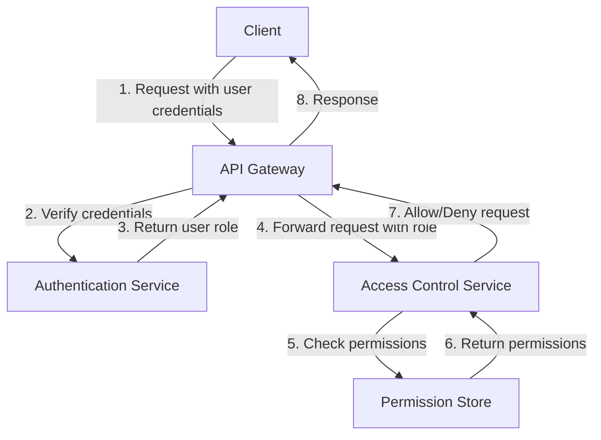
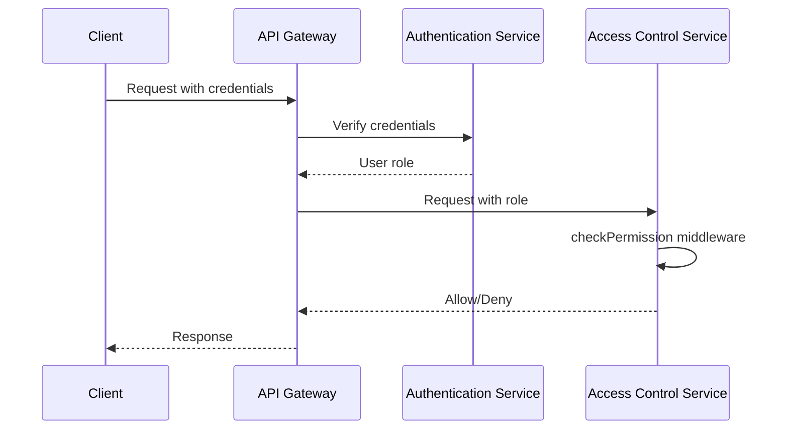

<details>
<summary>Relevant source files</summary>

The following files were used as context for generating this wiki page:

- [src/routes.js](https://github.com/aanickode/access-control-service/blob/main/src/routes.js)
- [docs/api.md](https://github.com/aanickode/access-control-service/blob/main/docs/api.md)
- [src/authMiddleware.js](https://github.com/aanickode/access-control-service/blob/main/src/authMiddleware.js)
- [src/db.js](https://github.com/aanickode/access-control-service/blob/main/src/db.js)
- [src/app.js](https://github.com/aanickode/access-control-service/blob/main/src/app.js)

</details>

# API Documentation

## Introduction

This API documentation covers the access control service, which provides a set of endpoints for managing users, roles, and permissions within the application. The service allows authorized users to view a list of registered users, create new roles with associated permissions, view the available permissions, and generate access tokens for users with specific roles.

Sources: [docs/api.md](), [src/routes.js]()

## API Endpoints

### GET /users

This endpoint retrieves a list of all registered users and their associated roles.

#### Requirements

- The requesting user must have the `view_users` permission.

#### Response

```json
[
  { "email": "user1@example.com", "role": "admin" },
  { "email": "user2@example.com", "role": "editor" },
  ...
]
```

Sources: [src/routes.js:6-9]()

### POST /roles

This endpoint allows authorized users to create a new role with a set of associated permissions.

#### Requirements

- The requesting user must have the `create_role` permission.

#### Request Body

```json
{
  "name": "editor",
  "permissions": ["edit_content", "publish_content"]
}
```

#### Response

```json
{
  "role": "editor",
  "permissions": ["edit_content", "publish_content"]
}
```

Sources: [src/routes.js:11-18]()

### GET /permissions

This endpoint retrieves a list of all available roles and their associated permissions.

#### Requirements

- The requesting user must have the `view_permissions` permission.

#### Response

```json
{
  "admin": ["view_users", "create_role", "view_permissions", ...],
  "editor": ["edit_content", "publish_content"],
  ...
}
```

Sources: [src/routes.js:20-22]()

### POST /tokens

This endpoint generates an access token for a user with a specific role.

#### Request Body

```json
{
  "user": "user1@example.com",
  "role": "admin"
}
```

#### Response

```json
{
  "user": "user1@example.com",
  "role": "admin"
}
```

Sources: [src/routes.js:24-31]()

## Access Control Flow

The access control flow for this service is as follows:



1. The client sends a request to the API Gateway with user credentials.
2. The API Gateway verifies the user's credentials with the Authentication Service.
3. The Authentication Service returns the user's role to the API Gateway.
4. The API Gateway forwards the request to the Access Control Service, including the user's role.
5. The Access Control Service checks the required permissions for the requested operation against the Permission Store.
6. The Permission Store returns the associated permissions for the user's role.
7. The Access Control Service allows or denies the request based on the user's permissions.
8. The API Gateway returns the appropriate response to the client.

Sources: [src/routes.js](), [src/authMiddleware.js](), [src/db.js]()

## Data Models

### User

| Field  | Type   | Description                    |
|--------|--------|--------------------------------|
| email  | string | The user's email address       |
| role   | string | The user's assigned role       |

Sources: [src/routes.js:7](), [src/routes.js:28]()

### Role

| Field       | Type    | Description                                   |
|-------------|---------|-----------------------------------------------|
| name        | string  | The name of the role                         |
| permissions | string[] | An array of permissions associated with the role |

Sources: [src/routes.js:13-14](), [src/routes.js:21]()

## Authentication and Authorization

The access control service relies on an external Authentication Service to verify user credentials and retrieve the user's role. The `checkPermission` middleware function is used to enforce authorization based on the user's role and the required permissions for each endpoint.



The `checkPermission` middleware function is defined as follows:

```javascript
import db from './db.js';

export const checkPermission = (requiredPermission) => {
  return (req, res, next) => {
    const userRole = req.user.role;
    const permissions = db.roles[userRole] || [];
    if (permissions.includes(requiredPermission)) {
      next();
    } else {
      res.status(403).json({ error: 'Forbidden' });
    }
  };
};
```

1. The client sends a request with user credentials to the API Gateway.
2. The API Gateway verifies the user's credentials with the Authentication Service.
3. The Authentication Service returns the user's role to the API Gateway.
4. The API Gateway forwards the request to the Access Control Service, including the user's role.
5. The Access Control Service invokes the `checkPermission` middleware function, which retrieves the user's permissions from the Permission Store (`db.roles`).
6. If the user has the required permission, the middleware function calls `next()` to proceed with the request handler.
7. If the user does not have the required permission, the middleware function returns a 403 Forbidden response.
8. The API Gateway returns the appropriate response to the client.

Sources: [src/authMiddleware.js](), [src/routes.js]()

## Conclusion

The access control service provides a set of endpoints for managing users, roles, and permissions within the application. It enforces authorization based on the user's role and the required permissions for each operation. The service relies on an external Authentication Service to verify user credentials and retrieve the user's role. The data models and access control flow are designed to ensure secure and controlled access to the application's resources.