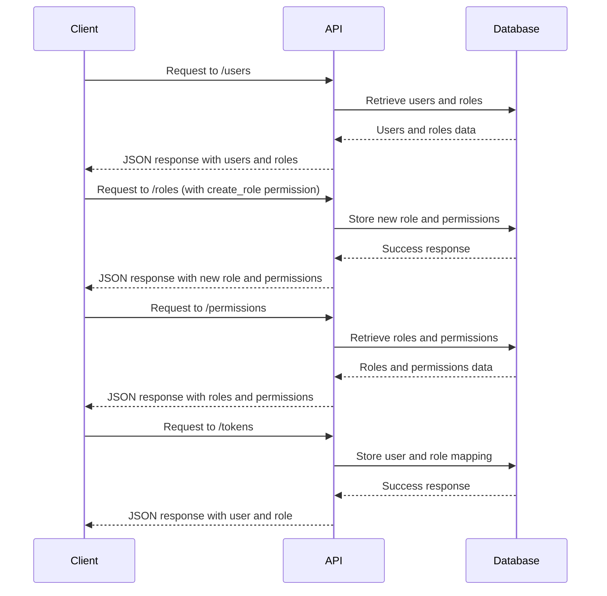

<details>
<summary>Relevant source files</summary>

The following files were used as context for generating this wiki page:

- [src/routes.js](https://github.com/aanickode/access-control-service/blob/main/src/routes.js)
- [docs/api.md](https://github.com/aanickode/access-control-service/blob/main/docs/api.md)
</details>

# API Documentation

## Introduction

This API documentation covers the implementation details and functionality of the API routes and endpoints provided by the access control service. The service manages user roles, permissions, and authentication tokens, allowing for controlled access to various resources within the application.

Sources: [src/routes.js](), [docs/api.md]()

## API Routes

### GET /users

This endpoint retrieves a list of all registered users and their associated roles.

#### Route Definition

```js
router.get('/users', checkPermission('view_users'), (req, res) => {
  res.json(Object.entries(db.users).map(([email, role]) => ({ email, role })));
});
```

Sources: [src/routes.js:6-9]()

#### Permissions

The `view_users` permission is required to access this endpoint.

Sources: [src/routes.js:6]()

#### Response

The response is a JSON array containing objects with the following structure:

```json
[
  { "email": "user1@example.com", "role": "admin" },
  { "email": "user2@example.com", "role": "editor" },
  ...
]
```

Sources: [src/routes.js:8]()

### POST /roles

This endpoint allows creating a new role with a set of associated permissions.

#### Route Definition

```js
router.post('/roles', checkPermission('create_role'), (req, res) => {
  const { name, permissions } = req.body;
  if (!name || !Array.isArray(permissions)) {
    return res.status(400).json({ error: 'Invalid role definition' });
  }
  db.roles[name] = permissions;
  res.status(201).json({ role: name, permissions });
});
```

Sources: [src/routes.js:11-18]()

#### Permissions

The `create_role` permission is required to access this endpoint.

Sources: [src/routes.js:11]()

#### Request Body

The request body should be a JSON object with the following structure:

```json
{
  "name": "role_name",
  "permissions": ["permission1", "permission2", ...]
}
```

Sources: [src/routes.js:12-13]()

#### Response

If the role is created successfully, the response will have a 201 status code and a JSON object with the following structure:

```json
{
  "role": "role_name",
  "permissions": ["permission1", "permission2", ...]
}
```

If the request body is invalid, the response will have a 400 status code and a JSON object with an error message:

```json
{
  "error": "Invalid role definition"
}
```

Sources: [src/routes.js:14-17]()

### GET /permissions

This endpoint retrieves a list of all defined roles and their associated permissions.

#### Route Definition

```js
router.get('/permissions', checkPermission('view_permissions'), (req, res) => {
  res.json(db.roles);
});
```

Sources: [src/routes.js:20-22]()

#### Permissions

The `view_permissions` permission is required to access this endpoint.

Sources: [src/routes.js:20]()

#### Response

The response is a JSON object where the keys represent role names, and the values are arrays of associated permissions.

```json
{
  "admin": ["view_users", "create_role", "view_permissions"],
  "editor": ["view_users"],
  ...
}
```

Sources: [src/routes.js:21]()

### POST /tokens

This endpoint allows creating an authentication token for a user with a specific role.

#### Route Definition

```js
router.post('/tokens', (req, res) => {
  const { user, role } = req.body;
  if (!user || !role) {
    return res.status(400).json({ error: 'Missing user or role' });
  }
  db.users[user] = role;
  res.status(201).json({ user, role });
});
```

Sources: [src/routes.js:24-31]()

#### Request Body

The request body should be a JSON object with the following structure:

```json
{
  "user": "user@example.com",
  "role": "role_name"
}
```

Sources: [src/routes.js:25]()

#### Response

If the token is created successfully, the response will have a 201 status code and a JSON object with the following structure:

```json
{
  "user": "user@example.com",
  "role": "role_name"
}
```

If the request body is missing the `user` or `role` fields, the response will have a 400 status code and a JSON object with an error message:

```json
{
  "error": "Missing user or role"
}
```

Sources: [src/routes.js:26-30]()

## Data Flow

The following sequence diagram illustrates the high-level data flow when a client interacts with the API endpoints:



Sources: [src/routes.js]()

## Permission Management

The access control service uses a role-based permission system to manage access to various resources and functionalities. Each role is associated with a set of permissions, and users are assigned specific roles.

### Role Definition

Roles are defined as key-value pairs in the `db.roles` object, where the key represents the role name, and the value is an array of associated permissions.

```js
db.roles = {
  "admin": ["view_users", "create_role", "view_permissions"],
  "editor": ["view_users"],
  ...
}
```

Sources: [src/routes.js:17]()

### User-Role Mapping

The `db.users` object stores the mapping between user identifiers (e.g., email addresses) and their assigned roles.

```js
db.users = {
  "user1@example.com": "admin",
  "user2@example.com": "editor",
  ...
}
```

Sources: [src/routes.js:30]()

## Authentication and Authorization

The `checkPermission` middleware function is used to enforce permission-based access control for certain API endpoints. It checks if the user associated with the incoming request has the required permission based on their assigned role.

```js
import { checkPermission } from './authMiddleware.js';

router.get('/users', checkPermission('view_users'), (req, res) => {
  // Route handler
});
```

Sources: [src/routes.js:6]()

The implementation details of the `checkPermission` middleware are not provided in the given source files.

## Conclusion

This API documentation covers the main routes and functionality of the access control service, including managing user roles, permissions, and authentication tokens. The service follows a role-based access control model, where users are assigned specific roles, and each role is associated with a set of permissions. The API endpoints allow creating and retrieving roles, permissions, and user-role mappings, as well as enforcing permission-based access control for certain routes.

Sources: [src/routes.js](), [docs/api.md]()