<details>
<summary>Relevant source files</summary>

The following files were used as context for generating this wiki page:

- [src/routes.js](https://github.com/aanickode/access-control-service/blob/main/src/routes.js)
- [docs/api.md](https://github.com/aanickode/access-control-service/blob/main/docs/api.md)
</details>

# API Documentation

## Introduction

This API documentation covers the implementation of an access control system within the project. The access control system manages user roles, permissions, and authentication tokens. It provides a set of API endpoints to retrieve user information, create and view roles and permissions, and generate authentication tokens for users.

Sources: [src/routes.js](), [docs/api.md]()

## API Endpoints

### GET /users

This endpoint retrieves a list of all registered users and their associated roles.

#### Endpoint Details

- **Method:** GET
- **Path:** `/users`
- **Permission Required:** `view_users`

#### Response

- **Status Code:** 200 OK
- **Response Body:** An array of user objects, each containing the user's email and role.

```json
[
  { "email": "user1@example.com", "role": "admin" },
  { "email": "user2@example.com", "role": "editor" },
  ...
]
```

Sources: [src/routes.js:6-9]()

### POST /roles

This endpoint creates a new role with a specified set of permissions.

#### Endpoint Details

- **Method:** POST
- **Path:** `/roles`
- **Permission Required:** `create_role`

#### Request Body

- **name** (string, required): The name of the new role.
- **permissions** (array of strings, required): The list of permissions associated with the new role.

```json
{
  "name": "editor",
  "permissions": ["edit_content", "publish_content"]
}
```

#### Response

- **Status Code:** 201 Created
- **Response Body:** An object containing the new role's name and associated permissions.

```json
{
  "role": "editor",
  "permissions": ["edit_content", "publish_content"]
}
```

Sources: [src/routes.js:11-18]()

### GET /permissions

This endpoint retrieves a list of all defined roles and their associated permissions.

#### Endpoint Details

- **Method:** GET
- **Path:** `/permissions`
- **Permission Required:** `view_permissions`

#### Response

- **Status Code:** 200 OK
- **Response Body:** An object where the keys are role names, and the values are arrays of permissions for each role.

```json
{
  "admin": ["view_users", "create_role", "view_permissions", ...],
  "editor": ["edit_content", "publish_content"],
  ...
}
```

Sources: [src/routes.js:20-23]()

### POST /tokens

This endpoint generates an authentication token for a user by associating the user with a specific role.

#### Endpoint Details

- **Method:** POST
- **Path:** `/tokens`
- **Permission Required:** None

#### Request Body

- **user** (string, required): The email or identifier of the user.
- **role** (string, required): The name of the role to assign to the user.

```json
{
  "user": "user1@example.com",
  "role": "admin"
}
```

#### Response

- **Status Code:** 201 Created
- **Response Body:** An object containing the user and the assigned role.

```json
{
  "user": "user1@example.com",
  "role": "admin"
}
```

Sources: [src/routes.js:25-32]()

## Authentication Flow

The authentication flow for this access control system follows these steps:

1. A client application sends a POST request to the `/tokens` endpoint with a user identifier and a role.
2. The server associates the user with the specified role and stores this mapping in the `db.users` object.
3. The server responds with a 201 Created status and the user-role mapping.
4. For subsequent requests to protected endpoints (e.g., `/users`, `/roles`, `/permissions`), the client includes the user's role in the request headers or as a query parameter.
5. The server's `checkPermission` middleware function verifies if the user's role has the required permission for the requested endpoint.
6. If the user has the necessary permission, the request is processed; otherwise, an unauthorized error is returned.

```mermaid
sequenceDiagram
    participant Client
    participant Server
    participant Database

    Client->>Server: POST /tokens { user, role }
    Server->>Database: Store user-role mapping
    Database-->>Server: Mapping stored
    Server-->>Client: 201 Created { user, role }

    Client->>Server: GET /users
    Note right of Server: Verify user's role has 'view_users' permission
    Server->>Database: Retrieve users and roles
    Database-->>Server: Users and roles
    Server-->>Client: 200 OK [{ email, role }, ...]

    Client->>Server: POST /roles { name, permissions }
    Note right of Server: Verify user's role has 'create_role' permission
    Server->>Database: Store new role
    Database-->>Server: Role stored
    Server-->>Client: 201 Created { role, permissions }
```



Sources: [src/routes.js](), [docs/api.md]()

## Data Models

### Users

The `db.users` object stores the mapping between user identifiers (e.g., email addresses) and their assigned roles.

```javascript
{
  "user1@example.com": "admin",
  "user2@example.com": "editor",
  ...
}
```

Sources: [src/routes.js:7,29]()

### Roles

The `db.roles` object stores the defined roles and their associated permissions.

```javascript
{
  "admin": ["view_users", "create_role", "view_permissions", ...],
  "editor": ["edit_content", "publish_content"],
  ...
}
```

Sources: [src/routes.js:16,22]()

## Middleware

### checkPermission

The `checkPermission` middleware function is used to protect routes that require specific permissions. It takes a required permission as an argument and checks if the user's role has that permission. If the user has the necessary permission, the request is allowed to proceed; otherwise, an unauthorized error is returned.

```javascript
import db from './db.js';

export const checkPermission = (requiredPermission) => {
  return (req, res, next) => {
    const userRole = db.users[req.user];
    const permissions = db.roles[userRole] || [];

    if (permissions.includes(requiredPermission)) {
      next();
    } else {
      res.status(403).json({ error: 'Forbidden' });
    }
  };
};
```

Sources: [src/authMiddleware.js]() (not provided, but inferred from usage in [src/routes.js:6,12,21]())

## Conclusion

This API documentation covers the implementation of an access control system within the project. It provides endpoints for managing users, roles, permissions, and authentication tokens. The system uses a role-based access control (RBAC) approach, where users are assigned roles, and roles are associated with specific permissions. The `checkPermission` middleware function is used to protect routes that require specific permissions. The data models include `db.users` for storing user-role mappings and `db.roles` for storing role-permission mappings.

Sources: [src/routes.js](), [docs/api.md]()