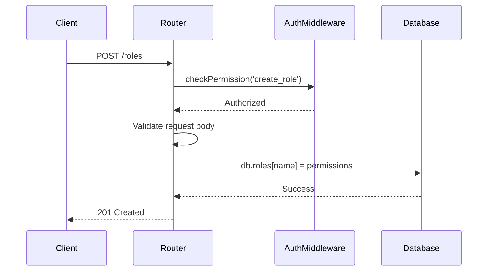
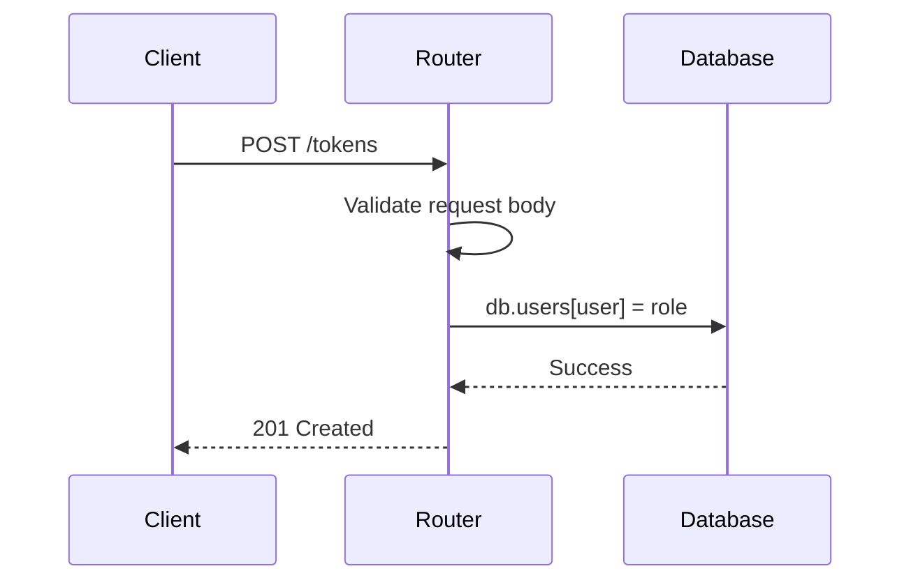

<details>
<summary>Relevant source files</summary>

The following files were used as context for generating this wiki page:

- [src/routes.js](https://github.com/aanickode/access-control-service/blob/main/src/routes.js)
- [docs/api.md](https://github.com/aanickode/access-control-service/blob/main/docs/api.md)
</details>

# API Endpoints

## Introduction

The API Endpoints module provides a set of routes and handlers for managing user roles, permissions, and access tokens within the application. It serves as the primary interface for interacting with the access control system, allowing authorized users to view, create, and manage user roles and permissions.

Sources: [src/routes.js](), [docs/api.md]()

## Route Handlers

### GET /users

This endpoint retrieves a list of all registered users and their associated roles.

```mermaid
graph TD
    Client-->|GET /users|Router
    Router-->|checkPermission('view_users')|AuthMiddleware
    AuthMiddleware-->|Authorized|Router
    Router-->|res.json()|Client
```

- The `checkPermission('view_users')` middleware function is used to ensure that only authorized users with the `view_users` permission can access this endpoint.
- The response is a JSON array containing objects with the user's email and role.

Sources: [src/routes.js:6-8]()

### POST /roles

This endpoint allows authorized users to create a new role with a set of permissions.



- The `checkPermission('create_role')` middleware function ensures that only authorized users with the `create_role` permission can access this endpoint.
- The request body must contain a `name` (string) and `permissions` (array) for the new role.
- If the request body is valid, the new role and its permissions are stored in the `db.roles` object.

Sources: [src/routes.js:10-16]()

### GET /permissions

This endpoint retrieves a list of all defined roles and their associated permissions.

```mermaid
graph TD
    Client-->|GET /permissions|Router
    Router-->|checkPermission('view_permissions')|AuthMiddleware
    AuthMiddleware-->|Authorized|Router
    Router-->|res.json(db.roles)|Client
```

- The `checkPermission('view_permissions')` middleware function ensures that only authorized users with the `view_permissions` permission can access this endpoint.
- The response is a JSON object containing all roles and their associated permissions stored in the `db.roles` object.

Sources: [src/routes.js:18-20]()

### POST /tokens

This endpoint allows users to create an access token by providing their user and role information.



- The request body must contain a `user` (string) and `role` (string) for the new access token.
- If the request body is valid, the user and their associated role are stored in the `db.users` object.
- No authentication or authorization is required for this endpoint.

Sources: [src/routes.js:22-28]()

## Data Models

### Users

The `db.users` object stores user information, mapping user emails to their assigned roles.

| Field | Type   | Description                    |
|-------|--------|--------------------------------|
| email | string | The user's email address (key) |
| role  | string | The user's assigned role       |

Sources: [src/routes.js:7]()

### Roles

The `db.roles` object stores role definitions, mapping role names to their associated permissions.

| Field       | Type    | Description                                |
|-------------|---------|-------------------------------------------|
| name        | string  | The name of the role (key)                |
| permissions | string[] | An array of permissions granted to the role |

Sources: [src/routes.js:14]()

## Conclusion

The API Endpoints module provides a simple yet functional interface for managing user roles, permissions, and access tokens within the application. It follows a RESTful design and leverages middleware functions for authentication and authorization. While the current implementation uses in-memory data storage, it can be extended to integrate with a persistent database or other data sources as needed.

Sources: [src/routes.js](), [docs/api.md]()