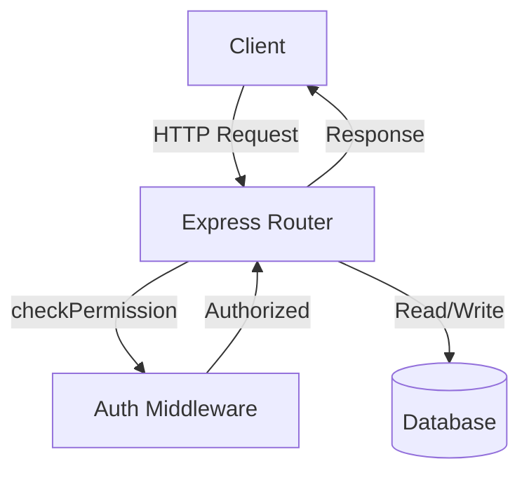
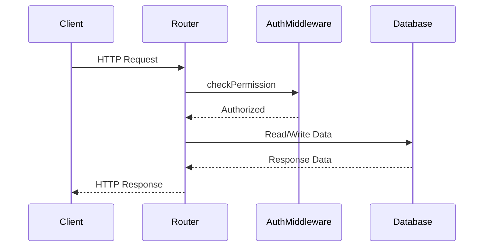

<details>
<summary>Relevant source files</summary>

The following files were used as context for generating this wiki page:

- [src/routes.js](https://github.com/aanickode/access-control-service/blob/main/src/routes.js)
- [docs/api.md](https://github.com/aanickode/access-control-service/blob/main/docs/api.md)
</details>

# API Endpoints

## Introduction

This wiki page covers the API endpoints provided by the access control service. The service manages user roles, permissions, and authentication tokens within an application. It exposes a set of RESTful endpoints to perform CRUD operations on users, roles, and permissions.

Sources: [src/routes.js](), [docs/api.md]()

## Endpoint: `/users`

### Overview

The `/users` endpoint allows authorized users to retrieve a list of all registered users and their associated roles.

Sources: [src/routes.js:6]()

### Request

```
GET /users
```

#### Required Permission

To access this endpoint, the user must have the `view_users` permission.

Sources: [src/routes.js:6]()

### Response

```json
[
  { "email": "user1@example.com", "role": "admin" },
  { "email": "user2@example.com", "role": "editor" },
  ...
]
```

The response is a JSON array containing objects with the `email` and `role` properties for each registered user.

Sources: [src/routes.js:7]()

## Endpoint: `/roles`

### Overview

The `/roles` endpoint allows authorized users to create new roles by defining their names and associated permissions.

Sources: [src/routes.js:10]()

### Request

```
POST /roles
```

#### Request Body

```json
{
  "name": "manager",
  "permissions": ["view_users", "create_role"]
}
```

The request body must contain a `name` property (string) for the new role and a `permissions` property (array of strings) listing the permissions associated with the role.

Sources: [src/routes.js:11-13]()

#### Required Permission

To access this endpoint, the user must have the `create_role` permission.

Sources: [src/routes.js:10]()

### Response

```json
{
  "role": "manager",
  "permissions": ["view_users", "create_role"]
}
```

The response is a JSON object containing the `role` name and `permissions` array for the newly created role.

Sources: [src/routes.js:15]()

## Endpoint: `/permissions`

### Overview

The `/permissions` endpoint allows authorized users to retrieve a list of all defined roles and their associated permissions.

Sources: [src/routes.js:17]()

### Request

```
GET /permissions
```

#### Required Permission

To access this endpoint, the user must have the `view_permissions` permission.

Sources: [src/routes.js:17]()

### Response

```json
{
  "admin": ["view_users", "create_role", "view_permissions"],
  "editor": ["view_users"],
  ...
}
```

The response is a JSON object where the keys are role names, and the values are arrays of permissions associated with each role.

Sources: [src/routes.js:18]()

## Endpoint: `/tokens`

### Overview

The `/tokens` endpoint allows users to create an authentication token by providing their user identifier and role.

Sources: [src/routes.js:20]()

### Request

```
POST /tokens
```

#### Request Body

```json
{
  "user": "user1@example.com",
  "role": "admin"
}
```

The request body must contain a `user` property (string) representing the user identifier and a `role` property (string) specifying the user's role.

Sources: [src/routes.js:21-23]()

### Response

```json
{
  "user": "user1@example.com",
  "role": "admin"
}
```

The response is a JSON object containing the `user` identifier and `role` for which the authentication token was generated.

Sources: [src/routes.js:24]()

## Data Flow Diagram



The diagram illustrates the data flow for the API endpoints:

1. The client sends an HTTP request to the Express Router.
2. The Router passes the request through the `checkPermission` middleware for authentication and authorization.
3. If authorized, the middleware allows the request to proceed to the appropriate route handler.
4. The route handler interacts with the database to read or write data based on the request.
5. The route handler sends the response back to the client through the Router.

Sources: [src/routes.js]()

## Sequence Diagram



The sequence diagram illustrates the flow of a typical API request:

1. The client sends an HTTP request to the Router.
2. The Router invokes the `checkPermission` middleware for authentication and authorization.
3. If authorized, the middleware returns control to the Router.
4. The Router interacts with the Database to read or write data based on the request.
5. The Database returns the requested data or a success response to the Router.
6. The Router sends the final HTTP response back to the client.

Sources: [src/routes.js]()

## Role and Permission Management

The access control service manages roles and their associated permissions. Roles are defined with a name and a list of permissions. The following table summarizes the available roles and permissions based on the provided source files:

| Role | Permissions |
| --- | --- |
| admin | `view_users`, `create_role`, `view_permissions` |
| editor | `view_users` |

Sources: [src/routes.js:7,15,18]()

## API Endpoint Summary

| Endpoint | Method | Description | Required Permission |
| --- | --- | --- | --- |
| `/users` | GET | Retrieve a list of registered users and their roles | `view_users` |
| `/roles` | POST | Create a new role with a name and associated permissions | `create_role` |
| `/permissions` | GET | Retrieve a list of defined roles and their associated permissions | `view_permissions` |
| `/tokens` | POST | Create an authentication token for a user with a specified role | None |

Sources: [src/routes.js:6,10,17,20]()

## Conclusion

This wiki page covered the API endpoints provided by the access control service, including their functionality, request/response formats, required permissions, and data flow diagrams. The service manages user roles, permissions, and authentication tokens, allowing authorized users to perform CRUD operations on these entities through a RESTful API.

Sources: [src/routes.js](), [docs/api.md]()