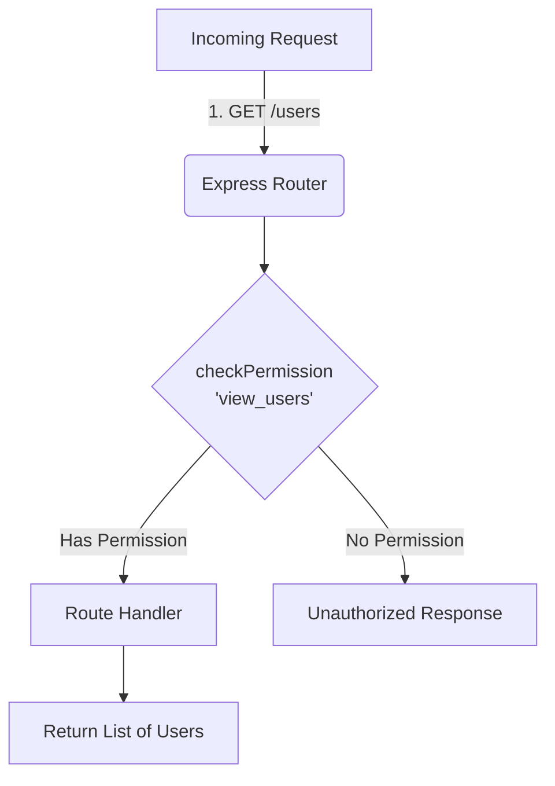
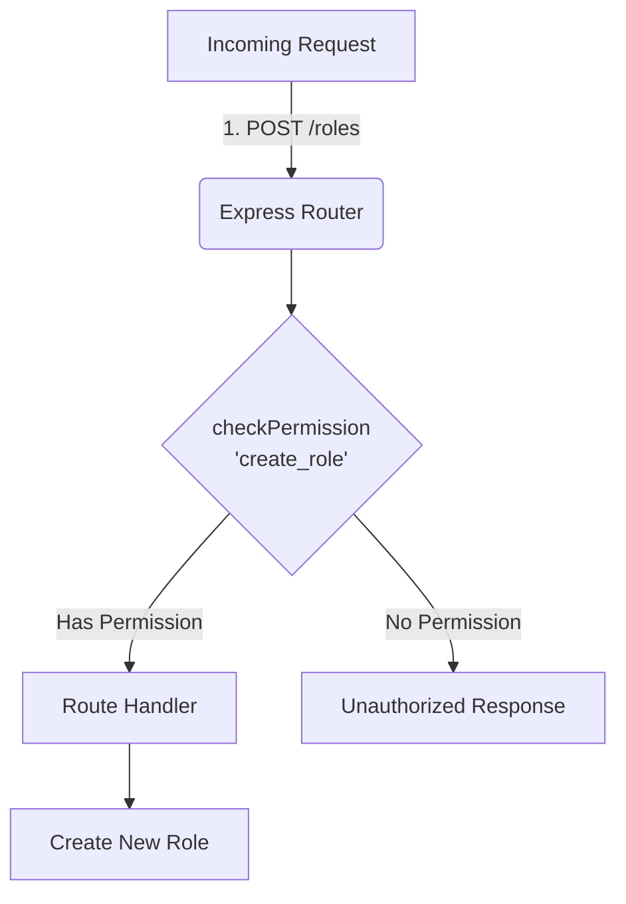
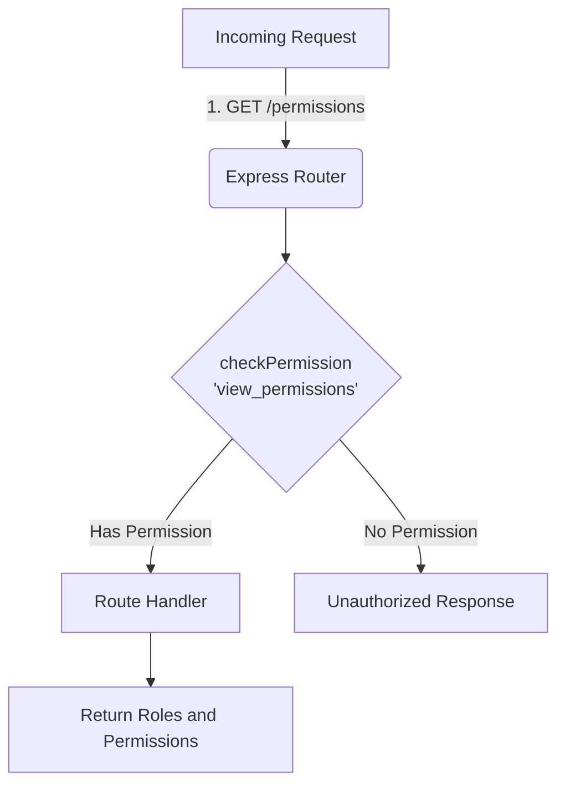
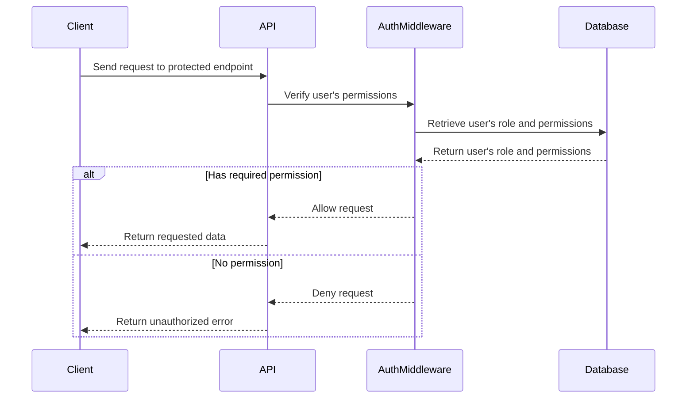

<details>
<summary>Relevant source files</summary>

The following files were used as context for generating this wiki page:

- [src/routes.js](https://github.com/aanickode/access-control-service/blob/main/src/routes.js)
- [docs/api.md](https://github.com/aanickode/access-control-service/blob/main/docs/api.md)
</details>

# API Endpoints

## Introduction

This wiki page provides an overview of the API endpoints implemented in the project. The API endpoints serve as the primary interface for interacting with the system's functionality, such as managing users, roles, and permissions. These endpoints handle HTTP requests and respond with appropriate data or status codes based on the requested operation.

Sources: [src/routes.js](), [docs/api.md]()

## Endpoint: `/users`

### Description

The `/users` endpoint retrieves a list of all registered users and their associated roles.

### Method and URL

```
GET /users
```

### Authentication and Authorization

This endpoint requires the `view_users` permission. The `checkPermission` middleware function is used to verify the user's authorization before executing the route handler.



Sources: [src/routes.js:6-9]()

### Response

If the user has the required permission, the endpoint responds with a JSON array containing the email and role of each registered user.

```json
[
  { "email": "user1@example.com", "role": "admin" },
  { "email": "user2@example.com", "role": "editor" },
  ...
]
```

Sources: [src/routes.js:8]()

## Endpoint: `/roles`

### Description

The `/roles` endpoint allows authorized users to create new roles by defining their names and associated permissions.

### Method and URL

```
POST /roles
```

### Authentication and Authorization

This endpoint requires the `create_role` permission. The `checkPermission` middleware function is used to verify the user's authorization before executing the route handler.



Sources: [src/routes.js:11-18]()

### Request Body

The request body should be a JSON object with the following properties:

- `name` (string): The name of the new role.
- `permissions` (array): An array of permission strings associated with the new role.

```json
{
  "name": "editor",
  "permissions": ["edit_content", "publish_content"]
}
```

Sources: [src/routes.js:12-13]()

### Response

If the request is valid and the user has the required permission, the endpoint responds with a JSON object containing the newly created role and its associated permissions.

```json
{
  "role": "editor",
  "permissions": ["edit_content", "publish_content"]
}
```

Sources: [src/routes.js:17]()

## Endpoint: `/permissions`

### Description

The `/permissions` endpoint retrieves a list of all defined roles and their associated permissions.

### Method and URL

```
GET /permissions
```

### Authentication and Authorization

This endpoint requires the `view_permissions` permission. The `checkPermission` middleware function is used to verify the user's authorization before executing the route handler.



Sources: [src/routes.js:20-23]()

### Response

If the user has the required permission, the endpoint responds with a JSON object containing the defined roles as keys and their associated permissions as values.

```json
{
  "admin": ["view_users", "create_role", "view_permissions"],
  "editor": ["edit_content", "publish_content"],
  ...
}
```

Sources: [src/routes.js:22]()

## Endpoint: `/tokens`

### Description

The `/tokens` endpoint allows users to obtain an access token by providing their user and role information.

### Method and URL

```
POST /tokens
```

### Request Body

The request body should be a JSON object with the following properties:

- `user` (string): The user's identifier (e.g., email address).
- `role` (string): The role associated with the user.

```json
{
  "user": "user1@example.com",
  "role": "admin"
}
```

Sources: [src/routes.js:25-30]()

### Response

If the request is valid, the endpoint responds with a JSON object containing the user and their associated role.

```json
{
  "user": "user1@example.com",
  "role": "admin"
}
```

Sources: [src/routes.js:31]()

## Sequence Diagram: User Authentication Flow

The following sequence diagram illustrates the high-level flow of user authentication and authorization when accessing a protected API endpoint:



Sources: [src/routes.js]()

## Conclusion

This wiki page covered the API endpoints implemented in the project, including their URLs, HTTP methods, request/response formats, authentication and authorization requirements, and high-level data flow. The endpoints provide functionality for managing users, roles, permissions, and access tokens within the system.

Sources: [src/routes.js](), [docs/api.md]()