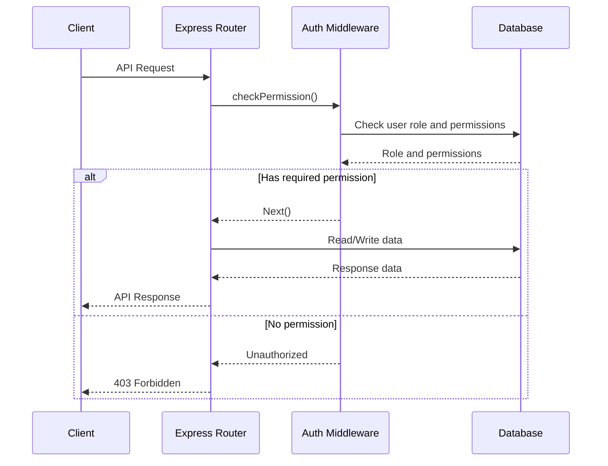

<details>
<summary>Relevant source files</summary>

The following files were used as context for generating this wiki page:

- [src/routes.js](https://github.com/aanickode/access-control-service/blob/main/src/routes.js)
- [docs/api.md](https://github.com/aanickode/access-control-service/blob/main/docs/api.md)
- [src/authMiddleware.js](https://github.com/aanickode/access-control-service/blob/main/src/authMiddleware.js)
- [src/db.js](https://github.com/aanickode/access-control-service/blob/main/src/db.js)
- [src/app.js](https://github.com/aanickode/access-control-service/blob/main/src/app.js)

</details>

# API Endpoints

## Introduction

This wiki page provides an overview of the API endpoints implemented in the access control service project. The service manages user roles, permissions, and authentication tokens, allowing for secure access control within an application or system.

The API endpoints are defined in the `src/routes.js` file and are built using the Express.js framework for Node.js. The service utilizes an in-memory database (`src/db.js`) to store user roles, permissions, and authentication tokens.

Sources: [src/routes.js](), [docs/api.md](), [src/db.js]()

## Endpoint: `/users`

### Description

The `/users` endpoint retrieves a list of all registered users and their associated roles.

### Method and URL

```
GET /users
```

### Access Control

This endpoint requires the `view_users` permission to access. The `checkPermission` middleware function from `src/authMiddleware.js` is used to enforce this requirement.

```javascript
router.get('/users', checkPermission('view_users'), (req, res) => {
  // ...
});
```

Sources: [src/routes.js:6-8](), [src/authMiddleware.js]()

### Response

The response is a JSON array containing objects with the `email` and `role` properties for each registered user.

```json
[
  { "email": "user1@example.com", "role": "admin" },
  { "email": "user2@example.com", "role": "editor" },
  { "email": "user3@example.com", "role": "viewer" }
]
```

Sources: [src/routes.js:9]()

## Endpoint: `/roles`

### Description

The `/roles` endpoint allows authorized users to create new roles with associated permissions.

### Method and URL

```
POST /roles
```

### Access Control

This endpoint requires the `create_role` permission to access. The `checkPermission` middleware function from `src/authMiddleware.js` is used to enforce this requirement.

```javascript
router.post('/roles', checkPermission('create_role'), (req, res) => {
  // ...
});
```

Sources: [src/routes.js:12](), [src/authMiddleware.js]()

### Request Body

The request body should be a JSON object with the following properties:

- `name` (string): The name of the new role.
- `permissions` (array): An array of permission strings associated with the new role.

Example request body:

```json
{
  "name": "manager",
  "permissions": ["view_users", "create_user"]
}
```

Sources: [src/routes.js:13-14]()

### Response

If the request is successful, the response will have a status code of `201 Created` and a JSON object containing the new role's `name` and `permissions`.

```json
{
  "role": "manager",
  "permissions": ["view_users", "create_user"]
}
```

If the request body is invalid (missing `name` or `permissions` array), the response will have a status code of `400 Bad Request` and a JSON object with an error message.

```json
{
  "error": "Invalid role definition"
}
```

Sources: [src/routes.js:13-19]()

## Endpoint: `/permissions`

### Description

The `/permissions` endpoint retrieves a list of all defined roles and their associated permissions.

### Method and URL

```
GET /permissions
```

### Access Control

This endpoint requires the `view_permissions` permission to access. The `checkPermission` middleware function from `src/authMiddleware.js` is used to enforce this requirement.

```javascript
router.get('/permissions', checkPermission('view_permissions'), (req, res) => {
  // ...
});
```

Sources: [src/routes.js:21](), [src/authMiddleware.js]()

### Response

The response is a JSON object where the keys are role names, and the values are arrays of permission strings associated with each role.

```json
{
  "admin": ["view_users", "create_role", "view_permissions"],
  "editor": ["view_users", "create_user"],
  "viewer": ["view_users"]
}
```

Sources: [src/routes.js:22]()

## Endpoint: `/tokens`

### Description

The `/tokens` endpoint allows users to obtain an authentication token by providing their user and role information.

### Method and URL

```
POST /tokens
```

### Request Body

The request body should be a JSON object with the following properties:

- `user` (string): The user's identifier (e.g., email address).
- `role` (string): The role associated with the user.

Example request body:

```json
{
  "user": "user1@example.com",
  "role": "admin"
}
```

Sources: [src/routes.js:24-25]()

### Response

If the request is successful, the response will have a status code of `201 Created` and a JSON object containing the `user` and `role` properties.

```json
{
  "user": "user1@example.com",
  "role": "admin"
}
```

If the request body is invalid (missing `user` or `role`), the response will have a status code of `400 Bad Request` and a JSON object with an error message.

```json
{
  "error": "Missing user or role"
}
```

Sources: [src/routes.js:24-30]()

## Sequence Diagram: API Request Flow



This sequence diagram illustrates the flow of an API request through the Express router, authentication middleware, and database interactions.

1. The client sends an API request to the Express router.
2. The router invokes the `checkPermission` middleware function from `src/authMiddleware.js`.
3. The middleware checks the user's role and required permissions against the in-memory database (`src/db.js`).
4. If the user has the required permission, the middleware allows the request to proceed to the router's handler function.
5. The router handler function reads or writes data to the database as needed.
6. The database responds with the requested data or a success status.
7. The router sends the appropriate API response back to the client.
8. If the user lacks the required permission, the middleware returns an "Unauthorized" response, and the router sends a `403 Forbidden` status to the client.

Sources: [src/routes.js](), [src/authMiddleware.js](), [src/db.js]()

## Conclusion

This wiki page covered the API endpoints implemented in the access control service project, including their descriptions, access control requirements, request and response formats, and relevant code snippets. The page also included a sequence diagram illustrating the flow of API requests through the Express router, authentication middleware, and database interactions.

By following the information provided in this wiki page, developers can understand the functionality and usage of the API endpoints, as well as the underlying architecture and data flow of the access control service.

Sources: [src/routes.js](), [docs/api.md](), [src/authMiddleware.js](), [src/db.js](), [src/app.js]()