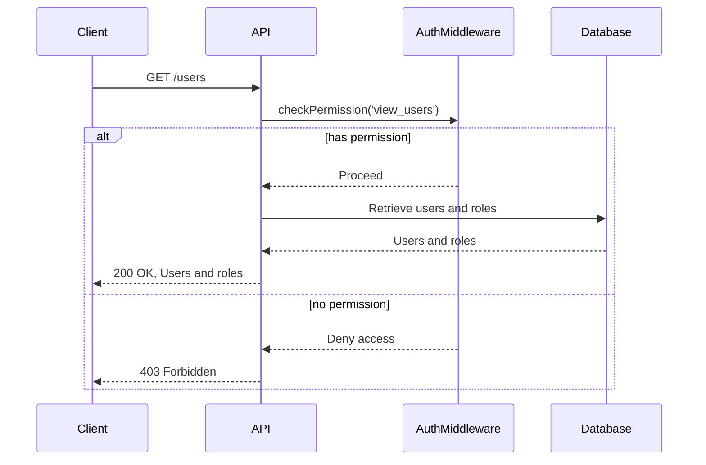
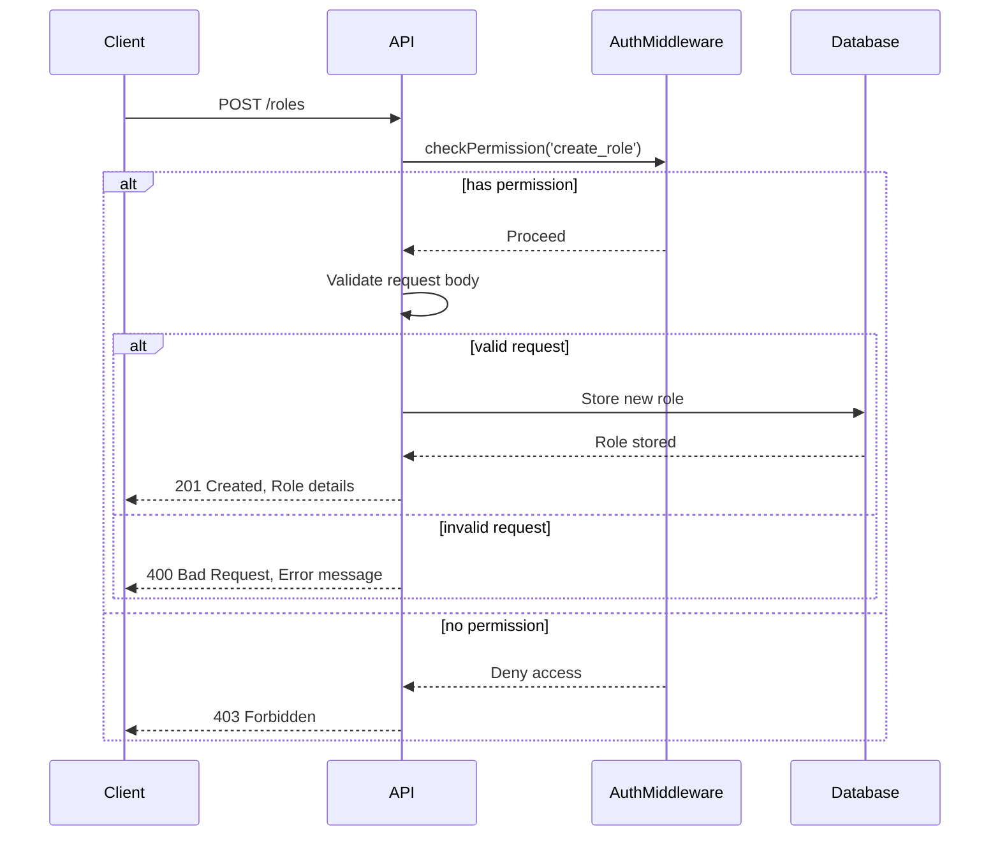
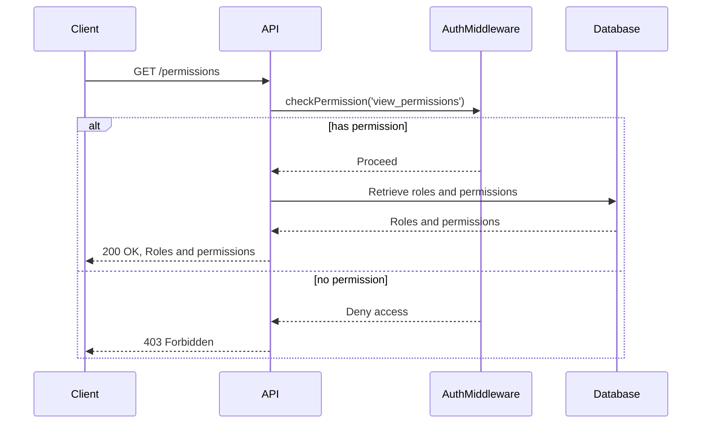
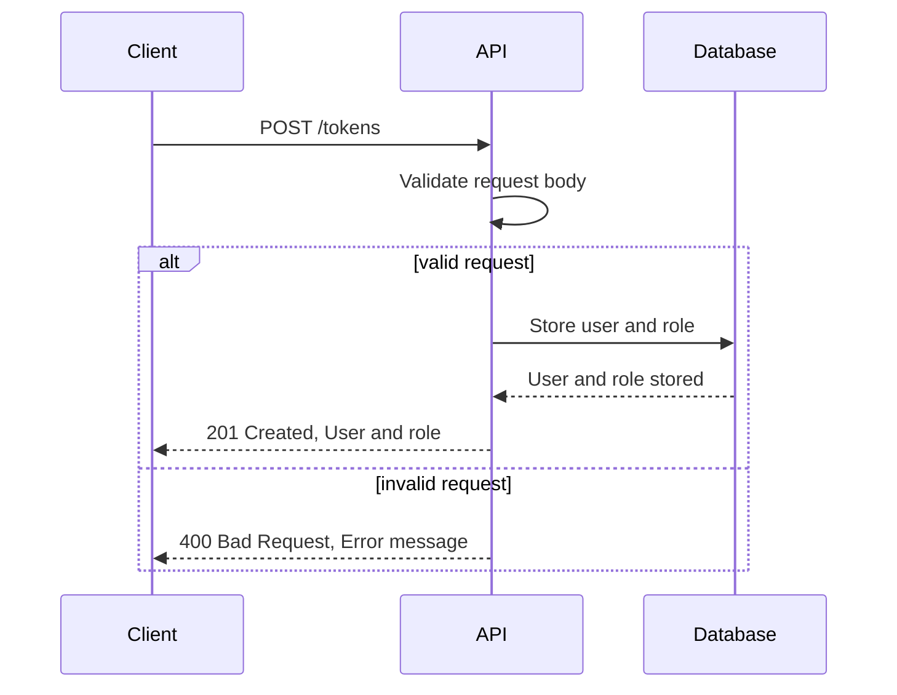
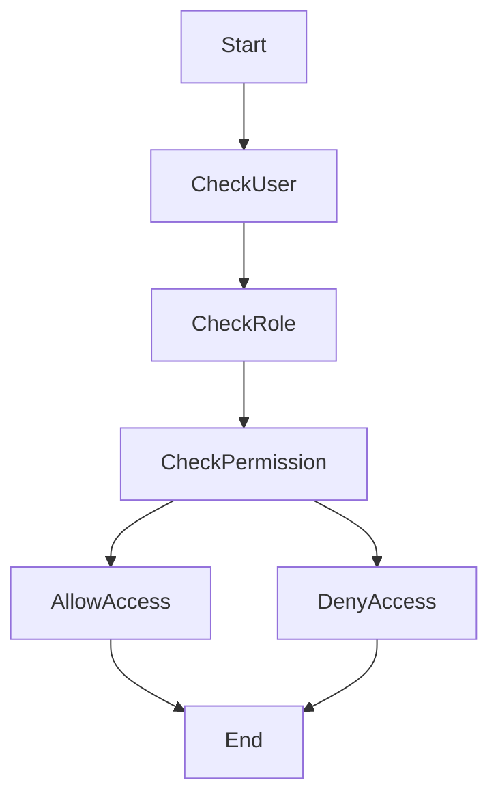

Relevant source files

The following files were used as context for generating this wiki page:

- [src/routes.js](https://github.com/aanickode/access-control-service/blob/main/src/routes.js)
- [docs/api.md](https://github.com/aanickode/access-control-service/blob/main/docs/api.md)

# API Endpoints

## Introduction

The API Endpoints module provides a set of routes and handlers for managing user roles, permissions, and access tokens within the application. It allows authorized users to view and create roles, view permissions, and generate access tokens for specific users and roles. This module plays a crucial role in implementing access control and authorization mechanisms for the overall project.

Sources: [src/routes.js](), [docs/api.md]()

## Route Handlers

### GET /users

This endpoint retrieves a list of all registered users and their associated roles.

This endpoint requires the `view_users` permission to access. It retrieves the list of users and their roles from the in-memory database and returns them as a JSON response.

Sources: [src/routes.js:6-9]()

### POST /roles

This endpoint allows authorized users to create a new role with a set of permissions.

This endpoint requires the `create_role` permission to access. It expects a JSON request body with a `name` and `permissions` array. If the request is valid, it stores the new role and its permissions in the in-memory database and returns the created role details.

Sources: [src/routes.js:11-18]()

### GET /permissions

This endpoint retrieves a list of all defined roles and their associated permissions.

This endpoint requires the `view_permissions` permission to access. It retrieves the roles and their associated permissions from the in-memory database and returns them as a JSON response.

Sources: [src/routes.js:20-23]()

### POST /tokens

This endpoint generates an access token for a given user and role.

This endpoint does not require any specific permission. It expects a JSON request body with a `user` and `role`. If the request is valid, it stores the user and their associated role in the in-memory database and returns the user and role details.

Sources: [src/routes.js:25-32]()

## Data Models

| Model | Description |
| --- | --- |
| `db.users` | An object mapping user emails to their assigned roles. |
| `db.roles` | An object mapping role names to their associated permissions (array of strings). |

Sources: [src/routes.js:3](), [src/routes.js:15]()

## Access Control Middleware

The `checkPermission` middleware function is used to enforce access control for certain routes based on the user's assigned role and the required permissions.

1. The middleware checks if the user is authenticated and has a valid role assigned.
2. It retrieves the user's role from the in-memory database.
3. It checks if the user's role has the required permission for the requested route.
4. If the user has the required permission, the middleware allows access to the route.
5. If the user does not have the required permission, the middleware denies access and returns a 403 Forbidden response.

Sources: [src/routes.js:6,12,21](), [src/authMiddleware.js]()

## Conclusion

The API Endpoints module provides a set of routes and handlers for managing user roles, permissions, and access tokens within the application. It implements access control mechanisms to ensure that only authorized users can perform certain actions based on their assigned roles and permissions. The module utilizes an in-memory database to store user and role information, and it provides endpoints for creating roles, viewing permissions, and generating access tokens.

Sources: [src/routes.js](), [docs/api.md]()