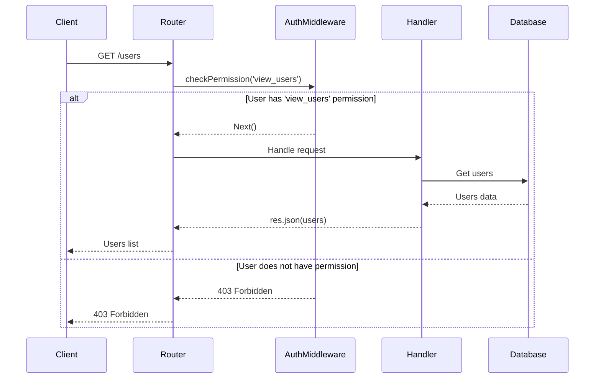
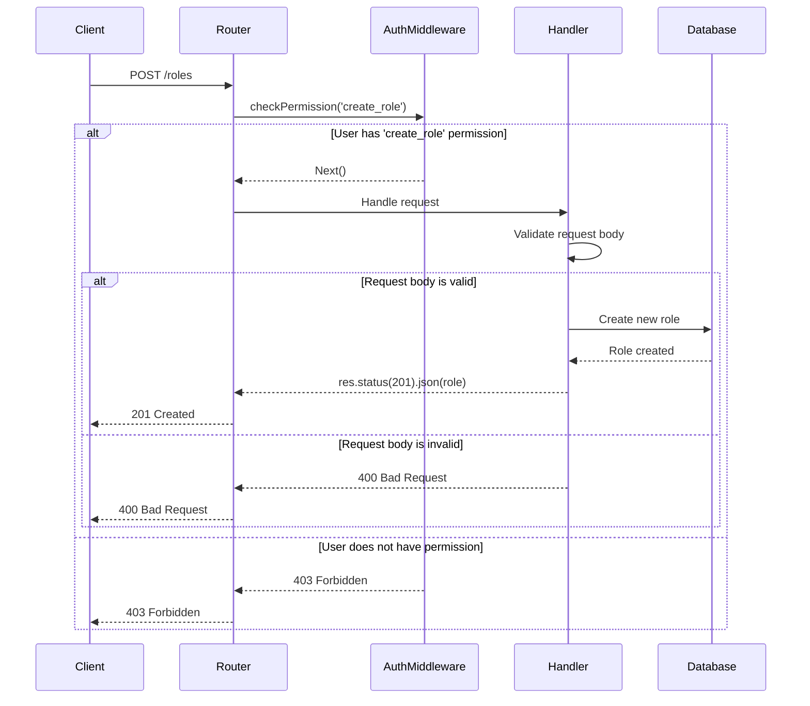
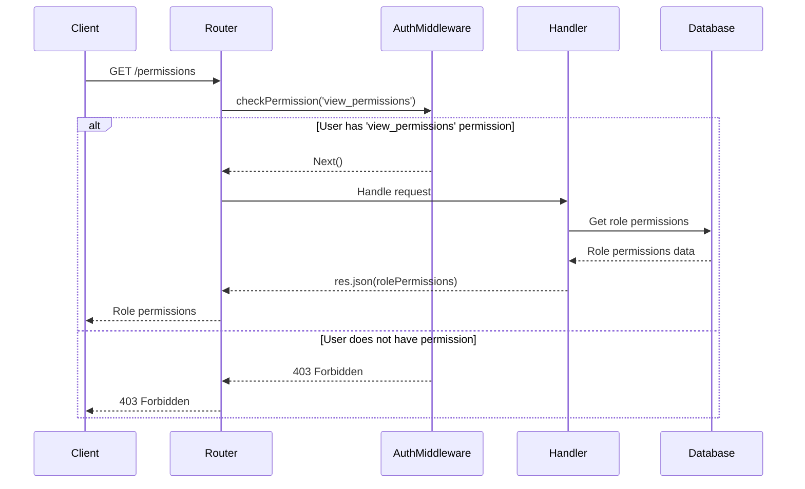
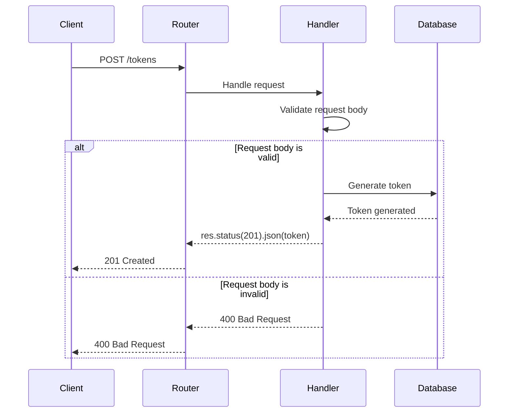

<details>
<summary>Relevant source files</summary>

The following files were used as context for generating this wiki page:

- [src/routes.js](https://github.com/aanickode/access-control-service/blob/main/src/routes.js)
- [docs/api.md](https://github.com/aanickode/access-control-service/blob/main/docs/api.md)
</details>

# API Endpoints

## Introduction

The API Endpoints module provides a set of routes and handlers for managing user roles, permissions, and authentication tokens within the access control system. It allows authorized users to view and create roles, view permissions, and generate authentication tokens for specific users and roles.

Sources: [src/routes.js](), [docs/api.md]()

## Route Handlers

### GET /users

This endpoint retrieves a list of all registered users and their associated roles.

#### Flow

```mermaid
graph TD
    A[Client] -->|GET /users| B[Express Router]
    B -->|checkPermission('view_users')| C[Middleware]
    C -->|Allowed| D[Handler]
    D -->|res.json| E[User List]
    E -->|Response| A
    C -->|Denied| F[403 Forbidden]
    F -->|Response| A
```

1. The client sends a GET request to the `/users` endpoint.
2. The Express router passes the request to the `checkPermission('view_users')` middleware.
3. If the user has the `view_users` permission, the middleware allows the request to proceed to the handler function.
4. The handler function retrieves the list of users and their roles from the in-memory database (`db.users`).
5. The user list is sent back to the client as a JSON response.
6. If the user does not have the `view_users` permission, the middleware returns a 403 Forbidden response.

Sources: [src/routes.js:6-9]()

### POST /roles

This endpoint allows authorized users to create new roles with a set of permissions.

#### Request Body

| Field       | Type     | Description                    |
|-------------|----------|--------------------------------|
| `name`      | `string` | The name of the new role.      |
| `permissions` | `array`  | An array of permission strings. |

#### Flow

```mermaid
graph TD
    A[Client] -->|POST /roles| B[Express Router]
    B -->|checkPermission('create_role')| C[Middleware]
    C -->|Allowed| D[Handler]
    D -->|Validate Request Body| E[Request Validation]
    E -->|Valid| F[Create Role]
    F -->|res.status(201).json| G[Role Created]
    G -->|Response| A
    E -->|Invalid| H[400 Bad Request]
    H -->|Response| A
    C -->|Denied| I[403 Forbidden]
    I -->|Response| A
```

1. The client sends a POST request to the `/roles` endpoint with the role definition in the request body.
2. The Express router passes the request to the `checkPermission('create_role')` middleware.
3. If the user has the `create_role` permission, the middleware allows the request to proceed to the handler function.
4. The handler function validates the request body, ensuring that the `name` and `permissions` fields are present and valid.
5. If the request body is valid, the new role is created in the in-memory database (`db.roles`).
6. A 201 Created response is sent back to the client with the new role definition.
7. If the request body is invalid, a 400 Bad Request response is sent back to the client.
8. If the user does not have the `create_role` permission, the middleware returns a 403 Forbidden response.

Sources: [src/routes.js:10-18]()

### GET /permissions

This endpoint retrieves a list of all defined roles and their associated permissions.

#### Flow

```mermaid
graph TD
    A[Client] -->|GET /permissions| B[Express Router]
    B -->|checkPermission('view_permissions')| C[Middleware]
    C -->|Allowed| D[Handler]
    D -->|res.json| E[Role Permissions]
    E -->|Response| A
    C -->|Denied| F[403 Forbidden]
    F -->|Response| A
```

1. The client sends a GET request to the `/permissions` endpoint.
2. The Express router passes the request to the `checkPermission('view_permissions')` middleware.
3. If the user has the `view_permissions` permission, the middleware allows the request to proceed to the handler function.
4. The handler function retrieves the role permissions from the in-memory database (`db.roles`).
5. The role permissions are sent back to the client as a JSON response.
6. If the user does not have the `view_permissions` permission, the middleware returns a 403 Forbidden response.

Sources: [src/routes.js:19-22]()

### POST /tokens

This endpoint generates an authentication token for a specific user and role.

#### Request Body

| Field  | Type     | Description                    |
|--------|----------|--------------------------------|
| `user` | `string` | The email or username of the user. |
| `role` | `string` | The name of the role to assign to the user. |

#### Flow

```mermaid
graph TD
    A[Client] -->|POST /tokens| B[Express Router]
    B -->|Handler| C[Request Validation]
    C -->|Valid| D[Generate Token]
    D -->|res.status(201).json| E[Token Created]
    E -->|Response| A
    C -->|Invalid| F[400 Bad Request]
    F -->|Response| A
```

1. The client sends a POST request to the `/tokens` endpoint with the user and role information in the request body.
2. The Express router passes the request to the handler function.
3. The handler function validates the request body, ensuring that the `user` and `role` fields are present.
4. If the request body is valid, a new authentication token is generated by assigning the specified role to the user in the in-memory database (`db.users`).
5. A 201 Created response is sent back to the client with the user and role information.
6. If the request body is invalid, a 400 Bad Request response is sent back to the client.

Sources: [src/routes.js:23-31]()

## Data Models

### Users

The `db.users` object stores user information, mapping user emails or usernames to their assigned roles.

```javascript
const db = {
  users: {
    'user1@example.com': 'admin',
    'user2@example.com': 'viewer',
    // ...
  },
  // ...
}
```

Sources: [src/routes.js:7](), [src/routes.js:27]()

### Roles

The `db.roles` object stores role definitions, mapping role names to an array of associated permissions.

```javascript
const db = {
  // ...
  roles: {
    'admin': ['view_users', 'create_role', 'view_permissions'],
    'viewer': ['view_permissions'],
    // ...
  },
}
```

Sources: [src/routes.js:15]()

## Sequence Diagrams

### GET /users



This sequence diagram illustrates the flow of the `GET /users` endpoint, which retrieves a list of all registered users and their associated roles. The client sends a GET request to the `/users` endpoint, which is handled by the Express router. The router passes the request to the `checkPermission('view_users')` middleware, which checks if the user has the required `view_users` permission. If the user is authorized, the middleware allows the request to proceed to the handler function, which retrieves the user list from the in-memory database and sends it back to the client as a JSON response. If the user is not authorized, the middleware returns a 403 Forbidden response.

Sources: [src/routes.js:6-9]()

### POST /roles



This sequence diagram illustrates the flow of the `POST /roles` endpoint, which allows authorized users to create new roles with a set of permissions. The client sends a POST request to the `/roles` endpoint with the role definition in the request body. The Express router passes the request to the `checkPermission('create_role')` middleware, which checks if the user has the required `create_role` permission. If the user is authorized, the middleware allows the request to proceed to the handler function, which validates the request body. If the request body is valid, the new role is created in the in-memory database, and a 201 Created response is sent back to the client with the new role definition. If the request body is invalid, a 400 Bad Request response is sent back to the client. If the user is not authorized, the middleware returns a 403 Forbidden response.

Sources: [src/routes.js:10-18]()

### GET /permissions



This sequence diagram illustrates the flow of the `GET /permissions` endpoint, which retrieves a list of all defined roles and their associated permissions. The client sends a GET request to the `/permissions` endpoint, which is handled by the Express router. The router passes the request to the `checkPermission('view_permissions')` middleware, which checks if the user has the required `view_permissions` permission. If the user is authorized, the middleware allows the request to proceed to the handler function, which retrieves the role permissions from the in-memory database and sends them back to the client as a JSON response. If the user is not authorized, the middleware returns a 403 Forbidden response.

Sources: [src/routes.js:19-22]()

### POST /tokens



This sequence diagram illustrates the flow of the `POST /tokens` endpoint, which generates an authentication token for a specific user and role. The client sends a POST request to the `/tokens` endpoint with the user and role information in the request body. The Express router passes the request to the handler function, which validates the request body. If the request body is valid, a new authentication token is generated by assigning the specified role to the user in the in-memory database, and a 201 Created response is sent back to the client with the user and role information. If the request body is invalid, a 400 Bad Request response is sent back to the client.

Sources: [src/routes.js:23-31]()

## Conclusion

The API Endpoints module provides a set of routes and handlers for managing user roles, permissions, and authentication tokens within the access control system. It allows authorized users to view and create roles, view permissions, and generate authentication tokens for specific users and roles. The module follows a RESTful API design and uses an in-memory database to store user and role information. The routes are secured using a middleware function that checks for the required permissions before allowing access to the respective handlers.

Sources: [src/routes.js](), [docs/api.md]()