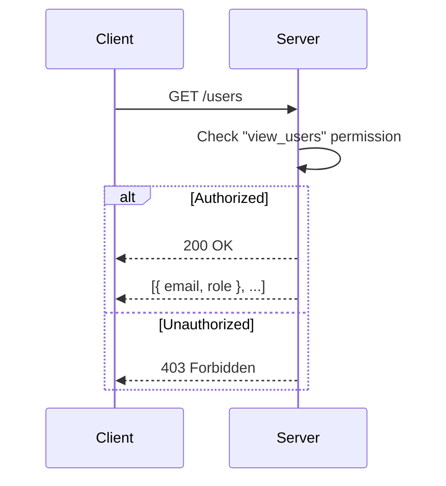
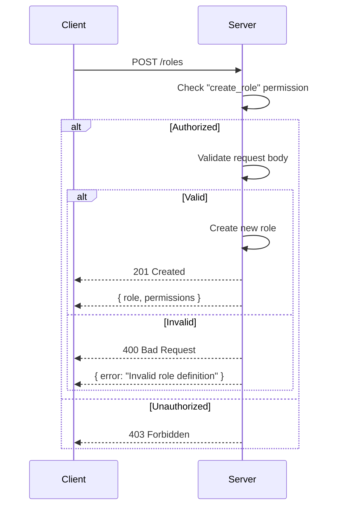
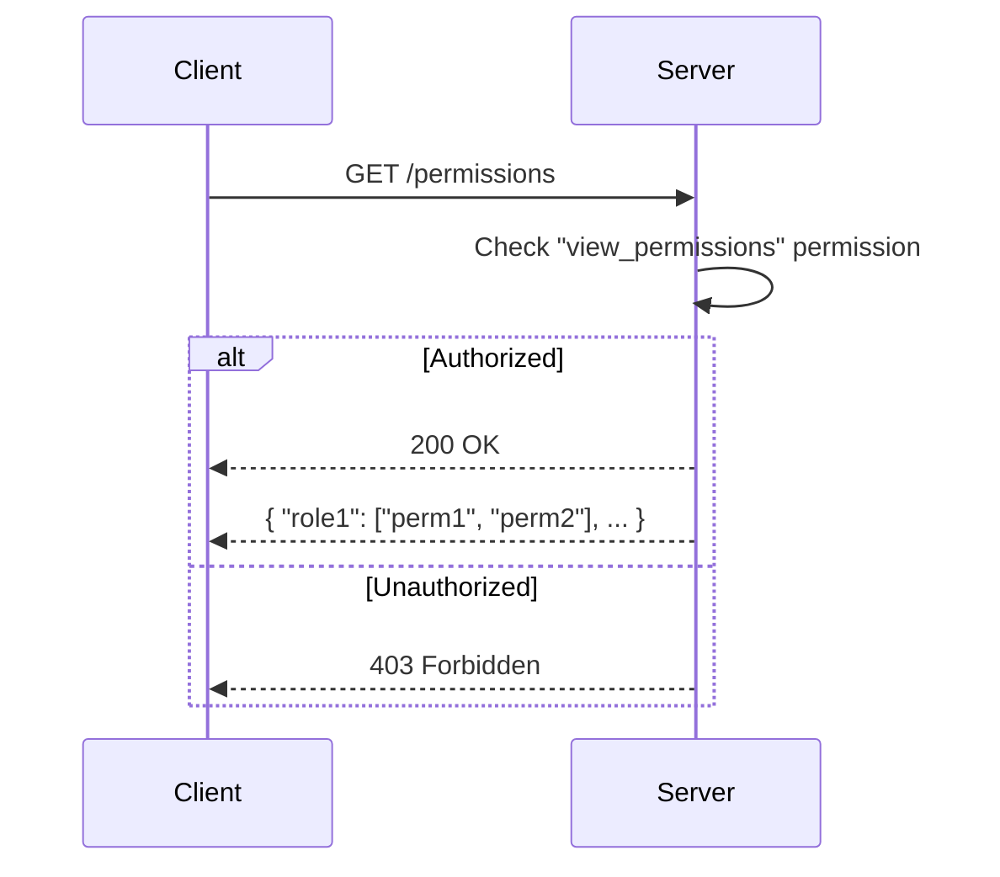
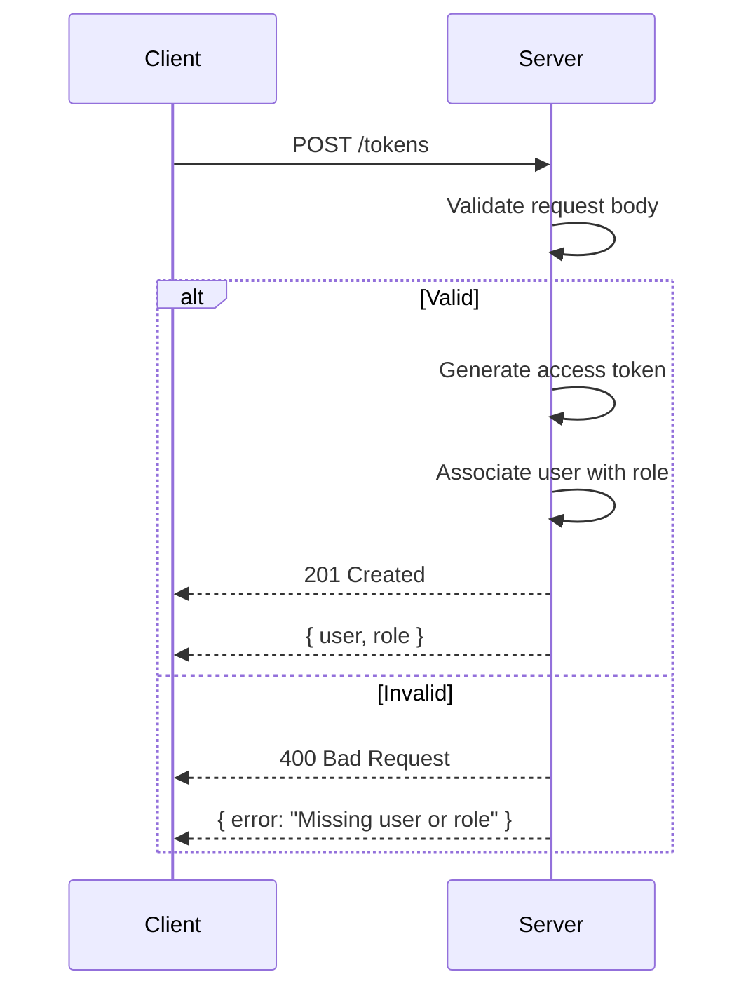

Relevant source files

The following files were used as context for generating this wiki page:

- [src/routes.js](https://github.com/aanickode/access-control-service/blob/main/src/routes.js)
- [docs/api.md](https://github.com/aanickode/access-control-service/blob/main/docs/api.md)

# API Endpoints

## Introduction

This wiki page covers the API endpoints implemented in the project, which provide a RESTful interface for managing user roles, permissions, and access tokens. The API endpoints handle operations such as retrieving user information, creating roles with associated permissions, viewing available permissions, and generating access tokens for users.

Sources: [src/routes.js](), [docs/api.md]()

## Endpoint: `/users`

### Overview

The `/users` endpoint allows authorized users with the `view_users` permission to retrieve a list of all registered users and their associated roles.

Sources: [src/routes.js:6-8]()

### Request

Sources: [src/routes.js:6-8]()

## Endpoint: `/roles`

### Overview

The `/roles` endpoint allows authorized users with the `create_role` permission to create a new role by specifying its name and associated permissions.

Sources: [src/routes.js:10-16]()

### Request

Sources: [src/routes.js:10-16]()

### Request Body

| Field       | Type   | Description                                |
|-------------|--------|--------------------------------------------
| `name`      | string | The name of the new role                  |
| `permissions` | array  | An array of permission strings for the role |

Sources: [src/routes.js:12]()

## Endpoint: `/permissions`

### Overview

The `/permissions` endpoint allows authorized users with the `view_permissions` permission to retrieve a list of all available roles and their associated permissions.

Sources: [src/routes.js:18-20]()

### Request

Sources: [src/routes.js:18-20]()

## Endpoint: `/tokens`

### Overview

The `/tokens` endpoint allows clients to generate an access token for a user by specifying the user's identifier and the role to be assigned.

Sources: [src/routes.js:22-28]()

### Request

Sources: [src/routes.js:22-28]()

### Request Body

| Field  | Type   | Description                        |
|--------|--------|--------------------------------------|
| `user` | string | The identifier of the user          |
| `role` | string | The role to be assigned to the user |

Sources: [src/routes.js:24]()

## Conclusion

This wiki page covered the API endpoints implemented in the project, including their functionality, request/response formats, and permission requirements. The endpoints provide a RESTful interface for managing user roles, permissions, and access tokens, enabling secure access control within the application.

Sources: [src/routes.js](), [docs/api.md]()