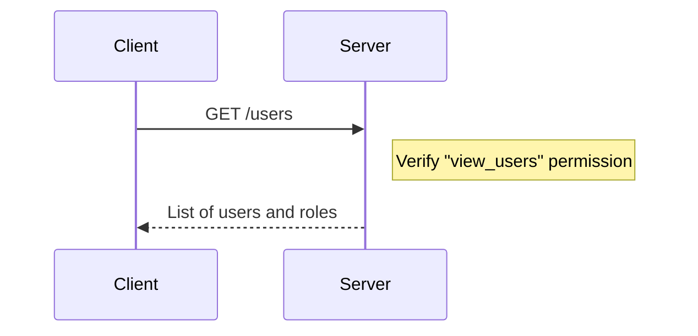
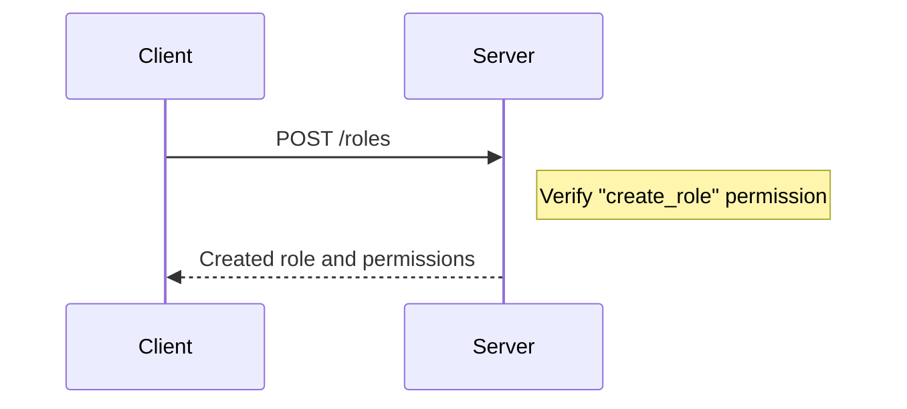
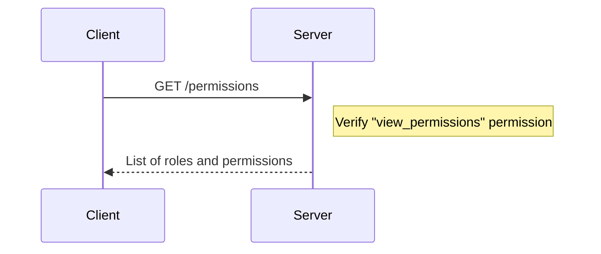
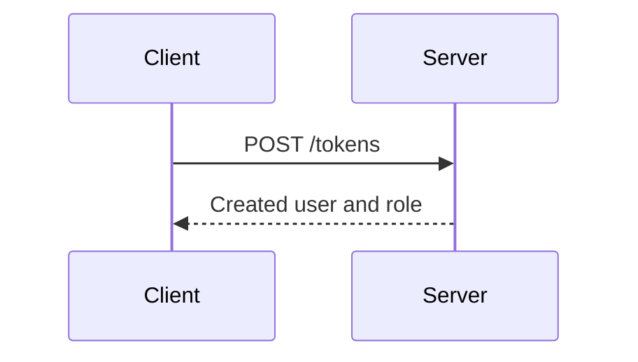
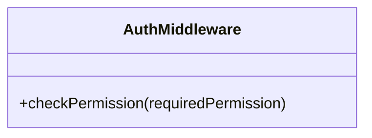
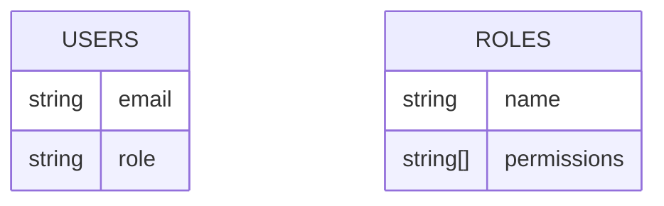

Relevant source files

The following files were used as context for generating this wiki page:

- [src/routes.js](https://github.com/aanickode/access-control-service/blob/main/src/routes.js)
- [docs/api.md](https://github.com/aanickode/access-control-service/blob/main/docs/api.md)

# API Endpoints

## Introduction

The API Endpoints module provides a set of routes and handlers for managing user roles, permissions, and access tokens within the application. It serves as the primary interface for interacting with the access control system, allowing authorized users to view, create, and manage user roles and permissions.

Sources: [src/routes.js](), [docs/api.md]()

## Route Handlers

### GET /users

This endpoint retrieves a list of all registered users and their associated roles.

Only users with the `view_users` permission can access this endpoint.

Sources: [src/routes.js:6-8]()

### POST /roles

This endpoint allows authorized users to create a new role with a specified set of permissions.

The request body must include a `name` for the new role and an array of `permissions`.

Sources: [src/routes.js:10-16]()

### GET /permissions

This endpoint retrieves a list of all defined roles and their associated permissions.

Only users with the `view_permissions` permission can access this endpoint.

Sources: [src/routes.js:18-20]()

### POST /tokens

This endpoint allows users to create an access token by providing their user identifier and role.

The request body must include a `user` identifier and a `role` name.

Sources: [src/routes.js:22-28]()

## Authentication Middleware

The `checkPermission` middleware is used to verify if a user has the required permission to access certain routes.

The `checkPermission` function takes a `requiredPermission` string as an argument and returns a middleware function that checks if the user's role has the specified permission. If the user is not authorized, a 403 Forbidden response is sent.

Sources: [src/routes.js:1]()

## Data Storage

The application uses an in-memory data store (`db.js`) to store user roles, permissions, and access tokens.

- The `users` object maps user emails to their assigned roles.
- The `roles` object maps role names to an array of associated permissions.

Sources: [src/routes.js:3]()

## API Endpoint Summary

| Endpoint       | Method | Description                    | Required Permissions |
|-----------------|--------|--------------------------------|----------------------|
| `/users`        | GET    | Get list of users and roles    | `view_users`         |
| `/roles`        | POST   | Create a new role              | `create_role`        |
| `/permissions`  | GET    | Get list of roles and permissions | `view_permissions`   |
| `/tokens`       | POST   | Create an access token         | None                 |

Sources: [src/routes.js]()

## Conclusion

The API Endpoints module provides a secure and controlled interface for managing user roles, permissions, and access tokens within the application. It enforces access control by requiring specific permissions for certain operations and ensures that only authorized users can perform sensitive actions.

Sources: [src/routes.js](), [docs/api.md]()