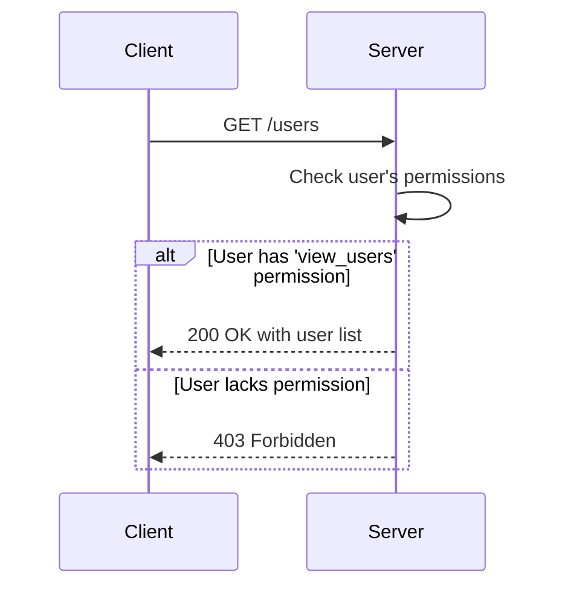
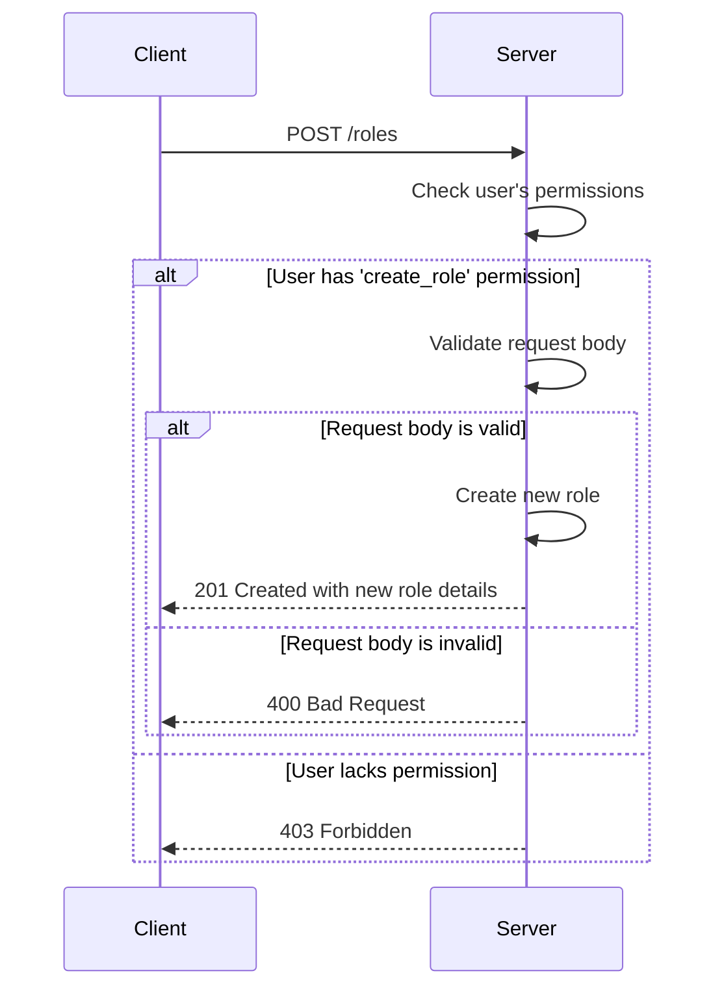
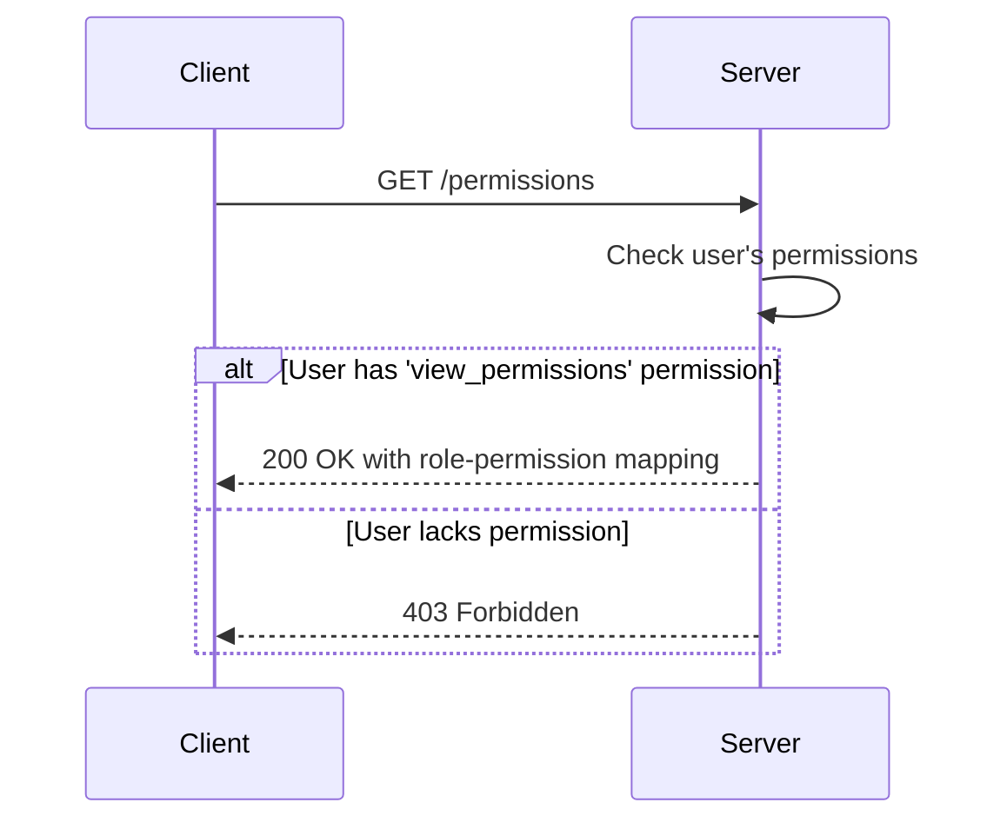
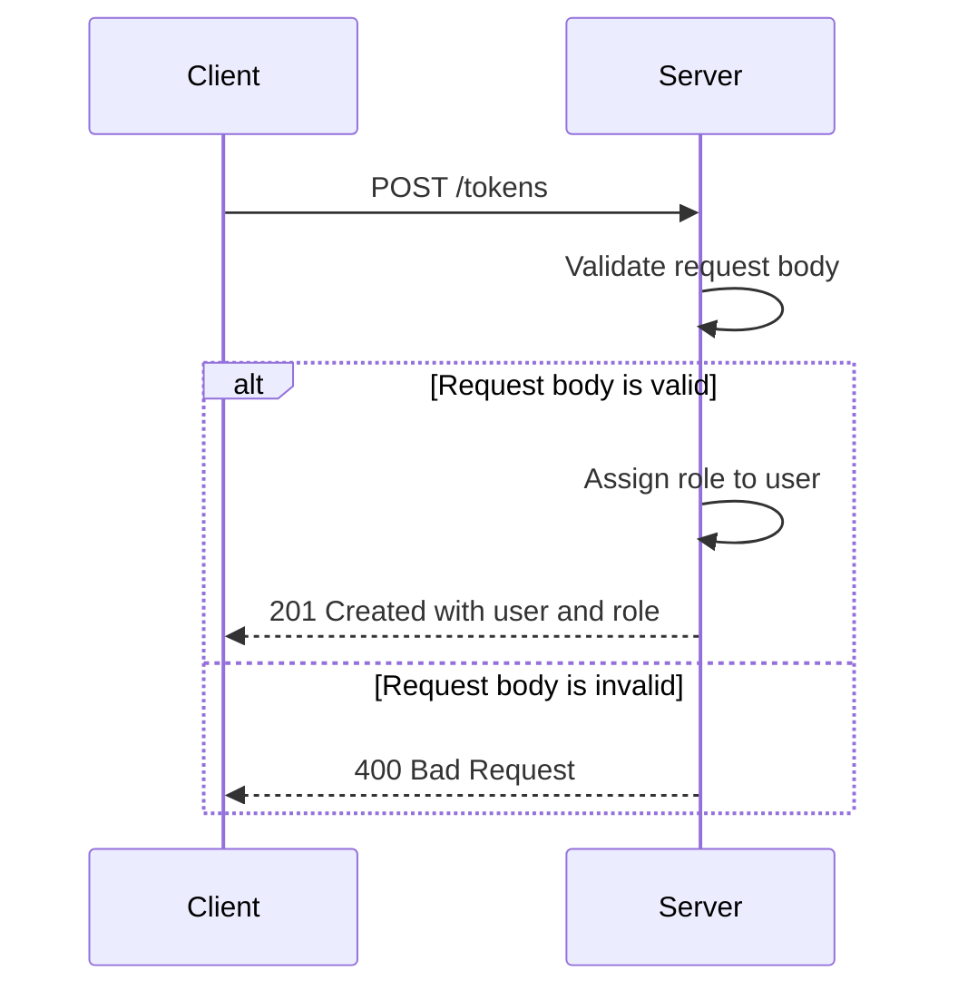
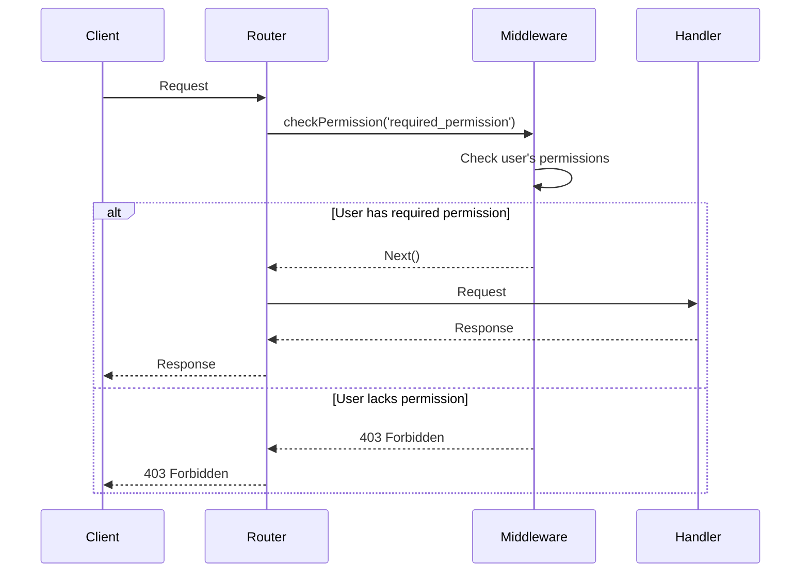

Relevant source files

The following files were used as context for generating this wiki page:

- [src/routes.js](https://github.com/aanickode/access-control-service/blob/main/src/routes.js)
- [docs/api.md](https://github.com/aanickode/access-control-service/blob/main/docs/api.md)

# API Endpoints

## Introduction

The API Endpoints in this project provide a set of routes for managing user roles, permissions, and access control within the application. These endpoints allow authorized users to view and create roles, view permissions associated with roles, and generate access tokens for users based on their assigned roles.

Sources: [src/routes.js](), [docs/api.md]()

## Endpoint: GET /users

This endpoint retrieves a list of all registered users and their associated roles.

### Access Control

To access this endpoint, the user must have the `view_users` permission.

Sources: [src/routes.js:6-8]()

## Endpoint: POST /roles

This endpoint allows authorized users to create a new role with a specified set of permissions.

### Request Body

- `name` (string, required): The name of the new role.
- `permissions` (array of strings, required): The list of permissions associated with the new role.

### Access Control

To access this endpoint, the user must have the `create_role` permission.

Sources: [src/routes.js:10-17]()

## Endpoint: GET /permissions

This endpoint retrieves a list of all roles and their associated permissions.

### Access Control

To access this endpoint, the user must have the `view_permissions` permission.

Sources: [src/routes.js:19-21]()

## Endpoint: POST /tokens

This endpoint generates an access token for a user based on their assigned role.

### Request Body

- `user` (string, required): The email or identifier of the user.
- `role` (string, required): The name of the role to assign to the user.

### Access Control

This endpoint does not require any specific permission.

Sources: [src/routes.js:23-30]()

## Data Model

The application uses an in-memory data store to manage users, roles, and permissions.

### Users

| Field | Type   | Description                   |
|-------|--------|-------------------------------|
| email | string | The email or identifier of the user |
| role  | string | The name of the role assigned to the user |

Sources: [src/routes.js:7]()

### Roles

| Field       | Type  | Description                   |
|-------------|-------|-------------------------------|
| name        | string | The name of the role         |
| permissions | array | The list of permissions associated with the role |

Sources: [src/routes.js:14]()

## Access Control Flow

The application implements a simple access control mechanism using the `checkPermission` middleware function.

Sources: [src/routes.js:6,10,19]()

## Summary

The API Endpoints in this project provide a simple yet effective way to manage user roles, permissions, and access control within the application. The endpoints allow authorized users to create and view roles, view permissions associated with roles, and generate access tokens for users based on their assigned roles. The application uses an in-memory data store to manage users, roles, and permissions, and implements a basic access control mechanism using a middleware function.

Sources: [src/routes.js](), [docs/api.md]()