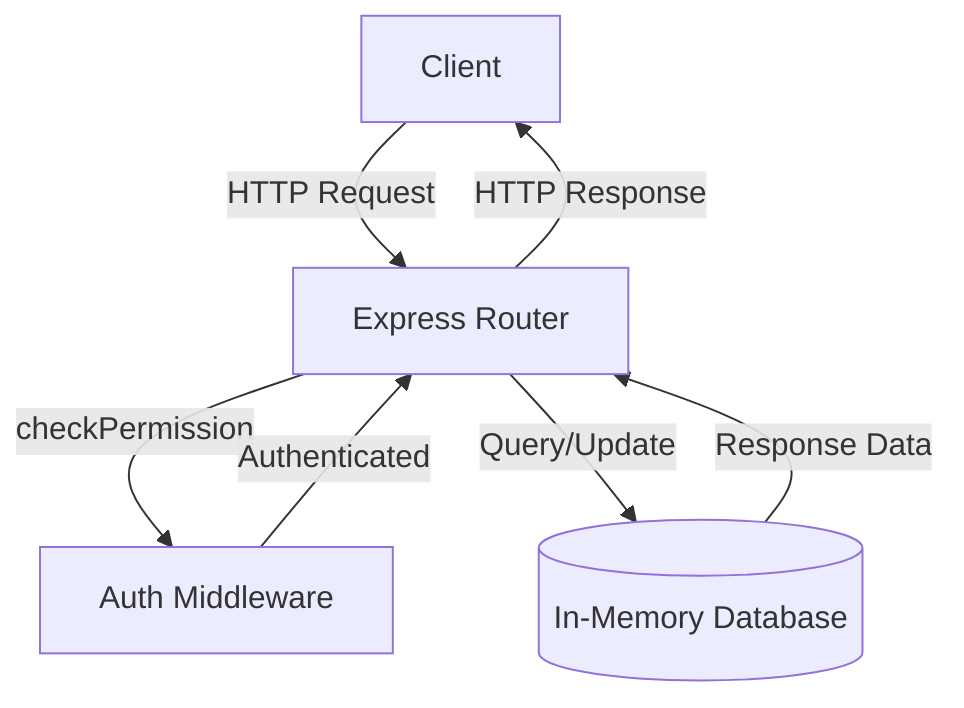
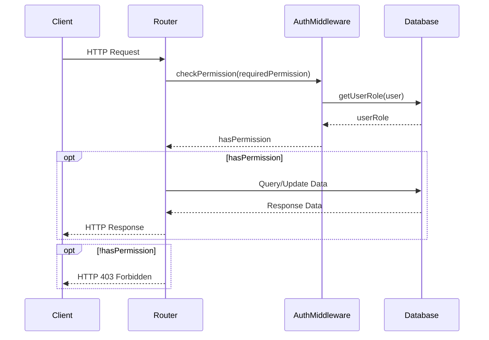

<details>
<summary>Relevant source files</summary>

The following files were used as context for generating this wiki page:

- [src/routes.js](https://github.com/aanickode/access-control-service/blob/main/src/routes.js)
- [docs/api.md](https://github.com/aanickode/access-control-service/blob/main/docs/api.md)
</details>

# API Endpoints

## Introduction

This wiki page covers the API endpoints implemented in the project, which provide functionality for managing users, roles, and permissions within an access control system. The API endpoints are defined in the `src/routes.js` file and handle various HTTP requests related to user authentication, role creation, and permission management.

## API Endpoint Definitions

### GET /users

This endpoint retrieves a list of all registered users and their associated roles.

**Requirements:**
- The requesting user must have the `view_users` permission.

**Response:**
- Status Code: 200 OK
- Body: An array of user objects, each containing the `email` and `role` properties.

```javascript
[
  { email: 'user1@example.com', role: 'admin' },
  { email: 'user2@example.com', role: 'viewer' },
  // ...
]
```

Sources: [src/routes.js:6-8]()

### POST /roles

This endpoint allows creating a new role with a specified set of permissions.

**Requirements:**
- The requesting user must have the `create_role` permission.
- The request body must contain a `name` property (string) and a `permissions` property (array of strings).

**Request Body:**
```json
{
  "name": "manager",
  "permissions": ["view_users", "create_role"]
}
```

**Response:**
- Status Code: 201 Created
- Body: An object containing the `role` name and `permissions` array.

**Error Response:**
- Status Code: 400 Bad Request
- Body: `{ error: 'Invalid role definition' }`

Sources: [src/routes.js:10-16]()

### GET /permissions

This endpoint retrieves a list of all defined roles and their associated permissions.

**Requirements:**
- The requesting user must have the `view_permissions` permission.

**Response:**
- Status Code: 200 OK
- Body: An object where the keys are role names, and the values are arrays of permissions.

```json
{
  "admin": ["view_users", "create_role", "view_permissions"],
  "manager": ["view_users", "create_role"],
  "viewer": ["view_users"]
}
```

Sources: [src/routes.js:18-20]()

### POST /tokens

This endpoint associates a user with a specific role, effectively granting them the permissions of that role.

**Request Body:**
```json
{
  "user": "user1@example.com",
  "role": "admin"
}
```

**Response:**
- Status Code: 201 Created
- Body: An object containing the `user` email and `role` name.

**Error Response:**
- Status Code: 400 Bad Request
- Body: `{ error: 'Missing user or role' }`

Sources: [src/routes.js:22-28]()

## Data Flow Diagram



The data flow for the API endpoints follows this sequence:

1. The client sends an HTTP request to the Express Router.
2. For protected routes, the `checkPermission` middleware function is invoked to authenticate the user and verify their permissions.
3. If the user is authenticated and has the required permissions, the request is processed by the corresponding route handler.
4. The route handler interacts with the in-memory database to retrieve or update data based on the request.
5. The database responds with the requested data or a success/error message.
6. The route handler sends the appropriate HTTP response back to the client.

Sources: [src/routes.js]()

## Access Control Sequence Diagram



The access control sequence diagram illustrates the flow of authentication and permission checking for protected API endpoints:

1. The client sends an HTTP request to the Express Router.
2. The Router invokes the `checkPermission` middleware, passing the required permission for the requested route.
3. The `checkPermission` middleware retrieves the user's role from the database.
4. Based on the user's role, the middleware determines if the user has the required permission.
5. If the user has the required permission, the Router processes the request, interacting with the database as needed, and sends the response back to the client.
6. If the user does not have the required permission, the Router responds with an HTTP 403 Forbidden status.

Note: This sequence assumes that the user's authentication has already been performed (e.g., via a JWT token or session management) before reaching the `checkPermission` middleware.

Sources: [src/routes.js:6, 10, 18](), [src/authMiddleware.js]()

## Role and Permission Management

The project implements a role-based access control (RBAC) system, where users are assigned roles, and roles are associated with specific permissions. The following table summarizes the roles and their corresponding permissions based on the provided source files:

| Role    | Permissions                |
|---------|-----------------------------
| admin   | view_users, create_role, view_permissions |
| manager | view_users, create_role    |
| viewer  | view_users                 |

Sources: [src/routes.js:18-20]()

## Conclusion

This wiki page covered the API endpoints implemented in the project, focusing on user management, role creation, and permission handling within an access control system. The endpoints allow retrieving user lists, creating new roles with specified permissions, fetching defined roles and permissions, and associating users with roles. The access control mechanism is implemented using a role-based approach, where users are granted permissions based on their assigned roles.