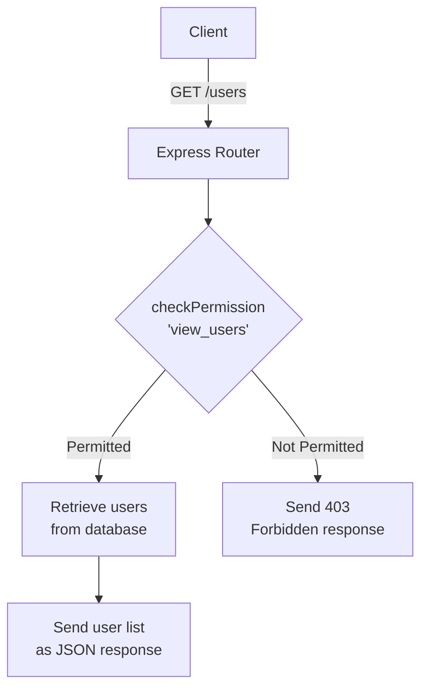
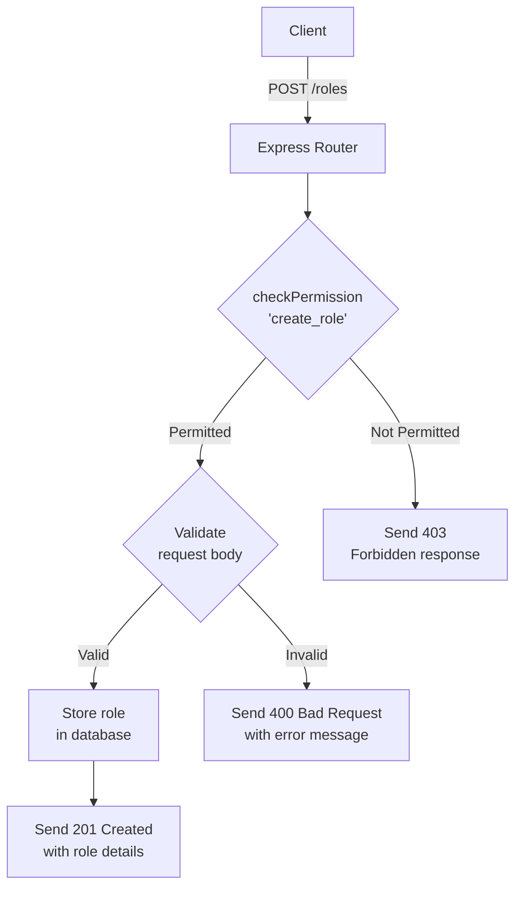
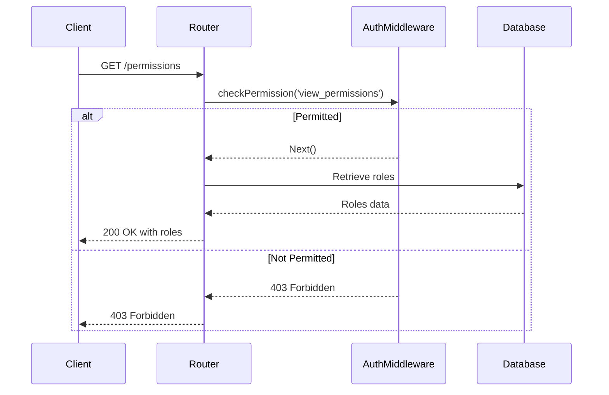
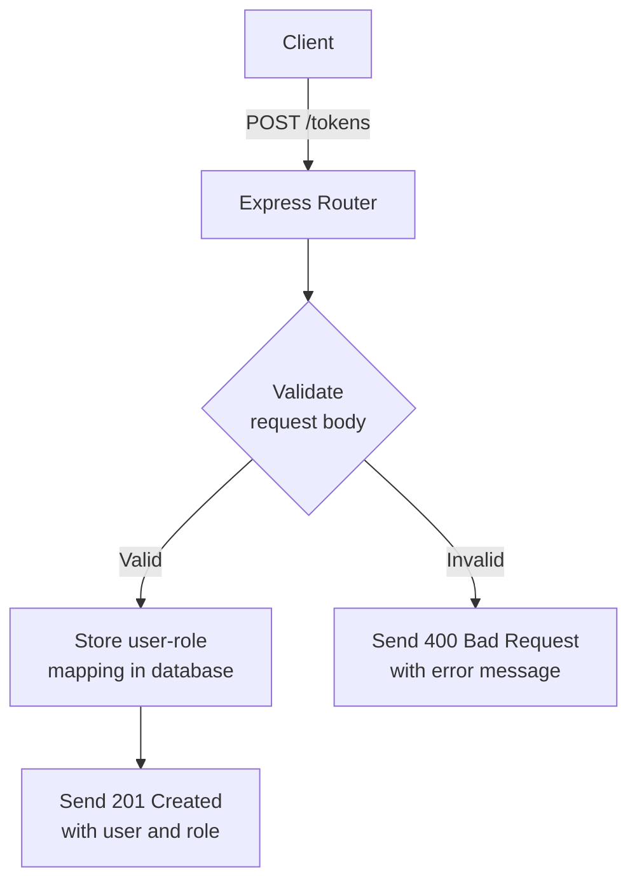
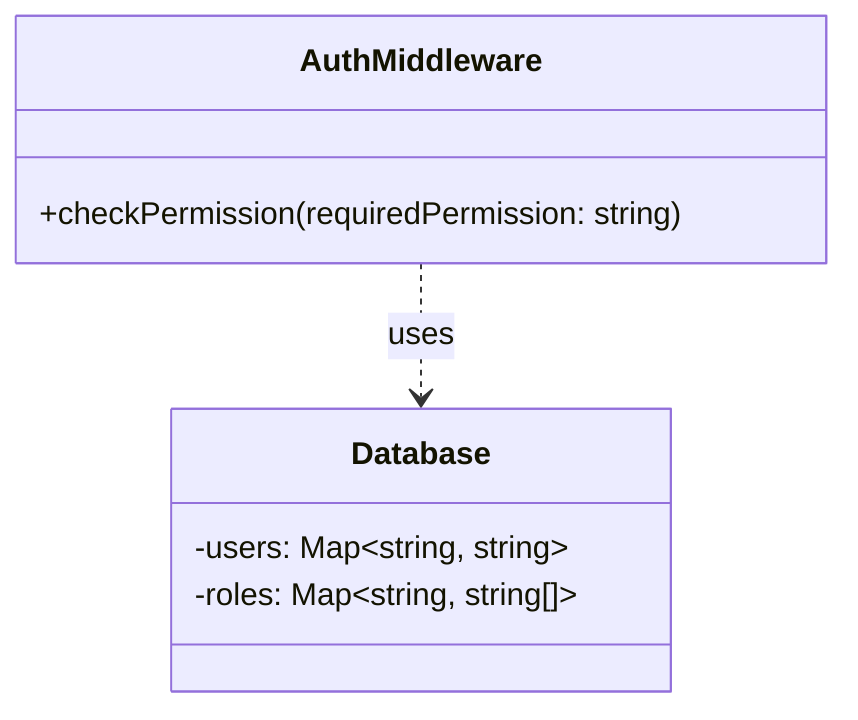
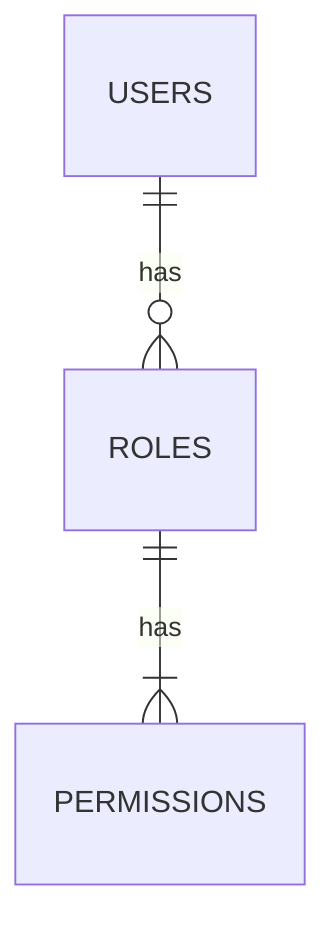

Relevant source files

The following files were used as context for generating this wiki page:

- [src/routes.js](https://github.com/aanickode/access-control-service/blob/main/src/routes.js)
- [docs/api.md](https://github.com/aanickode/access-control-service/blob/main/docs/api.md)

# API Endpoints

## Introduction

The API Endpoints module provides a set of routes and handlers for managing user roles, permissions, and authentication tokens within the access control service. It allows authorized users to view and create roles, view permissions, and generate authentication tokens for users with specific roles.

Sources: [src/routes.js](), [docs/api.md]()

## Route Handlers

### GET /users

This endpoint retrieves a list of all users and their associated roles.

#### Flow

To access this endpoint, the user must have the `'view_users'` permission.

Sources: [src/routes.js:6-8]()

### POST /roles

This endpoint allows creating a new role with a set of permissions.

#### Request Body

| Field       | Type     | Description                    |
|-------------|----------|--------------------------------|
| `name`      | `string` | The name of the new role       |
| `permissions` | `array`  | An array of permission strings |

#### Flow

To create a new role, the user must have the `'create_role'` permission. The request body must contain a `name` field (string) and a `permissions` field (array of strings).

Sources: [src/routes.js:10-16]()

### GET /permissions

This endpoint retrieves a list of all roles and their associated permissions.

#### Flow

To access this endpoint, the user must have the `'view_permissions'` permission.

Sources: [src/routes.js:18-20]()

### POST /tokens

This endpoint generates an authentication token for a user with a specific role.

#### Request Body

| Field  | Type     | Description                      |
|--------|----------|----------------------------------|
| `user` | `string` | The email or username of the user|
| `role` | `string` | The role to assign to the user   |

#### Flow

The request body must contain a `user` field (string) and a `role` field (string). The user-role mapping is stored in the database, and a 201 Created response is sent with the user and role details.

Sources: [src/routes.js:22-28]()

## Authentication Middleware

The `checkPermission` middleware function is used to enforce role-based access control for certain routes. It checks if the user has the required permission based on their assigned role.

The `checkPermission` function retrieves the user's role from the database, looks up the associated permissions for that role, and checks if the required permission is present. If the user has the necessary permission, the request is allowed to proceed; otherwise, a 403 Forbidden response is sent.

Sources: [src/routes.js:6, 12, 19](), [src/authMiddleware.js]()

## Data Storage

The application uses an in-memory data store (`db.js`) to store user-role mappings and role-permission mappings.

- `users` is a map of user email/username to their assigned role.
- `roles` is a map of role name to an array of associated permissions.

Sources: [src/routes.js:3](), [src/db.js]()

## Conclusion

The API Endpoints module provides a set of routes and handlers for managing user roles, permissions, and authentication tokens within the access control service. It allows authorized users to view and create roles, view permissions, and generate authentication tokens for users with specific roles. The module also includes an authentication middleware for enforcing role-based access control and an in-memory data store for storing user-role and role-permission mappings.

Sources: [src/routes.js](), [docs/api.md]()