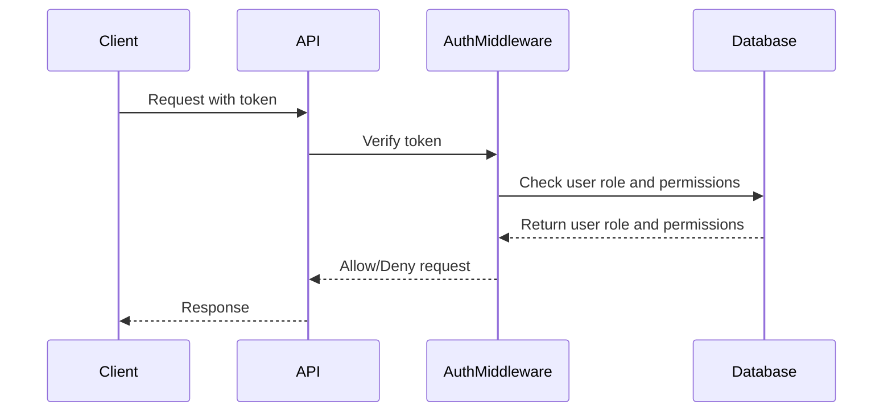

<details>
<summary>Relevant source files</summary>

The following files were used as context for generating this wiki page:

- [src/routes.js](https://github.com/aanickode/access-control-service/blob/main/src/routes.js)
- [docs/api.md](https://github.com/aanickode/access-control-service/blob/main/docs/api.md)
</details>

# API Reference

## Introduction

The API Reference provides a comprehensive guide to the various endpoints and functionalities offered by the access control service. This service is responsible for managing user roles, permissions, and authentication tokens within the application. It serves as a centralized system for controlling access to resources and enforcing authorization rules.

Sources: [src/routes.js](), [docs/api.md]()

## Endpoints

### GET /users

This endpoint retrieves a list of all registered users and their associated roles.

#### Requirements

- The requesting user must have the `view_users` permission.

#### Response

```json
[
  { "email": "user1@example.com", "role": "admin" },
  { "email": "user2@example.com", "role": "editor" },
  ...
]
```

Sources: [src/routes.js:6-8]()

### POST /roles

This endpoint allows the creation of a new role with a set of associated permissions.

#### Requirements

- The requesting user must have the `create_role` permission.

#### Request Body

```json
{
  "name": "role_name",
  "permissions": ["permission1", "permission2", ...]
}
```

#### Response

```json
{
  "role": "role_name",
  "permissions": ["permission1", "permission2", ...]
}
```

Sources: [src/routes.js:10-16]()

### GET /permissions

This endpoint retrieves a list of all defined roles and their associated permissions.

#### Requirements

- The requesting user must have the `view_permissions` permission.

#### Response

```json
{
  "admin": ["view_users", "create_role", "view_permissions", ...],
  "editor": ["view_users", ...],
  ...
}
```

Sources: [src/routes.js:18-20]()

### POST /tokens

This endpoint allows the creation of an authentication token for a user by associating them with a specific role.

#### Request Body

```json
{
  "user": "user@example.com",
  "role": "role_name"
}
```

#### Response

```json
{
  "user": "user@example.com",
  "role": "role_name"
}
```

Sources: [src/routes.js:22-28]()

## Authentication Flow



The authentication flow follows these steps:

1. The client sends a request to the API, including an authentication token.
2. The API passes the token to the `AuthMiddleware` for verification.
3. The `AuthMiddleware` checks the user's role and associated permissions in the database.
4. The database returns the user's role and permissions to the `AuthMiddleware`.
5. The `AuthMiddleware` either allows or denies the request based on the user's permissions.
6. The API responds to the client with the appropriate response.

Sources: [src/routes.js:6,10,18,22](), [docs/api.md]()

## Data Model

| Field | Type | Description |
| --- | --- | --- |
| `users` | Object | Stores user email addresses as keys and their associated roles as values. |
| `roles` | Object | Stores role names as keys and their associated permissions as values. |

The data model is currently stored in-memory using simple JavaScript objects. In a production environment, a more robust and persistent data storage solution (e.g., a database) would be recommended.

Sources: [src/routes.js:3](), [docs/api.md]()

## Conclusion

The API Reference provides a comprehensive overview of the access control service's endpoints, authentication flow, and data model. It serves as a valuable resource for developers working on or integrating with this service, ensuring a clear understanding of its functionalities and usage.