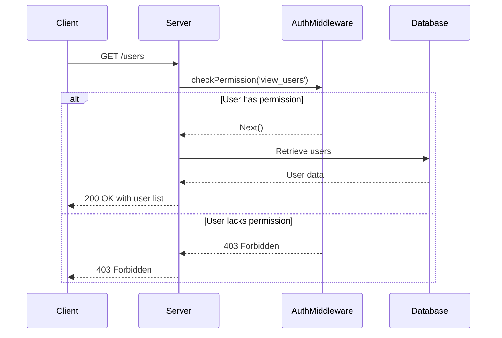
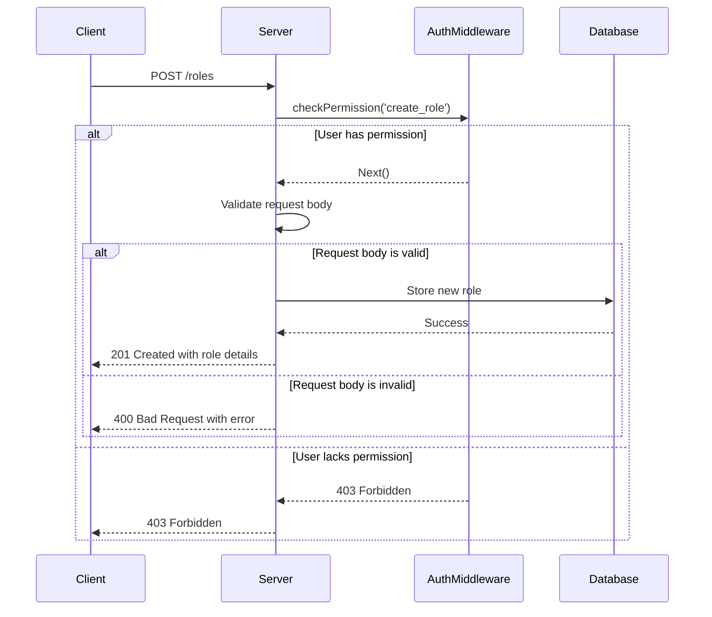

<details>
<summary>Relevant source files</summary>

The following files were used as context for generating this wiki page:

- [src/routes.js](https://github.com/aanickode/access-control-service/blob/main/src/routes.js)
- [docs/api.md](https://github.com/aanickode/access-control-service/blob/main/docs/api.md)
</details>

# API Reference

## Introduction

The API Reference provides a comprehensive overview of the API endpoints and their associated functionality within the Access Control Service project. This service manages user roles, permissions, and authentication tokens, enabling controlled access to various resources and operations based on defined roles and permissions.

Sources: [src/routes.js](), [docs/api.md]()

## API Endpoints

### 1. Get Users

```
GET /users
```

This endpoint retrieves a list of all registered users and their associated roles.

**Requirements:**
- The requesting user must have the `view_users` permission.

**Response:**
- Status Code: 200 OK
- Body: An array of user objects, each containing the `email` and `role` properties.

Sources: [src/routes.js:6-8]()

### 2. Create Role

```
POST /roles
```

This endpoint allows the creation of a new role with a specified set of permissions.

**Request Body:**
- `name` (string): The name of the new role.
- `permissions` (array): An array of permission strings associated with the role.

**Requirements:**
- The requesting user must have the `create_role` permission.

**Response:**
- Status Code: 201 Created
- Body: An object containing the `role` name and `permissions` array.

**Error Response:**
- Status Code: 400 Bad Request
- Body: An error object with the message `"Invalid role definition"` if the request body is invalid.

Sources: [src/routes.js:10-17]()

### 3. Get Permissions

```
GET /permissions
```

This endpoint retrieves a list of all defined roles and their associated permissions.

**Requirements:**
- The requesting user must have the `view_permissions` permission.

**Response:**
- Status Code: 200 OK
- Body: An object where the keys represent role names, and the values are arrays of permission strings.

Sources: [src/routes.js:19-21]()

### 4. Create Token

```
POST /tokens
```

This endpoint generates an authentication token for a user with a specified role.

**Request Body:**
- `user` (string): The email or identifier of the user.
- `role` (string): The name of the role to assign to the user.

**Response:**
- Status Code: 201 Created
- Body: An object containing the `user` and `role` properties.

**Error Response:**
- Status Code: 400 Bad Request
- Body: An error object with the message `"Missing user or role"` if the request body is invalid.

Sources: [src/routes.js:23-30]()

## Authentication Middleware

The `checkPermission` middleware function is used to verify if a user has the required permission to access a specific endpoint. It is implemented in the `authMiddleware.js` file (not provided in the given source files).

This middleware is applied to the `/users`, `/roles`, and `/permissions` endpoints, ensuring that only authorized users with the appropriate permissions can access these routes.

Sources: [src/routes.js:6, 10, 19]()

## Data Storage

The application uses an in-memory data store (`db.js`) to persist user roles, permissions, and authentication tokens. The data structure is as follows:

```javascript
const db = {
  users: {
    // 'user@email.com': 'admin',
    // 'another@email.com': 'viewer'
  },
  roles: {
    // 'admin': ['view_users', 'create_role', 'view_permissions'],
    // 'viewer': ['view_users']
  }
}
```

- The `users` object stores user email addresses as keys and their assigned roles as values.
- The `roles` object stores role names as keys and arrays of associated permissions as values.

Sources: [src/routes.js:3]() (inferred from the usage of `db.users` and `db.roles`)

## Sequence Diagrams

### User Retrieval Flow



This sequence diagram illustrates the flow when a client requests the `/users` endpoint to retrieve a list of registered users and their roles.

1. The client sends a `GET /users` request to the server.
2. The server invokes the `checkPermission` middleware to verify if the user has the `view_users` permission.
3. If the user has the required permission, the middleware allows the request to proceed.
4. The server retrieves the user data from the database.
5. The server responds with a 200 OK status and the list of users.
6. If the user lacks the required permission, the middleware responds with a 403 Forbidden status.

Sources: [src/routes.js:6-8]()

### Role Creation Flow



This sequence diagram illustrates the flow when a client requests the `/roles` endpoint to create a new role with a specified set of permissions.

1. The client sends a `POST /roles` request to the server with the role name and permissions in the request body.
2. The server invokes the `checkPermission` middleware to verify if the user has the `create_role` permission.
3. If the user has the required permission, the middleware allows the request to proceed.
4. The server validates the request body for the required properties (`name` and `permissions`).
5. If the request body is valid, the server stores the new role in the database.
6. The server responds with a 201 Created status and the details of the created role.
7. If the request body is invalid, the server responds with a 400 Bad Request status and an error message.
8. If the user lacks the required permission, the middleware responds with a 403 Forbidden status.

Sources: [src/routes.js:10-17]()

## Data Model

The application uses the following data model to store user roles, permissions, and authentication tokens:

| Entity | Description |
| --- | --- |
| `users` | An object that maps user email addresses (keys) to their assigned roles (values). |
| `roles` | An object that maps role names (keys) to arrays of associated permissions (values). |

Sources: [src/routes.js:3]() (inferred from the usage of `db.users` and `db.roles`)

## Configuration

The application does not seem to have any configurable options based on the provided source files.

## Conclusion

The API Reference covers the core functionality of the Access Control Service, including managing user roles, permissions, and authentication tokens. It provides a detailed overview of the available API endpoints, their request/response formats, and the required permissions for each operation. The documentation also includes sequence diagrams to illustrate the flow of key operations and a description of the underlying data model.

Sources: [src/routes.js](), [docs/api.md]()