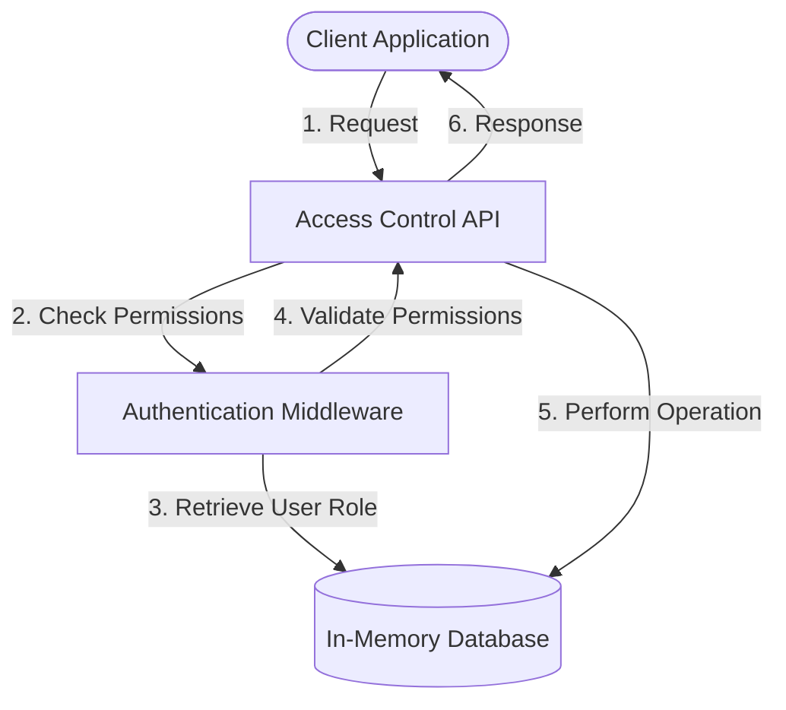
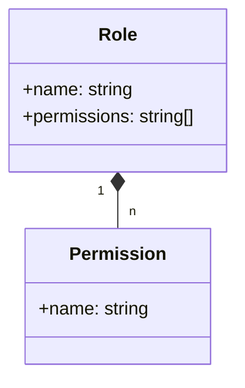
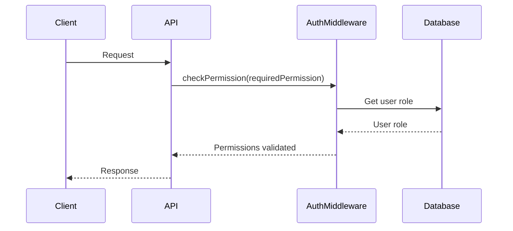

<details>
<summary>Relevant source files</summary>

The following files were used as context for generating this wiki page:

- [src/routes.js](https://github.com/aanickode/access-control-service/blob/main/src/routes.js)
- [docs/api.md](https://github.com/aanickode/access-control-service/blob/main/docs/api.md)
- [src/authMiddleware.js](https://github.com/aanickode/access-control-service/blob/main/src/authMiddleware.js)
- [src/db.js](https://github.com/aanickode/access-control-service/blob/main/src/db.js)
- [src/server.js](https://github.com/aanickode/access-control-service/blob/main/src/server.js)

</details>

# API Reference

## Introduction

The API Reference provides a comprehensive overview of the endpoints and functionality offered by the Access Control Service. This service is responsible for managing user roles, permissions, and authentication tokens within the application. It serves as a centralized system for controlling access to various resources and features based on defined roles and permissions.

The API Reference covers the available endpoints, their request/response formats, and the underlying data structures and logic used to handle user authentication, role management, and permission assignment.

Sources: [src/routes.js](), [docs/api.md]()

## Endpoints

### GET /users

This endpoint retrieves a list of all registered users and their associated roles.

#### Response

```json
[
  {
    "email": "user1@example.com",
    "role": "admin"
  },
  {
    "email": "user2@example.com",
    "role": "editor"
  }
]
```

The response is a JSON array containing objects with `email` and `role` properties for each user.

#### Requirements

The requesting user must have the `view_users` permission to access this endpoint.

Sources: [src/routes.js:6-8]()

### POST /roles

This endpoint allows creating a new role with a set of associated permissions.

#### Request Body

```json
{
  "name": "manager",
  "permissions": ["view_users", "create_role"]
}
```

The request body should be a JSON object with the following properties:

- `name` (string): The name of the new role.
- `permissions` (array): An array of permission strings associated with the role.

#### Response

```json
{
  "role": "manager",
  "permissions": ["view_users", "create_role"]
}
```

The response is a JSON object containing the `role` name and `permissions` array.

#### Requirements

The requesting user must have the `create_role` permission to access this endpoint.

Sources: [src/routes.js:10-17]()

### GET /permissions

This endpoint retrieves a mapping of all defined roles and their associated permissions.

#### Response

```json
{
  "admin": ["view_users", "create_role", "view_permissions"],
  "editor": ["view_users"],
  "manager": ["view_users", "create_role"]
}
```

The response is a JSON object where the keys are role names, and the values are arrays of permission strings.

#### Requirements

The requesting user must have the `view_permissions` permission to access this endpoint.

Sources: [src/routes.js:19-21]()

### POST /tokens

This endpoint generates an authentication token for a user by associating them with a specific role.

#### Request Body

```json
{
  "user": "user1@example.com",
  "role": "admin"
}
```

The request body should be a JSON object with the following properties:

- `user` (string): The email or identifier of the user.
- `role` (string): The name of the role to assign to the user.

#### Response

```json
{
  "user": "user1@example.com",
  "role": "admin"
}
```

The response is a JSON object containing the `user` identifier and the assigned `role`.

#### Requirements

There are no specific permissions required to access this endpoint.

Sources: [src/routes.js:23-30]()

## Data Flow

The following diagram illustrates the high-level data flow and interactions between the API endpoints and the underlying data structures:



1. The client application sends a request to one of the API endpoints.
2. The API routes the request through the Authentication Middleware to check if the user has the required permissions for the requested operation.
3. The Authentication Middleware retrieves the user's role from the in-memory database.
4. The Authentication Middleware validates the user's permissions based on their role and the required permissions for the requested operation.
5. If the user has the necessary permissions, the API performs the requested operation, potentially interacting with the in-memory database.
6. The API sends the response back to the client application.

Sources: [src/routes.js](), [src/authMiddleware.js](), [src/db.js]()

## Authentication and Authorization

The Access Control Service implements a role-based access control (RBAC) system to manage user permissions and authorization. The core components involved in this process are:

### Roles

Roles are defined sets of permissions that can be assigned to users. Each role has a unique name and an associated array of permission strings.



Roles are stored in an in-memory data structure, and new roles can be created using the `POST /roles` endpoint.

Sources: [src/routes.js:10-17](), [src/db.js]()

### Permissions

Permissions are strings that represent specific actions or operations that a user can perform within the application. Examples of permissions include `view_users`, `create_role`, and `view_permissions`.

Permissions are associated with roles, and a user's effective permissions are determined by the role(s) assigned to them.

Sources: [src/routes.js:6-8, 10-17, 19-21](), [src/authMiddleware.js:3-9]()

### Authentication Middleware

The Authentication Middleware is responsible for checking if a user has the required permissions for a specific API endpoint. It retrieves the user's role from the in-memory database and validates the associated permissions against the required permissions for the requested operation.



The `checkPermission` middleware function is used to protect API endpoints by specifying the required permission(s) as an argument.

Sources: [src/routes.js:6-8, 10-17, 19-21](), [src/authMiddleware.js]()

### User Authentication

The Access Control Service does not handle user authentication directly. Instead, it assumes that the client application has already authenticated the user and provides the user's identifier (e.g., email) when making requests to the API.

The `POST /tokens` endpoint is used to associate a user with a specific role, effectively granting them the permissions associated with that role.

Sources: [src/routes.js:23-30]()

## Configuration

The Access Control Service does not have any explicit configuration options in the provided source files. However, the in-memory database used to store user roles and permissions is initialized with some default values.

```javascript
const db = {
  users: {
    'admin@example.com': 'admin',
    'editor@example.com': 'editor',
  },
  roles: {
    admin: ['view_users', 'create_role', 'view_permissions'],
    editor: ['view_users'],
  },
};
```

This initial configuration defines two users (`admin@example.com` and `editor@example.com`) with the `admin` and `editor` roles, respectively. The `admin` role has all three permissions (`view_users`, `create_role`, and `view_permissions`), while the `editor` role only has the `view_users` permission.

Sources: [src/db.js]()

## Potential Improvements

Based on the provided source files, here are some potential improvements that could be considered for the Access Control Service:

- **Persistent Storage**: Currently, the user roles and permissions are stored in an in-memory data structure, which means that any changes or new roles created will be lost when the application restarts. Implementing a persistent storage solution, such as a database or file-based storage, would ensure that the access control data is preserved across application restarts.

- **User Authentication**: The service currently assumes that user authentication is handled by the client application and only requires the user's identifier (e.g., email) when making requests. Integrating user authentication functionality directly into the service could provide a more secure and centralized approach to managing user identities and authentication tokens.

- **Role Hierarchy and Inheritance**: The current implementation treats roles as flat sets of permissions. Introducing a role hierarchy or inheritance model could simplify permission management and allow for more granular control over access levels.

- **Audit Logging**: Implementing audit logging functionality could help track changes to roles, permissions, and user assignments, providing a historical record for auditing and compliance purposes.

- **API Documentation**: While this wiki page serves as a reference for the API endpoints, it may be beneficial to have a dedicated API documentation tool or format (e.g., OpenAPI/Swagger) for better discoverability and ease of use.

- **Error Handling and Validation**: Enhancing error handling and input validation mechanisms could improve the robustness and security of the API endpoints.

- **Testing**: Implementing comprehensive unit and integration tests would help ensure the correctness and reliability of the Access Control Service's functionality.

Sources: [src/routes.js](), [src/authMiddleware.js](), [src/db.js](), [src/server.js]()

## Summary

The Access Control Service provides a centralized system for managing user roles, permissions, and authentication tokens within an application. It implements a role-based access control (RBAC) model, where users are assigned roles with specific permissions that determine the operations they can perform.

The API Reference covers the available endpoints for retrieving user and role information, creating new roles, and generating authentication tokens. It also explains the underlying data structures, authentication middleware, and the overall data flow and interactions between the components.

While the current implementation is functional, there are potential improvements that could be considered, such as persistent storage, user authentication, role hierarchies, audit logging, and enhanced documentation and testing.

Sources: [src/routes.js](), [src/authMiddleware.js](), [src/db.js](), [src/server.js](), [docs/api.md]()