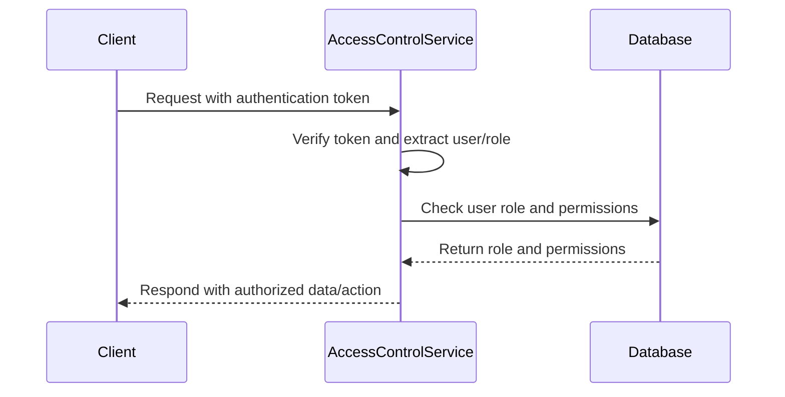
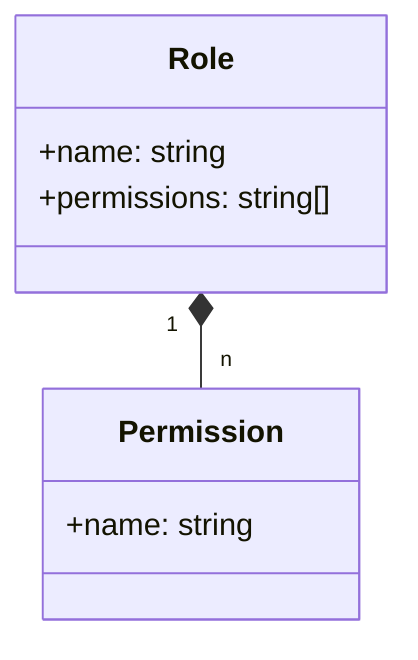
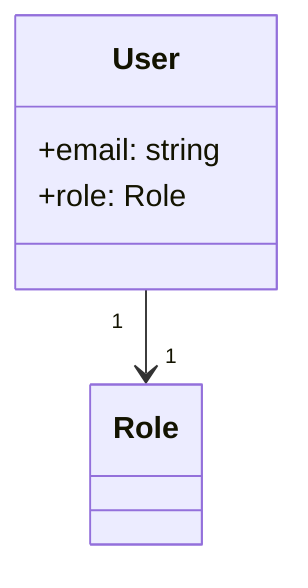
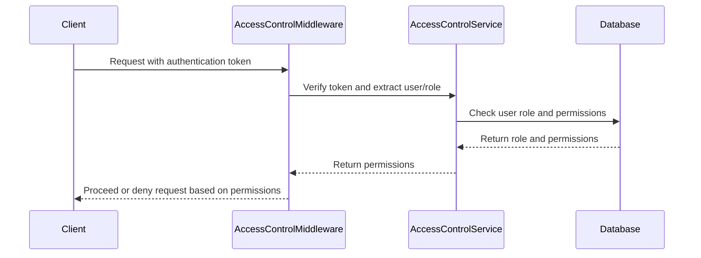

<details>
<summary>Relevant source files</summary>

The following files were used as context for generating this wiki page:

- [src/routes.js](https://github.com/aanickode/access-control-service/blob/main/src/routes.js)
- [docs/api.md](https://github.com/aanickode/access-control-service/blob/main/docs/api.md)
</details>

# API Reference

## Introduction

This API Reference provides documentation for the access control service, which manages user roles, permissions, and authentication tokens within the application. The service exposes a set of RESTful endpoints to handle CRUD operations related to user roles, permissions, and token generation.

Sources: [src/routes.js](), [docs/api.md]()

## Endpoints

### GET /users

Retrieves a list of all registered users and their associated roles.

#### Requirements

- The requesting user must have the `view_users` permission.

#### Response

```json
[
  {
    "email": "user1@example.com",
    "role": "admin"
  },
  {
    "email": "user2@example.com",
    "role": "editor"
  }
]
```

Sources: [src/routes.js:6-9]()

### POST /roles

Creates a new role with the specified name and permissions.

#### Requirements

- The requesting user must have the `create_role` permission.

#### Request Body

```json
{
  "name": "editor",
  "permissions": ["edit_content", "publish_content"]
}
```

#### Response

```json
{
  "role": "editor",
  "permissions": ["edit_content", "publish_content"]
}
```

Sources: [src/routes.js:11-18]()

### GET /permissions

Retrieves a list of all defined roles and their associated permissions.

#### Requirements

- The requesting user must have the `view_permissions` permission.

#### Response

```json
{
  "admin": ["view_users", "create_role", "view_permissions"],
  "editor": ["edit_content", "publish_content"]
}
```

Sources: [src/routes.js:20-22]()

### POST /tokens

Generates an authentication token for a user by associating them with a specific role.

#### Request Body

```json
{
  "user": "user1@example.com",
  "role": "admin"
}
```

#### Response

```json
{
  "user": "user1@example.com",
  "role": "admin"
}
```

Sources: [src/routes.js:24-31]()

## Data Flow

The following sequence diagram illustrates the high-level data flow when a client interacts with the access control service:



1. The client sends a request to the access control service, including an authentication token.
2. The service verifies the token and extracts the associated user and role information.
3. The service checks the user's role and permissions in the database.
4. The database returns the role and associated permissions.
5. The service responds to the client with the authorized data or performs the requested action based on the user's permissions.

Sources: [src/routes.js]()

## Role and Permission Management

The access control service maintains a mapping of roles to their associated permissions in the `db.roles` object. This mapping is used to determine the actions a user can perform based on their assigned role.



- Roles are defined with a unique name and a list of associated permissions.
- Permissions are represented as strings (e.g., `"view_users"`, `"create_role"`, `"edit_content"`).
- The `GET /permissions` endpoint retrieves the mapping of roles to their permissions.
- The `POST /roles` endpoint allows creating new roles with specified permissions.

Sources: [src/routes.js:11-18](), [src/routes.js:20-22]()

## User and Token Management

The access control service maintains a mapping of users to their assigned roles in the `db.users` object. This mapping is used to authenticate users and determine their permissions based on their assigned role.



- Users are identified by their email addresses.
- Each user is associated with a single role.
- The `GET /users` endpoint retrieves the list of registered users and their assigned roles.
- The `POST /tokens` endpoint allows assigning a role to a user, effectively generating an authentication token.

Sources: [src/routes.js:6-9](), [src/routes.js:24-31]()

## Access Control Middleware

The access control service includes a middleware function `checkPermission` that verifies if a user has the required permission to access a specific route or perform a certain action.



1. The client sends a request with an authentication token.
2. The `checkPermission` middleware verifies the token and extracts the associated user and role information.
3. The middleware checks the user's role and permissions in the database.
4. The database returns the role and associated permissions.
5. The middleware determines if the user has the required permission to access the requested route or perform the action.
6. The middleware either proceeds with the request or denies access based on the user's permissions.

Sources: [src/routes.js:3](), [src/routes.js:6](), [src/routes.js:11](), [src/routes.js:20]()

## Conclusion

The access control service provides a robust and flexible system for managing user roles, permissions, and authentication tokens within the application. It exposes a set of RESTful endpoints for CRUD operations related to roles, permissions, and token generation, allowing for fine-grained control over user access and authorization.