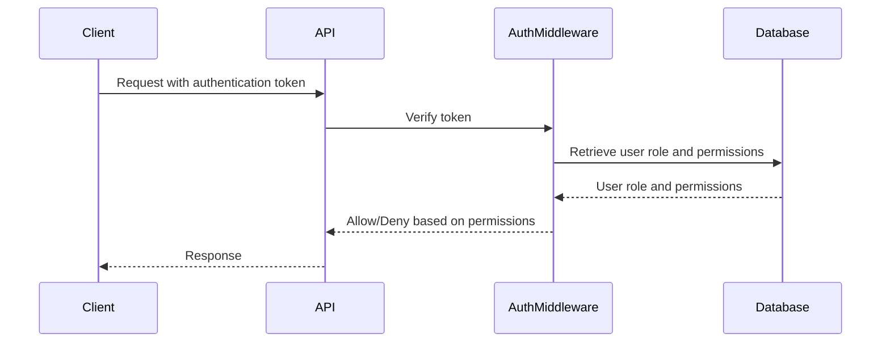
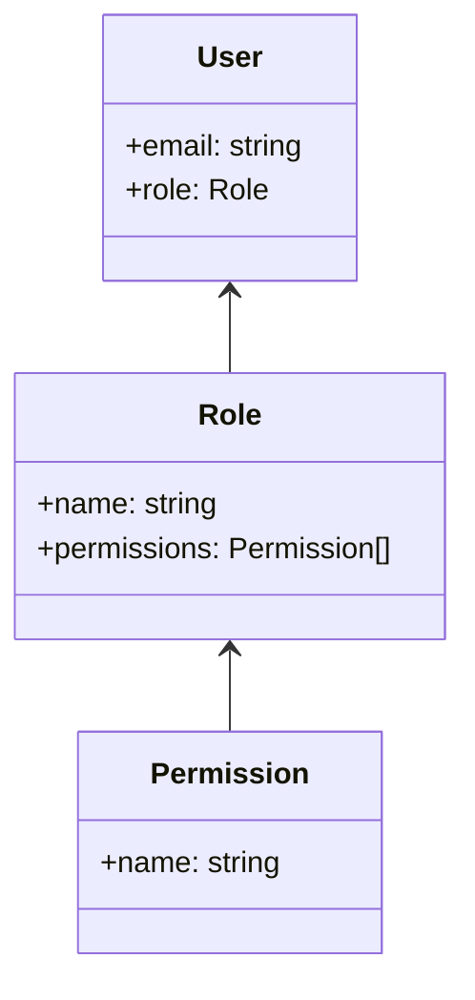

<details>
<summary>Relevant source files</summary>

The following files were used as context for generating this wiki page:

- [src/routes.js](https://github.com/aanickode/access-control-service/blob/main/src/routes.js)
- [docs/api.md](https://github.com/aanickode/access-control-service/blob/main/docs/api.md)
</details>

# API Reference

## Introduction

The API Reference provides a comprehensive overview of the available endpoints and their functionalities within the access control service. This service manages user roles, permissions, and authentication tokens, enabling controlled access to various resources or operations based on defined roles and permissions.

Sources: [src/routes.js](), [docs/api.md]()

## Endpoints

### GET /users

Retrieves a list of all registered users and their associated roles.

#### Requirements

- The requesting user must have the `view_users` permission.

#### Response

```json
[
  { "email": "user1@example.com", "role": "admin" },
  { "email": "user2@example.com", "role": "editor" },
  ...
]
```

Sources: [src/routes.js:6-9]()

### POST /roles

Creates a new role with a specified name and set of permissions.

#### Request Body

```json
{
  "name": "manager",
  "permissions": ["view_users", "create_role"]
}
```

#### Requirements

- The requesting user must have the `create_role` permission.
- The request body must contain a `name` (string) and `permissions` (array of strings) property.

#### Response

```json
{
  "role": "manager",
  "permissions": ["view_users", "create_role"]
}
```

Sources: [src/routes.js:11-18]()

### GET /permissions

Retrieves a list of all defined roles and their associated permissions.

#### Requirements

- The requesting user must have the `view_permissions` permission.

#### Response

```json
{
  "admin": ["view_users", "create_role", "view_permissions"],
  "editor": ["view_users"],
  "manager": ["view_users", "create_role"]
}
```

Sources: [src/routes.js:20-22]()

### POST /tokens

Assigns a role to a user, effectively creating an authentication token.

#### Request Body

```json
{
  "user": "user1@example.com",
  "role": "admin"
}
```

#### Requirements

- The request body must contain a `user` (string) and `role` (string) property.

#### Response

```json
{
  "user": "user1@example.com",
  "role": "admin"
}
```

Sources: [src/routes.js:24-31]()

## Authentication Flow

The authentication flow for accessing protected resources or operations follows these steps:



1. The client sends a request to the API, including an authentication token (obtained from the `/tokens` endpoint).
2. The API passes the token to the `AuthMiddleware` for verification.
3. The `AuthMiddleware` retrieves the user's role and associated permissions from the database.
4. Based on the required permissions for the requested operation, the `AuthMiddleware` allows or denies the request.
5. The API responds to the client accordingly.

Sources: [src/routes.js](), [docs/api.md]()

## Role-Based Access Control (RBAC) Model

The access control service implements a Role-Based Access Control (RBAC) model, where permissions are grouped into roles, and users are assigned specific roles. This model follows the principle of least privilege, granting users only the necessary permissions to perform their tasks.



- Users are associated with a single role.
- Roles are defined by a name and a set of permissions.
- Permissions are strings representing specific actions or resource access rights.

When a user attempts to perform an operation, the system checks if the user's assigned role has the required permission(s) for that operation. If the permissions match, the operation is allowed; otherwise, it is denied.

Sources: [src/routes.js]()

## Conclusion

The API Reference covers the available endpoints, their functionalities, and the underlying role-based access control model implemented in the access control service. By following the documented endpoints and authentication flow, clients can manage user roles, permissions, and authentication tokens, enabling controlled access to resources based on defined roles and permissions.

Sources: [src/routes.js](), [docs/api.md]()