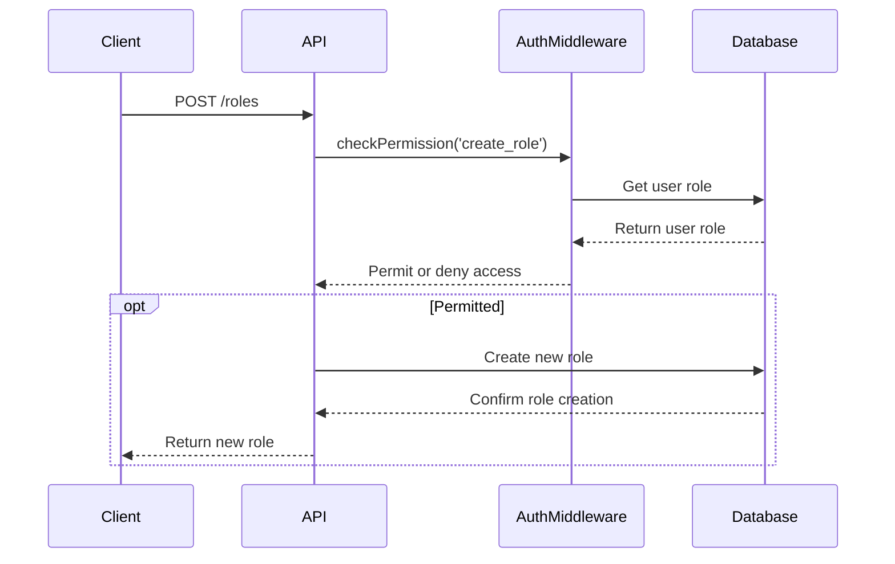

<details>
<summary>Relevant source files</summary>

The following files were used as context for generating this wiki page:

- [src/routes.js](https://github.com/aanickode/access-control-service/blob/main/src/routes.js)
- [docs/api.md](https://github.com/aanickode/access-control-service/blob/main/docs/api.md)
- [src/authMiddleware.js](https://github.com/aanickode/access-control-service/blob/main/src/authMiddleware.js)
- [src/db.js](https://github.com/aanickode/access-control-service/blob/main/src/db.js)
- [src/app.js](https://github.com/aanickode/access-control-service/blob/main/src/app.js)

</details>

# API Reference

## Introduction

This API Reference provides documentation for the Access Control Service, a component responsible for managing user roles, permissions, and authentication within the overall project. The service exposes a RESTful API that allows clients to retrieve user information, create and view roles and permissions, and generate authentication tokens.

Sources: [docs/api.md](), [src/routes.js]()

## API Endpoints

### GET /users

Retrieves a list of all registered users and their associated roles.

#### Response

```json
[
  { "email": "user1@example.com", "role": "admin" },
  { "email": "user2@example.com", "role": "viewer" },
  ...
]
```

#### Permission Required

`view_users`

Sources: [src/routes.js:6-9]()

### POST /roles

Creates a new role with the specified name and permissions.

#### Request Body

```json
{
  "name": "editor",
  "permissions": ["edit_content", "publish_content"]
}
```

#### Response

```json
{
  "role": "editor",
  "permissions": ["edit_content", "publish_content"]
}
```

#### Permission Required

`create_role`

Sources: [src/routes.js:11-18]()

### GET /permissions

Retrieves a list of all defined roles and their associated permissions.

#### Response

```json
{
  "admin": ["view_users", "create_role", "view_permissions"],
  "editor": ["edit_content", "publish_content"],
  ...
}
```

#### Permission Required

`view_permissions`

Sources: [src/routes.js:20-22]()

### POST /tokens

Generates an authentication token for a given user and role.

#### Request Body

```json
{
  "user": "user1@example.com",
  "role": "admin"
}
```

#### Response

```json
{
  "user": "user1@example.com",
  "role": "admin"
}
```

#### Permission Required

None

Sources: [src/routes.js:24-31]()

## Authentication Middleware

The `checkPermission` middleware is used to enforce role-based access control for API endpoints. It verifies if the authenticated user has the required permission to access the requested resource.

```javascript
import db from './db.js';

export const checkPermission = (requiredPermission) => {
  return (req, res, next) => {
    const user = req.user; // Assuming user is set by an authentication middleware
    const role = db.users[user];
    const permissions = db.roles[role] || [];

    if (permissions.includes(requiredPermission)) {
      next();
    } else {
      res.status(403).json({ error: 'Forbidden' });
    }
  };
};
```

Sources: [src/authMiddleware.js]()

## Data Storage

The service uses an in-memory data store to persist user roles, permissions, and authentication tokens.

```javascript
const db = {
  users: {
    'user1@example.com': 'admin',
    'user2@example.com': 'viewer',
  },
  roles: {
    admin: ['view_users', 'create_role', 'view_permissions'],
    viewer: ['view_content'],
  },
};

export default db;
```

Sources: [src/db.js]()

## Application Setup

The API is built using the Express.js framework and is configured in the `app.js` file.

```javascript
import express from 'express';
import routes from './routes.js';

const app = express();

app.use(express.json());
app.use('/api', routes);

const PORT = process.env.PORT || 3000;
app.listen(PORT, () => {
  console.log(`Server is running on port ${PORT}`);
});
```

Sources: [src/app.js]()

## Sequence Diagrams

### User Retrieval Flow


Sources: [src/routes.js:6-9](), [src/authMiddleware.js](), [src/db.js]()

### Role Creation Flow



Sources: [src/routes.js:11-18](), [src/authMiddleware.js](), [src/db.js]()

## Conclusion

This API Reference provides an overview of the Access Control Service's API endpoints, authentication middleware, data storage, and application setup. It covers the functionality for managing users, roles, permissions, and authentication tokens within the project.