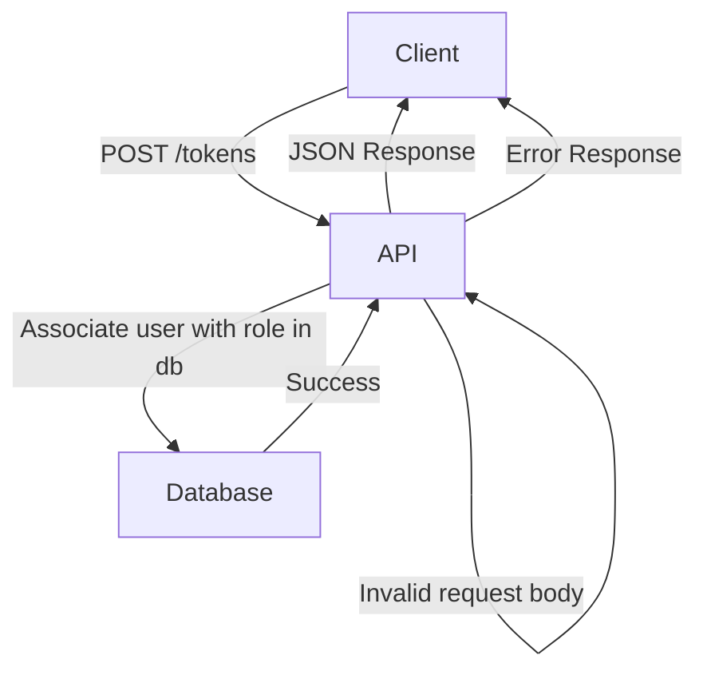

<details>
<summary>Relevant source files</summary>

The following files were used as context for generating this wiki page:

- [src/routes.js](https://github.com/aanickode/access-control-service/blob/main/src/routes.js)
- [docs/api.md](https://github.com/aanickode/access-control-service/blob/main/docs/api.md)
</details>

# API Reference

## Introduction

This API Reference covers the implementation details of the API routes and endpoints within the access control service project. The API provides functionality for managing users, roles, permissions, and authentication tokens. It serves as the primary interface for interacting with the access control system.

Sources: [src/routes.js](), [docs/api.md]()

## API Routes

### GET /users

This endpoint retrieves a list of all registered users and their associated roles.

#### Route Details

- **Method:** GET
- **Path:** `/users`
- **Permission Required:** `view_users`

#### Response

- **Status Code:** 200 OK
- **Response Body:** An array of user objects, each containing the `email` and `role` properties.

```json
[
  { "email": "user1@example.com", "role": "admin" },
  { "email": "user2@example.com", "role": "editor" },
  ...
]
```

#### Flow Diagram

```mermaid
graph TD
    Client-->|GET /users|API
    API-->|checkPermission('view_users')|AuthMiddleware
    AuthMiddleware-->|Authorized|API
    API-->|Fetch users from db|Database
    Database--Users-->API
    API--JSON Response-->Client
```

Sources: [src/routes.js:5-8]()

### POST /roles

This endpoint creates a new role with the specified name and permissions.

#### Route Details

- **Method:** POST
- **Path:** `/roles`
- **Permission Required:** `create_role`

#### Request Body

- **name** (string): The name of the new role.
- **permissions** (array): An array of permission strings associated with the role.

```json
{
  "name": "editor",
  "permissions": ["edit_content", "publish_content"]
}
```

#### Response

- **Status Code:** 201 Created
- **Response Body:** An object containing the `role` name and `permissions` array.

```json
{
  "role": "editor",
  "permissions": ["edit_content", "publish_content"]
}
```

#### Error Responses

- **Status Code:** 400 Bad Request
  - **Response Body:** `{ "error": "Invalid role definition" }`

#### Flow Diagram

```mermaid
graph TD
    Client-->|POST /roles|API
    API-->|checkPermission('create_role')|AuthMiddleware
    AuthMiddleware-->|Authorized|API
    API-->|Validate request body|API
    API-->|Create new role in db|Database
    Database--Success-->API
    API--JSON Response-->Client
    API-->|Invalid request body|API
    API--Error Response-->Client
```

Sources: [src/routes.js:9-16]()

### GET /permissions

This endpoint retrieves a list of all defined roles and their associated permissions.

#### Route Details

- **Method:** GET
- **Path:** `/permissions`
- **Permission Required:** `view_permissions`

#### Response

- **Status Code:** 200 OK
- **Response Body:** An object where the keys are role names, and the values are arrays of permission strings.

```json
{
  "admin": ["view_users", "create_role", "view_permissions"],
  "editor": ["edit_content", "publish_content"],
  ...
}
```

#### Flow Diagram

```mermaid
graph TD
    Client-->|GET /permissions|API
    API-->|checkPermission('view_permissions')|AuthMiddleware
    AuthMiddleware-->|Authorized|API
    API-->|Fetch roles from db|Database
    Database--Roles-->API
    API--JSON Response-->Client
```

Sources: [src/routes.js:17-19]()

### POST /tokens

This endpoint associates a user with a role, effectively granting the user the permissions of that role.

#### Route Details

- **Method:** POST
- **Path:** `/tokens`
- **No Permission Required**

#### Request Body

- **user** (string): The email or identifier of the user.
- **role** (string): The name of the role to assign to the user.

```json
{
  "user": "user1@example.com",
  "role": "editor"
}
```

#### Response

- **Status Code:** 201 Created
- **Response Body:** An object containing the `user` and `role` properties.

```json
{
  "user": "user1@example.com",
  "role": "editor"
}
```

#### Error Responses

- **Status Code:** 400 Bad Request
  - **Response Body:** `{ "error": "Missing user or role" }`

#### Flow Diagram



Sources: [src/routes.js:20-28]()

## Data Models

### Users

The `users` object in the database stores the mapping between user identifiers (e.g., email addresses) and their assigned roles.

```js
{
  "user1@example.com": "admin",
  "user2@example.com": "editor",
  ...
}
```

Sources: [src/routes.js:6,26]()

### Roles

The `roles` object in the database stores the mapping between role names and their associated permissions.

```js
{
  "admin": ["view_users", "create_role", "view_permissions"],
  "editor": ["edit_content", "publish_content"],
  ...
}
```

Sources: [src/routes.js:13,18]()

## Authentication and Authorization

The API uses a middleware function `checkPermission` to enforce role-based access control (RBAC) for certain routes. This middleware checks if the authenticated user has the required permission based on their assigned role.

```js
import { checkPermission } from './authMiddleware.js';

router.get('/users', checkPermission('view_users'), (req, res) => {
  // Route handler
});
```

The implementation of the `checkPermission` middleware is not provided in the given source files, but it likely involves checking the user's role against the required permission and allowing or denying access accordingly.

Sources: [src/routes.js:5,10,17]()

## Conclusion

This API Reference covers the main routes and functionality of the access control service API. It provides endpoints for managing users, roles, permissions, and authentication tokens. The API follows a role-based access control (RBAC) model, where users are assigned roles with specific permissions. The API enforces these permissions through middleware checks on certain routes.

Sources: [src/routes.js](), [docs/api.md]()