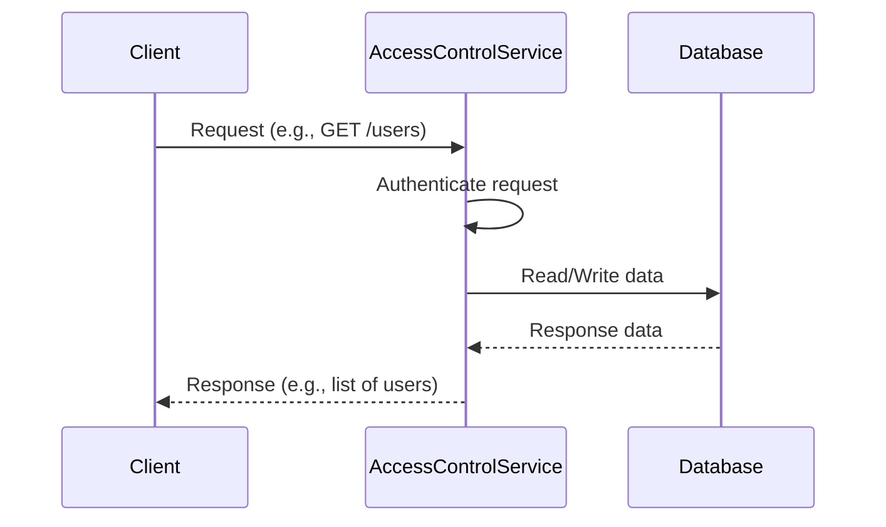
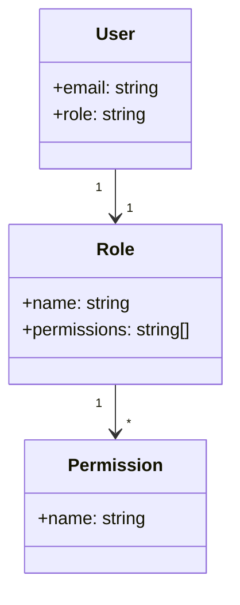

<details>
<summary>Relevant source files</summary>

The following files were used as context for generating this wiki page:

- [src/routes.js](https://github.com/aanickode/access-control-service/blob/main/src/routes.js)
- [docs/api.md](https://github.com/aanickode/access-control-service/blob/main/docs/api.md)
</details>

# API Reference

## Introduction

The API Reference provides a comprehensive guide to the various endpoints and functionalities offered by the access control service. This service plays a crucial role in managing user roles, permissions, and authentication within the application. It allows authorized users to view and create roles, assign roles to users, and generate authentication tokens.

Sources: [src/routes.js](), [docs/api.md]()

## Endpoints

### GET /users

This endpoint retrieves a list of all registered users and their associated roles.

#### Requirements

- The requesting user must have the `view_users` permission.

#### Response

- Status Code: 200 (OK)
- Body: An array of user objects containing the `email` and `role` properties.

```json
[
  { "email": "user1@example.com", "role": "admin" },
  { "email": "user2@example.com", "role": "editor" },
  ...
]
```

Sources: [src/routes.js:6-9]()

### POST /roles

This endpoint allows authorized users to create new roles with specific permissions.

#### Requirements

- The requesting user must have the `create_role` permission.

#### Request Body

- `name` (string): The name of the new role.
- `permissions` (array): An array of permission strings associated with the role.

```json
{
  "name": "manager",
  "permissions": ["view_users", "create_role"]
}
```

#### Response

- Status Code: 201 (Created)
- Body: An object containing the `role` name and `permissions` array.

```json
{
  "role": "manager",
  "permissions": ["view_users", "create_role"]
}
```

Sources: [src/routes.js:11-18]()

### GET /permissions

This endpoint retrieves a list of all defined roles and their associated permissions.

#### Requirements

- The requesting user must have the `view_permissions` permission.

#### Response

- Status Code: 200 (OK)
- Body: An object where the keys are role names, and the values are arrays of permission strings.

```json
{
  "admin": ["view_users", "create_role", "view_permissions"],
  "editor": ["view_users"],
  ...
}
```

Sources: [src/routes.js:20-23]()

### POST /tokens

This endpoint allows users to generate an authentication token by providing their user and role information.

#### Request Body

- `user` (string): The user's email or identifier.
- `role` (string): The role to be assigned to the user.

```json
{
  "user": "user1@example.com",
  "role": "admin"
}
```

#### Response

- Status Code: 201 (Created)
- Body: An object containing the `user` and `role` properties.

```json
{
  "user": "user1@example.com",
  "role": "admin"
}
```

Sources: [src/routes.js:25-33]()

## Data Flow

The following sequence diagram illustrates the high-level data flow when a client interacts with the access control service:



1. The client sends a request to the access control service, such as retrieving a list of users or creating a new role.
2. The access control service authenticates the request by checking the user's permissions based on their assigned role.
3. If the user has the required permissions, the service interacts with the database to read or write data as needed.
4. The database responds with the requested data or a success/failure status.
5. The access control service processes the response and sends it back to the client.

Sources: [src/routes.js]()

## Role-Based Access Control (RBAC) Architecture

The access control service implements a Role-Based Access Control (RBAC) architecture, where permissions are assigned to roles, and users are assigned specific roles. This approach simplifies the management of permissions and provides a flexible way to control access to various resources and functionalities within the application.



- **Users**: Represent individual users in the system, identified by their email or a unique identifier. Each user is assigned a specific role.
- **Roles**: Define a set of permissions that govern what actions a user can perform within the application.
- **Permissions**: Represent individual access rights or capabilities, such as viewing users, creating roles, or modifying data.

The access control service manages the relationships between users, roles, and permissions, ensuring that users can only perform actions they are authorized for based on their assigned roles.

Sources: [src/routes.js]()

## Role Management

The access control service provides endpoints for managing roles and their associated permissions.

| Endpoint | Description | Required Permission |
| --- | --- | --- |
| `POST /roles` | Create a new role with specified permissions | `create_role` |
| `GET /permissions` | Retrieve a list of all defined roles and their permissions | `view_permissions` |

Sources: [src/routes.js:11-23]()

## User Management

The access control service allows authorized users to view a list of registered users and their assigned roles.

| Endpoint | Description | Required Permission |
| --- | --- | --- |
| `GET /users` | Retrieve a list of all registered users and their roles | `view_users` |

Sources: [src/routes.js:6-9]()

## Authentication

The access control service provides an endpoint for generating authentication tokens for users based on their assigned roles.

| Endpoint | Description |
| --- | --- |
| `POST /tokens` | Generate an authentication token for a user with a specified role |

Sources: [src/routes.js:25-33]()

## Conclusion

The API Reference provides a comprehensive overview of the access control service's endpoints, data flow, and role-based access control architecture. It covers the management of users, roles, permissions, and authentication tokens, enabling developers to integrate and utilize the service effectively within their applications.