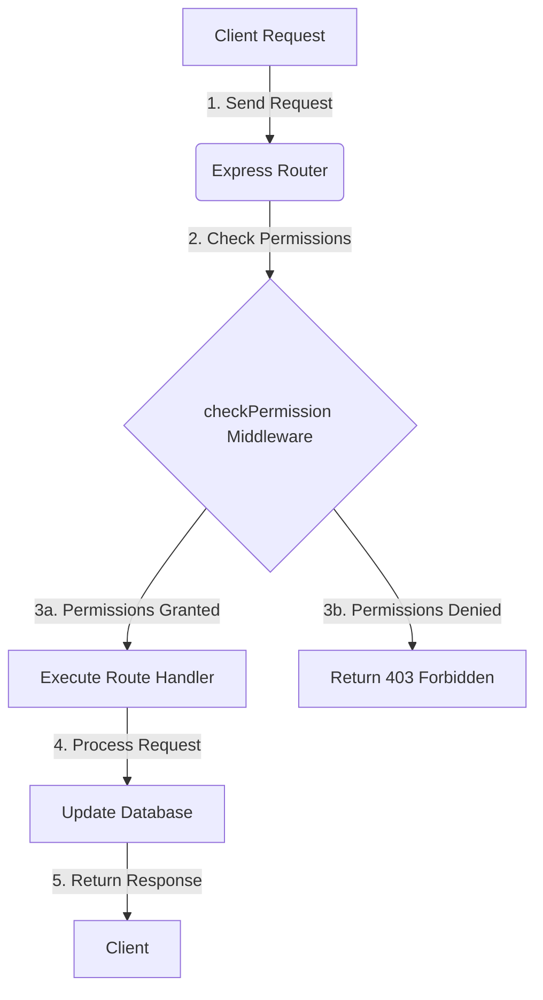
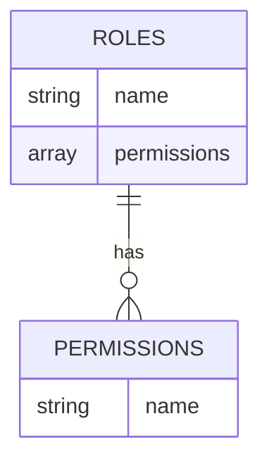
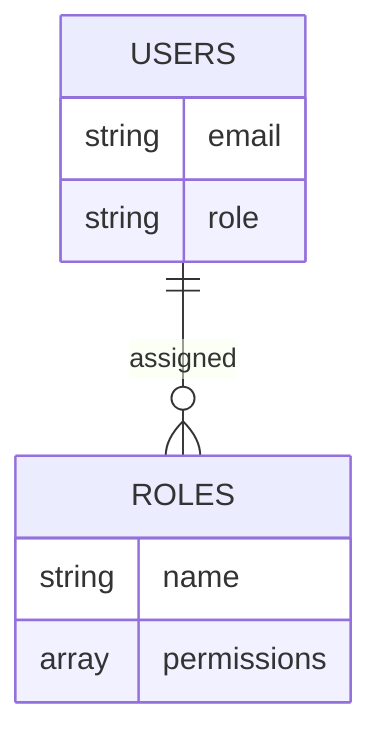
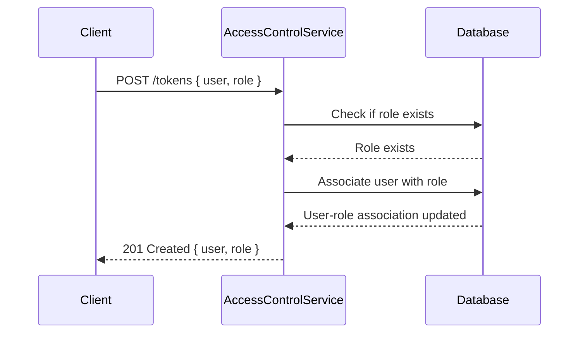

<details>
<summary>Relevant source files</summary>

The following files were used as context for generating this wiki page:

- [src/routes.js](https://github.com/aanickode/access-control-service/blob/main/src/routes.js)
- [docs/api.md](https://github.com/aanickode/access-control-service/blob/main/docs/api.md)
- [src/authMiddleware.js](https://github.com/aanickode/access-control-service/blob/main/src/authMiddleware.js)
- [src/db.js](https://github.com/aanickode/access-control-service/blob/main/src/db.js)
- [src/index.js](https://github.com/aanickode/access-control-service/blob/main/src/index.js)
</details>

# API Reference

## Introduction

This API Reference provides a comprehensive overview of the Access Control Service, a component responsible for managing user roles, permissions, and authentication tokens within the project. The service exposes a set of RESTful API endpoints that allow clients to perform various operations related to user management, role creation, and permission handling.

The Access Control Service plays a crucial role in enforcing access control policies and ensuring that only authorized users can perform specific actions within the application. It serves as a centralized authority for managing user roles, permissions, and authentication tokens, promoting a secure and organized approach to access control.

## API Endpoints

### GET /users

This endpoint retrieves a list of all registered users and their associated roles.

#### Request

```http
GET /users
```

#### Response

```json
[
  {
    "email": "user1@example.com",
    "role": "admin"
  },
  {
    "email": "user2@example.com",
    "role": "editor"
  }
]
```

#### Requirements

The client must have the `view_users` permission to access this endpoint.

Sources: [src/routes.js:6-8]()

### POST /roles

This endpoint allows the creation of a new role with a specified set of permissions.

#### Request

```http
POST /roles
Content-Type: application/json

{
  "name": "manager",
  "permissions": ["view_users", "create_role"]
}
```

#### Response

```json
{
  "role": "manager",
  "permissions": ["view_users", "create_role"]
}
```

#### Requirements

The client must have the `create_role` permission to access this endpoint.

Sources: [src/routes.js:10-16]()

### GET /permissions

This endpoint retrieves a list of all defined roles and their associated permissions.

#### Request

```http
GET /permissions
```

#### Response

```json
{
  "admin": ["view_users", "create_role", "view_permissions"],
  "editor": ["view_users"],
  "manager": ["view_users", "create_role"]
}
```

#### Requirements

The client must have the `view_permissions` permission to access this endpoint.

Sources: [src/routes.js:18-20]()

### POST /tokens

This endpoint generates an authentication token for a user by associating them with a specific role.

#### Request

```http
POST /tokens
Content-Type: application/json

{
  "user": "user1@example.com",
  "role": "admin"
}
```

#### Response

```json
{
  "user": "user1@example.com",
  "role": "admin"
}
```

#### Requirements

No specific permissions are required to access this endpoint.

Sources: [src/routes.js:22-28]()

## Access Control Flow

The Access Control Service follows a specific flow to handle user authentication and authorization:



1. The client sends a request to the Express Router.
2. The Router invokes the `checkPermission` middleware to verify the client's permissions.
3. The middleware checks if the client has the required permissions for the requested route.
   - If the permissions are granted, the route handler is executed.
   - If the permissions are denied, a 403 Forbidden response is returned.
4. The route handler processes the request, potentially updating the database.
5. The response is sent back to the client.

Sources: [src/routes.js](), [src/authMiddleware.js]()

## Permission Handling

The Access Control Service maintains a mapping of roles to their associated permissions. This mapping is stored in an in-memory database for simplicity.



- The `ROLES` table stores the name of each role and an array of associated permission names.
- The `PERMISSIONS` table contains the unique names of all available permissions.

Sources: [src/db.js]()

## User Management

The Access Control Service also maintains a mapping of users to their assigned roles. This mapping is stored in an in-memory database for simplicity.



- The `USERS` table stores the email address of each user and the name of their assigned role.
- The `ROLES` table stores the name of each role and an array of associated permission names.

Sources: [src/db.js]()

## Authentication Flow

The authentication flow for the Access Control Service involves the following steps:



1. The client sends a `POST /tokens` request with the user's email and desired role.
2. The Access Control Service checks if the requested role exists in the database.
3. If the role exists, the service associates the user with the requested role in the database.
4. The service responds with a 201 Created status and the user-role association.

Sources: [src/routes.js:22-28](), [src/db.js]()

## Key Components

| Component | Description |
| --- | --- |
| Express Router | Handles incoming HTTP requests and routes them to the appropriate handlers. |
| `checkPermission` Middleware | Verifies if the client has the required permissions for a specific route. |
| In-Memory Database | Stores user-role mappings and role-permission mappings. |

Sources: [src/routes.js](), [src/authMiddleware.js](), [src/db.js]()

## Conclusion

The Access Control Service provides a centralized solution for managing user roles, permissions, and authentication tokens within the project. By exposing a set of RESTful API endpoints, it allows clients to perform various operations related to user management, role creation, and permission handling. The service enforces access control policies and ensures that only authorized users can perform specific actions, promoting a secure and organized approach to access control.