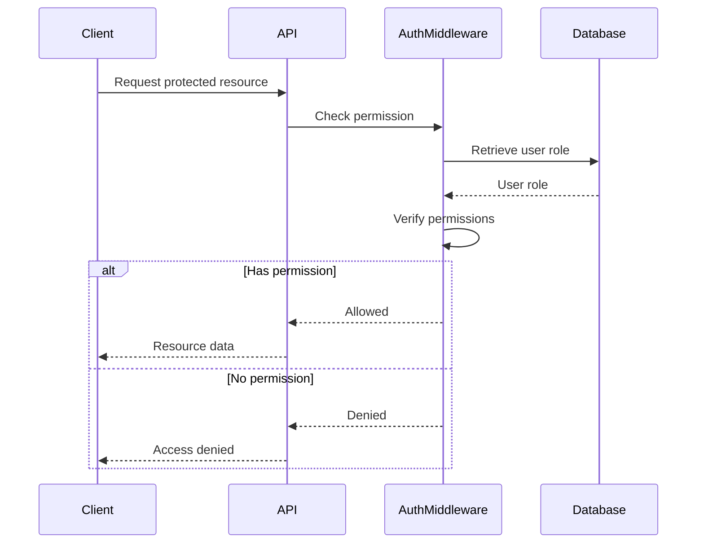
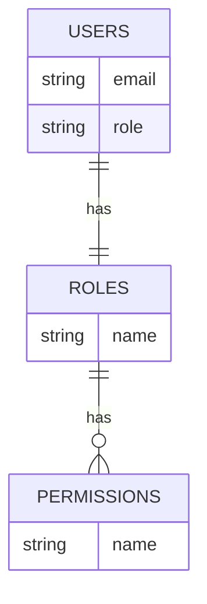

<details>
<summary>Relevant source files</summary>

The following files were used as context for generating this wiki page:

- [src/routes.js](https://github.com/aanickode/access-control-service/blob/main/src/routes.js)
- [docs/api.md](https://github.com/aanickode/access-control-service/blob/main/docs/api.md)
</details>

# API Reference

## Introduction

The API Reference provides a comprehensive overview of the API endpoints and their functionalities within the access control service. This service manages user roles, permissions, and authentication tokens, enabling controlled access to resources based on defined roles and permissions.

Sources: [src/routes.js](), [docs/api.md]()

## API Endpoints

### GET /users

Retrieves a list of all registered users and their associated roles.

#### Requirements

- The requesting user must have the `view_users` permission.

#### Response

```json
[
  {
    "email": "user1@example.com",
    "role": "admin"
  },
  {
    "email": "user2@example.com",
    "role": "editor"
  }
]
```

Sources: [src/routes.js:6-9]()

### POST /roles

Creates a new role with the specified name and associated permissions.

#### Requirements

- The requesting user must have the `create_role` permission.

#### Request Body

```json
{
  "name": "manager",
  "permissions": ["view_users", "create_role"]
}
```

#### Response

```json
{
  "role": "manager",
  "permissions": ["view_users", "create_role"]
}
```

Sources: [src/routes.js:11-18]()

### GET /permissions

Retrieves a list of all defined roles and their associated permissions.

#### Requirements

- The requesting user must have the `view_permissions` permission.

#### Response

```json
{
  "admin": ["view_users", "create_role", "view_permissions"],
  "editor": ["view_users"],
  "manager": ["view_users", "create_role"]
}
```

Sources: [src/routes.js:20-22]()

### POST /tokens

Assigns a role to a user, effectively creating an authentication token.

#### Request Body

```json
{
  "user": "user1@example.com",
  "role": "admin"
}
```

#### Response

```json
{
  "user": "user1@example.com",
  "role": "admin"
}
```

Sources: [src/routes.js:24-31]()

## Access Control Flow

The following sequence diagram illustrates the access control flow when a user attempts to access a protected resource:



1. The client sends a request to access a protected resource.
2. The API routes the request to the `authMiddleware` for permission checking.
3. The `authMiddleware` retrieves the user's role from the database.
4. The `authMiddleware` verifies if the user's role has the required permission for the requested resource.
5. If the user has permission, the API returns the requested resource data to the client.
6. If the user does not have permission, the API returns an "Access denied" response to the client.

Sources: [src/routes.js:6](), [src/routes.js:11](), [src/routes.js:20]()

## Role and Permission Management

The access control service provides endpoints for managing roles and their associated permissions. The following diagram illustrates the relationship between roles and permissions:


- A `Role` has a unique name and a list of associated `Permission` names.
- A `Permission` represents a specific action or resource access level.
- A `Role` can have multiple `Permission` instances, and a `Permission` can be associated with multiple `Role` instances.

Sources: [src/routes.js:11-18](), [src/routes.js:20-22]()

## Data Storage

The access control service uses an in-memory data store to persist user roles, permissions, and authentication tokens. The following diagram illustrates the data model:



- The `USERS` table stores user email addresses and their assigned role names.
- The `ROLES` table stores role names and their associated permission names.
- The `PERMISSIONS` table stores unique permission names.
- A user can have one role, and a role can have multiple permissions.

Sources: [src/routes.js:6-9](), [src/routes.js:11-18](), [src/routes.js:20-22](), [src/routes.js:24-31]()

## Conclusion

The API Reference provides a comprehensive overview of the access control service's API endpoints, data models, and access control mechanisms. By leveraging roles and permissions, the service enables controlled access to resources based on defined access levels. The API endpoints allow for managing users, roles, permissions, and authentication tokens, ensuring secure and granular access control within the application.