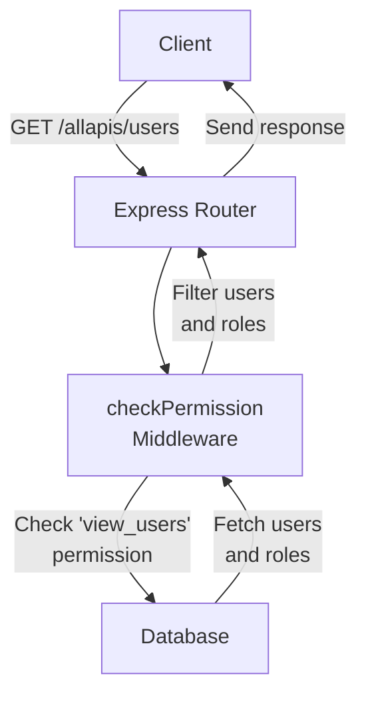
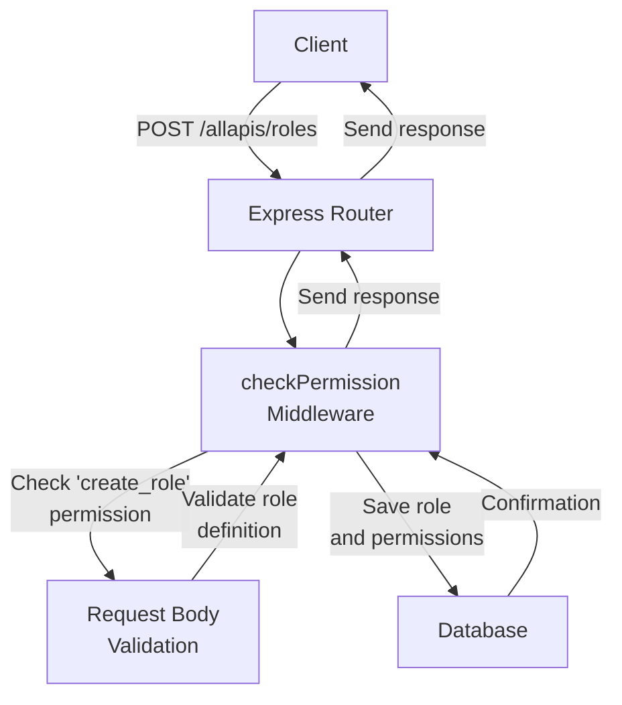
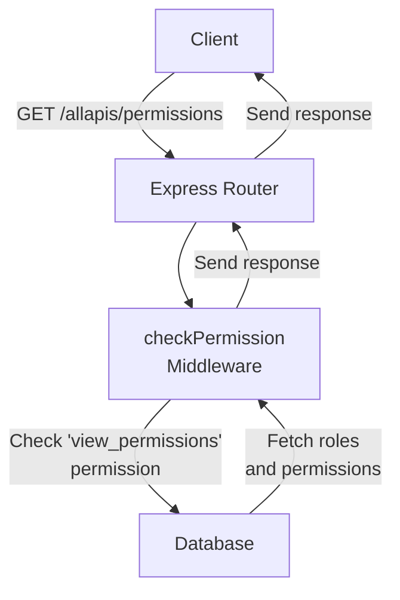
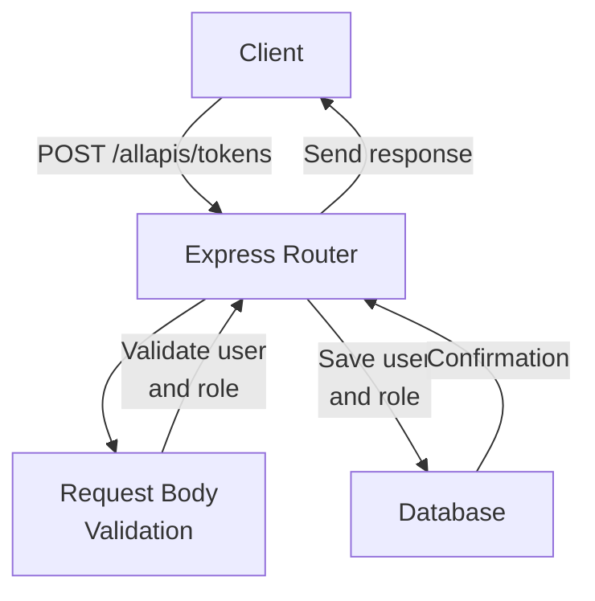
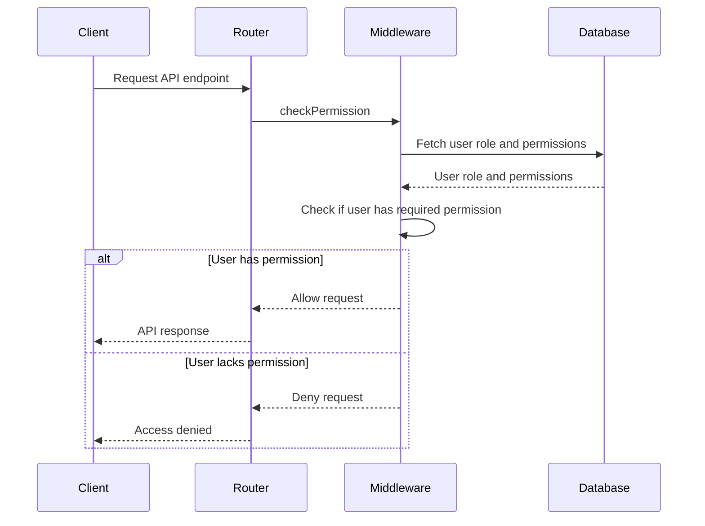

Relevant source files

The following files were used as context for generating this wiki page:

- [src/routes.js](https://github.com/aanickode/access-control-service/blob/main/src/routes.js)
- [docs/api.md](https://github.com/aanickode/access-control-service/blob/main/docs/api.md)

# API and Routes

## Introduction

The API and Routes module serves as the central interface for handling HTTP requests and managing access control within the application. It defines the available endpoints, handles authentication and authorization, and interacts with the underlying data store. This module plays a crucial role in facilitating secure access to resources based on user roles and permissions.

## API Endpoints

### GET /allapis/users

This endpoint retrieves a list of all registered users and their associated roles.

#### Flow

Sources: [src/routes.js:7-9]()

### POST /allapis/roles

This endpoint allows authorized users to create new roles with associated permissions.

#### Flow

Sources: [src/routes.js:12-18]()

### GET /allapis/permissions

This endpoint retrieves a list of all defined roles and their associated permissions.

#### Flow

Sources: [src/routes.js:21-23]()

### POST /allapis/tokens

This endpoint allows users to obtain an access token by providing their user credentials and associated role.

#### Flow

Sources: [src/routes.js:26-32]()

## Authentication and Authorization

The API routes are protected by an authentication middleware (`checkPermission`) that verifies the user's permissions before allowing access to specific endpoints.

Sources: [src/routes.js:3,7,12,21]()

## Data Models

### User

| Field | Type | Description |
| --- | --- | --- |
| email | string | Unique email address of the user |
| role | string | Role assigned to the user |

Sources: [src/routes.js:8]()

### Role

| Field | Type | Description |
| --- | --- | --- |
| name | string | Unique name of the role |
| permissions | string[] | Array of permissions associated with the role |

Sources: [src/routes.js:14,22]()

## Conclusion

The API and Routes module provides a secure and organized way to manage user access and permissions within the application. By defining clear endpoints and implementing authentication and authorization mechanisms, it ensures that only authorized users can perform specific actions based on their assigned roles and permissions.