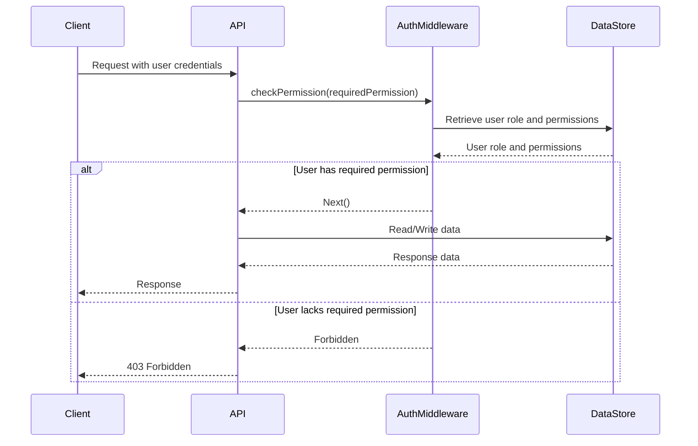

<details>
<summary>Relevant source files</summary>

The following files were used as context for generating this wiki page:

- [src/routes.js](https://github.com/aanickode/access-control-service/blob/main/src/routes.js)
- [docs/api.md](https://github.com/aanickode/access-control-service/blob/main/docs/api.md)
</details>

# API and Routes

## Introduction

This wiki page covers the API and routing system within the project, which handles incoming requests, enforces access control, and interacts with the underlying data store. The API provides endpoints for managing users, roles, permissions, and authentication tokens.

Sources: [src/routes.js](), [docs/api.md]()

## API Endpoints

### GET /users

Retrieves a list of all registered users and their associated roles.

#### Requirements

- The requesting user must have the `view_users` permission.

#### Response

```json
[
  { "email": "user1@example.com", "role": "admin" },
  { "email": "user2@example.com", "role": "editor" }
]
```

Sources: [src/routes.js:6-8]()

### POST /roles

Creates a new role with the specified name and permissions.

#### Request Body

```json
{
  "name": "manager",
  "permissions": ["view_users", "create_role"]
}
```

#### Requirements

- The requesting user must have the `create_role` permission.
- The `name` field is required and must be a non-empty string.
- The `permissions` field is required and must be an array of valid permission strings.

#### Response

```json
{
  "role": "manager",
  "permissions": ["view_users", "create_role"]
}
```

Sources: [src/routes.js:10-16]()

### GET /permissions

Retrieves a list of all defined roles and their associated permissions.

#### Requirements

- The requesting user must have the `view_permissions` permission.

#### Response

```json
{
  "admin": ["view_users", "create_role", "view_permissions"],
  "editor": ["view_users"]
}
```

Sources: [src/routes.js:18-20]()

### POST /tokens

Assigns a role to a user, effectively creating an authentication token.

#### Request Body

```json
{
  "user": "user1@example.com",
  "role": "admin"
}
```

#### Requirements

- The `user` field is required and must be a non-empty string.
- The `role` field is required and must be a valid role defined in the system.

#### Response

```json
{
  "user": "user1@example.com",
  "role": "admin"
}
```

Sources: [src/routes.js:22-28]()

## Access Control Middleware

The `checkPermission` middleware function is used to enforce access control on protected routes. It verifies if the requesting user has the required permission based on their assigned role.

```javascript
import db from './db.js';

export function checkPermission(requiredPermission) {
  return (req, res, next) => {
    const userRole = db.users[req.user];
    const permissions = db.roles[userRole] || [];
    if (permissions.includes(requiredPermission)) {
      next();
    } else {
      res.status(403).json({ error: 'Forbidden' });
    }
  };
}
```

- The `checkPermission` function takes a `requiredPermission` string as an argument.
- It returns a middleware function that can be used in route handlers.
- The middleware function retrieves the user's role from the `db.users` object.
- It then looks up the permissions associated with that role in the `db.roles` object.
- If the required permission is present in the user's permissions, the request is allowed to proceed.
- Otherwise, a 403 Forbidden response is sent.

Sources: [src/routes.js:1](), [src/authMiddleware.js]()

## Data Store

The application uses an in-memory data store (`db.js`) to persist users, roles, and permissions. This is a simplified implementation for demonstration purposes and should be replaced with a proper database solution in a production environment.

```javascript
const db = {
  users: {
    'admin@example.com': 'admin',
  },
  roles: {
    admin: ['view_users', 'create_role', 'view_permissions'],
    editor: ['view_users'],
  },
};

export default db;
```

- The `users` object maps user emails to their assigned roles.
- The `roles` object maps role names to an array of associated permissions.

Sources: [src/db.js]()

## Request Flow

The following sequence diagram illustrates the flow of a request through the API and the access control middleware:



1. The client sends a request to the API, including user credentials.
2. The API invokes the `checkPermission` middleware with the required permission for the requested route.
3. The middleware retrieves the user's role and associated permissions from the data store.
4. If the user has the required permission, the middleware allows the request to proceed to the route handler.
5. The route handler interacts with the data store to read or write data as needed.
6. The API sends the appropriate response back to the client.
7. If the user lacks the required permission, the middleware sends a 403 Forbidden response to the client.

Sources: [src/routes.js](), [src/authMiddleware.js](), [src/db.js]()

## Conclusion

The API and routing system in this project provides a simple yet effective way to manage users, roles, permissions, and authentication tokens. The access control middleware ensures that only authorized users can perform certain actions based on their assigned roles and permissions. While the current implementation uses an in-memory data store, it can be easily extended to integrate with a more robust database solution in a production environment.