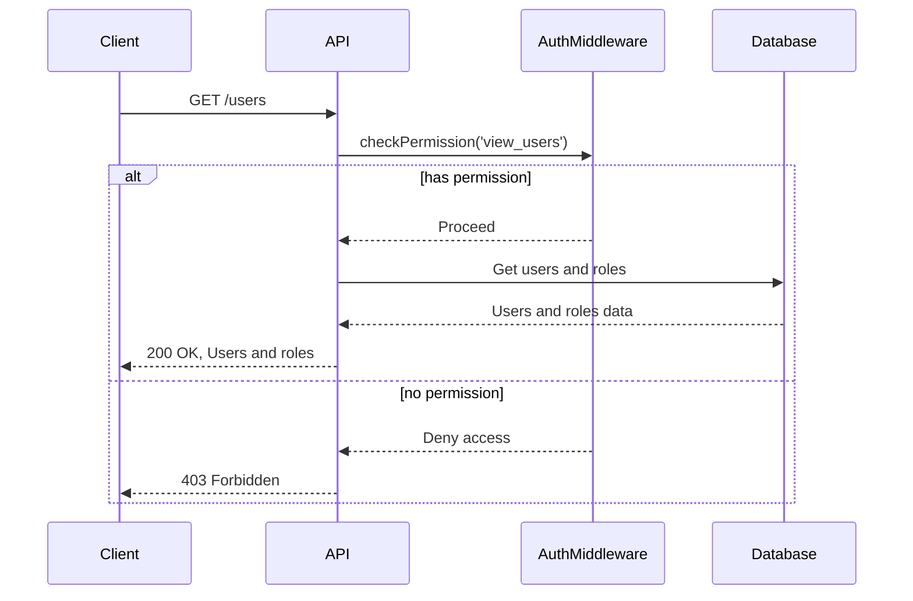
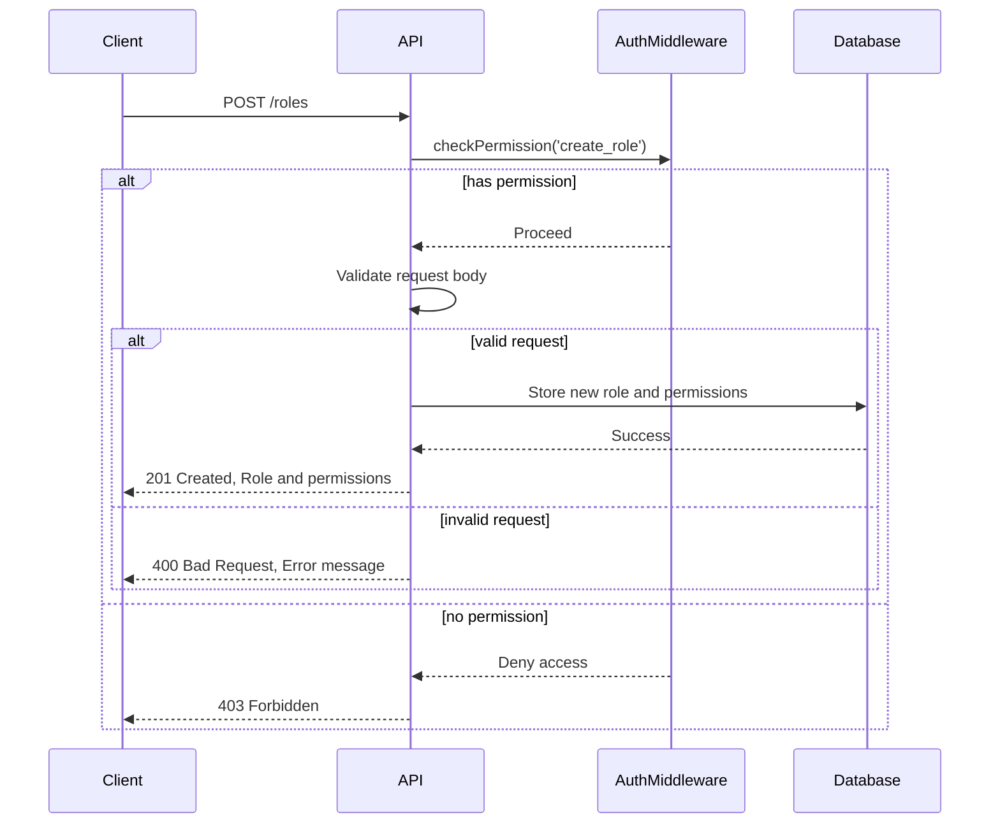
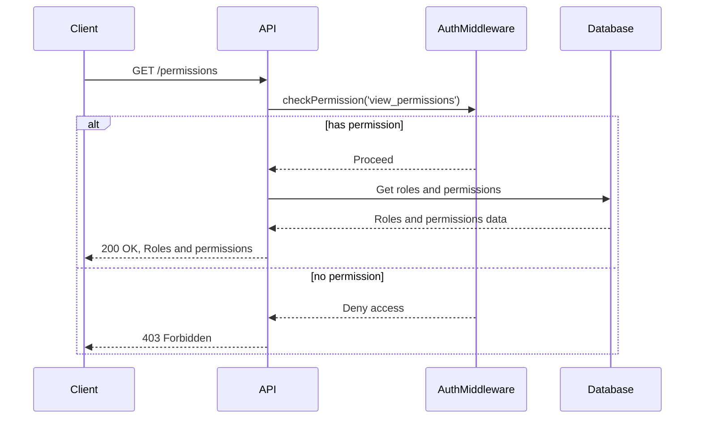
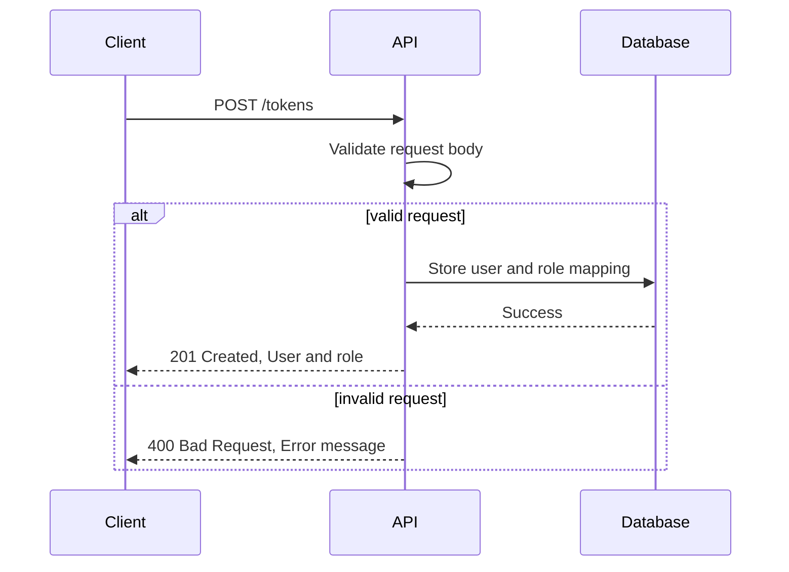
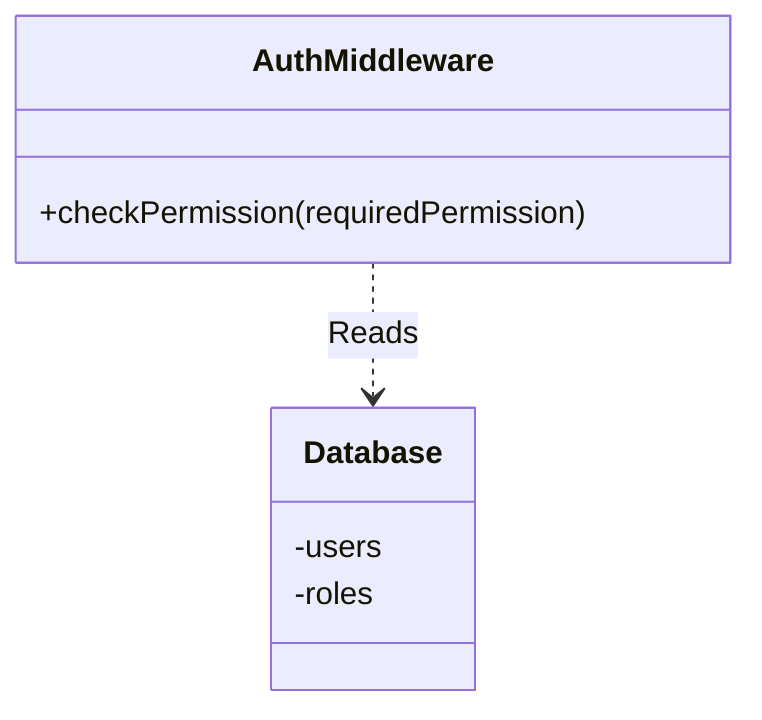

Relevant source files

The following files were used as context for generating this wiki page:

- [src/routes.js](https://github.com/aanickode/access-control-service/blob/main/src/routes.js)
- [docs/api.md](https://github.com/aanickode/access-control-service/blob/main/docs/api.md)

# API and Routes

## Introduction

The API and Routes module is a crucial component of the project, responsible for handling incoming HTTP requests and exposing various functionalities related to user management, role management, and access control. It serves as the primary interface for interacting with the application's core features.

Sources: [src/routes.js](), [docs/api.md]()

## API Endpoints

### GET /users

This endpoint retrieves a list of all registered users and their associated roles. It requires the `view_users` permission to access.

Sources: [src/routes.js:5-8]()

### POST /roles

This endpoint allows creating a new role with a set of permissions. It requires the `create_role` permission to access.

Sources: [src/routes.js:10-17]()

### GET /permissions

This endpoint retrieves a list of all defined roles and their associated permissions. It requires the `view_permissions` permission to access.

Sources: [src/routes.js:19-22]()

### POST /tokens

This endpoint associates a user with a role, effectively granting the user the permissions associated with that role.

Sources: [src/routes.js:24-31]()

## Access Control Middleware

The `checkPermission` middleware is used to enforce access control for certain routes based on the user's assigned role and the required permissions.

The `checkPermission` middleware function:

1. Retrieves the user's role from the `Database`.
2. Checks if the user's role has the `requiredPermission`.
3. If the user has the required permission, the request is allowed to proceed.
4. If the user does not have the required permission, the request is denied with a 403 Forbidden status.

Sources: [src/routes.js:5,10,19](), [src/authMiddleware.js]()

## Data Models

### Users

The `users` object in the `Database` maps user identifiers (e.g., email addresses) to their assigned roles.

| Field | Type   | Description                |
|-------|--------|----------------------------|
| email | string | User's email address       |
| role  | string | Name of the assigned role  |

Sources: [src/routes.js:7,30](), [src/db.js]()

### Roles

The `roles` object in the `Database` maps role names to their associated permissions.

| Field       | Type     | Description                       |
|-------------|----------|-----------------------------------|
| name        | string   | Name of the role                  |
| permissions | string[] | Array of permission identifiers   |

Sources: [src/routes.js:13,22](), [src/db.js]()

## Conclusion

The API and Routes module provides a comprehensive set of endpoints for managing users, roles, and permissions within the application. It enforces access control through the `checkPermission` middleware, ensuring that only authorized users can perform certain actions based on their assigned roles and permissions.

Sources: [src/routes.js](), [docs/api.md]()