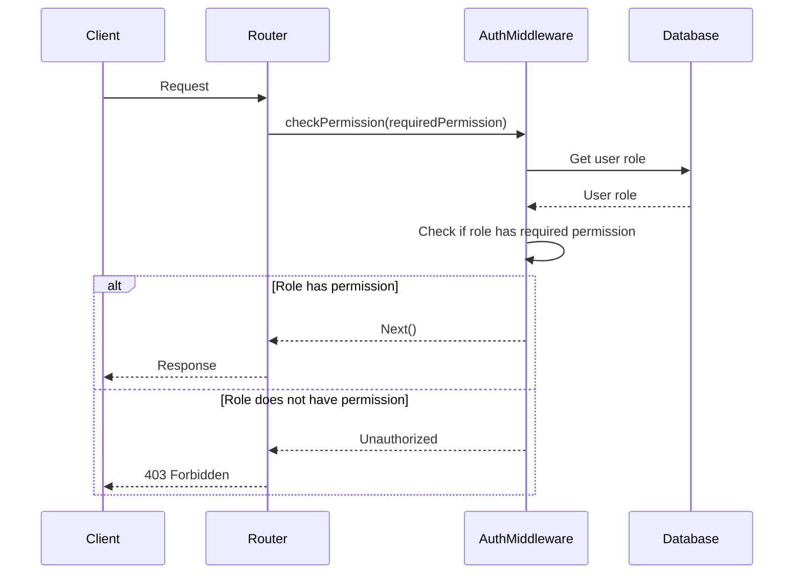

<details>
<summary>Relevant source files</summary>

The following files were used as context for generating this wiki page:

- [src/routes.js](https://github.com/aanickode/access-control-service/blob/main/src/routes.js)
- [docs/api.md](https://github.com/aanickode/access-control-service/blob/main/docs/api.md)
- [src/authMiddleware.js](https://github.com/aanickode/access-control-service/blob/main/src/authMiddleware.js)
- [src/db.js](https://github.com/aanickode/access-control-service/blob/main/src/db.js)
- [src/index.js](https://github.com/aanickode/access-control-service/blob/main/src/index.js)

</details>

# API and Routes

## Introduction

This wiki page covers the API and routing architecture of the access control service. The service provides a RESTful API for managing user roles, permissions, and authentication tokens. It uses Express.js as the web application framework and maintains an in-memory database for storing user roles and permissions.

The API endpoints and their corresponding routes are defined in the `src/routes.js` file, which imports necessary middleware functions and the in-memory database module. The service follows a role-based access control (RBAC) model, where users are assigned roles, and roles are associated with specific permissions.

## API Endpoints and Routes

### GET /users

This endpoint retrieves a list of all registered users and their assigned roles.

```mermaid
graph TD
    Client-->|GET /users|Router
    Router-->|checkPermission('view_users')|AuthMiddleware
    AuthMiddleware-->|Authorized|Router
    Router-->|res.json()|Client
```

- **Route:** `router.get('/users', checkPermission('view_users'), ...)`
- **Middleware:** `checkPermission('view_users')` from `authMiddleware.js`
- **Response:** JSON array of user email and role objects
- **Permission Required:** `view_users`

Sources: [src/routes.js:6-8](), [src/authMiddleware.js]()

### POST /roles

This endpoint allows creating a new role with a set of permissions.

```mermaid
graph TD
    Client-->|POST /roles|Router
    Router-->|checkPermission('create_role')|AuthMiddleware
    AuthMiddleware-->|Authorized|Router
    Router-->|db.roles[name] = permissions|Database
    Router-->|res.status(201).json()|Client
```

- **Route:** `router.post('/roles', checkPermission('create_role'), ...)`
- **Middleware:** `checkPermission('create_role')` from `authMiddleware.js`
- **Request Body:** `{ name, permissions }`
- **Response:** JSON object with the new role and its permissions
- **Permission Required:** `create_role`

Sources: [src/routes.js:10-16](), [src/authMiddleware.js](), [src/db.js]()

### GET /permissions

This endpoint retrieves a list of all defined roles and their associated permissions.

```mermaid
graph TD
    Client-->|GET /permissions|Router
    Router-->|checkPermission('view_permissions')|AuthMiddleware
    AuthMiddleware-->|Authorized|Router
    Router-->|res.json(db.roles)|Client
```

- **Route:** `router.get('/permissions', checkPermission('view_permissions'), ...)`
- **Middleware:** `checkPermission('view_permissions')` from `authMiddleware.js`
- **Response:** JSON object containing roles and their permissions
- **Permission Required:** `view_permissions`

Sources: [src/routes.js:18-20](), [src/authMiddleware.js](), [src/db.js]()

### POST /tokens

This endpoint assigns a role to a user, effectively creating an authentication token.

```mermaid
graph TD
    Client-->|POST /tokens|Router
    Router-->|db.users[user] = role|Database
    Router-->|res.status(201).json()|Client
```

- **Route:** `router.post('/tokens', ...)`
- **Request Body:** `{ user, role }`
- **Response:** JSON object with the user and assigned role
- **No Permission Required**

Sources: [src/routes.js:22-27](), [src/db.js]()

## Authentication Middleware

The `checkPermission` middleware function from `authMiddleware.js` is used to enforce role-based access control for certain routes. It checks if the user's assigned role has the required permission before allowing access to the requested route.



- **Middleware Function:** `checkPermission(requiredPermission)`
- **Purpose:** Checks if the user's assigned role has the required permission
- **Implementation:** Retrieves the user's role from the in-memory database and checks if the role's permissions include the required permission

Sources: [src/authMiddleware.js](), [src/db.js]()

## Data Storage

The service uses an in-memory data store (`db.js`) to maintain user roles, permissions, and user-role assignments. This data store is a simple JavaScript object with the following structure:

```javascript
const db = {
  users: {
    // 'user@example.com': 'admin',
    // 'another@example.com': 'viewer'
  },
  roles: {
    // 'admin': ['view_users', 'create_role', 'view_permissions'],
    // 'viewer': ['view_users', 'view_permissions']
  }
};
```

| Key | Type | Description |
|-----|------|-------------|
| `users` | Object | Mapping of user emails to assigned roles |
| `roles` | Object | Mapping of role names to arrays of permissions |

Sources: [src/db.js]()

## Application Entry Point

The `index.js` file serves as the entry point for the application. It sets up the Express server, imports the routes, and starts the server on a specified port.

```javascript
import express from 'express';
import routes from './routes.js';

const app = express();
app.use(express.json());
app.use('/api', routes);

const port = process.env.PORT || 3000;
app.listen(port, () => {
  console.log(`Server running on port ${port}`);
});
```

Sources: [src/index.js]()

## Conclusion

This wiki page covered the API and routing architecture of the access control service, including the available endpoints, authentication middleware, data storage, and application entry point. The service follows a role-based access control model and provides endpoints for managing users, roles, permissions, and authentication tokens. The implementation uses Express.js and an in-memory data store for simplicity.