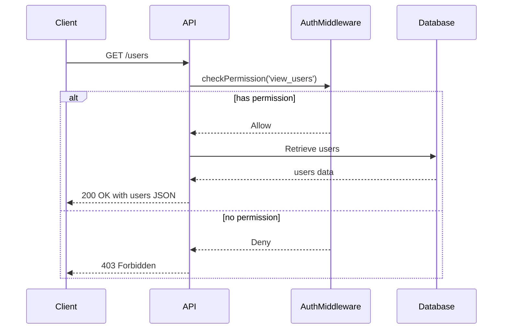
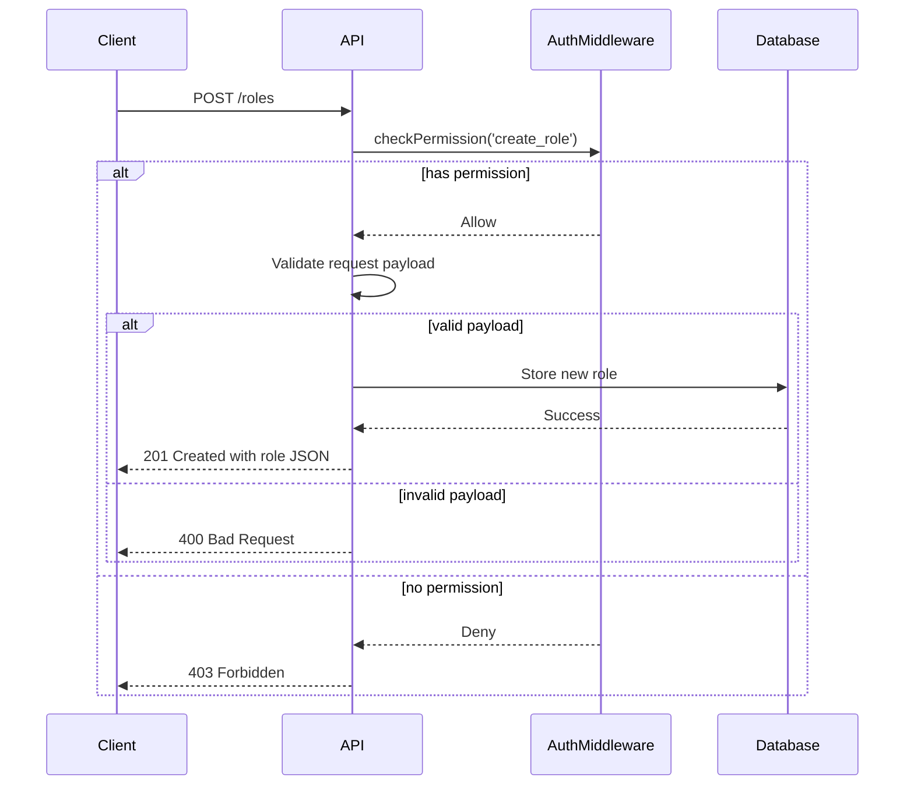
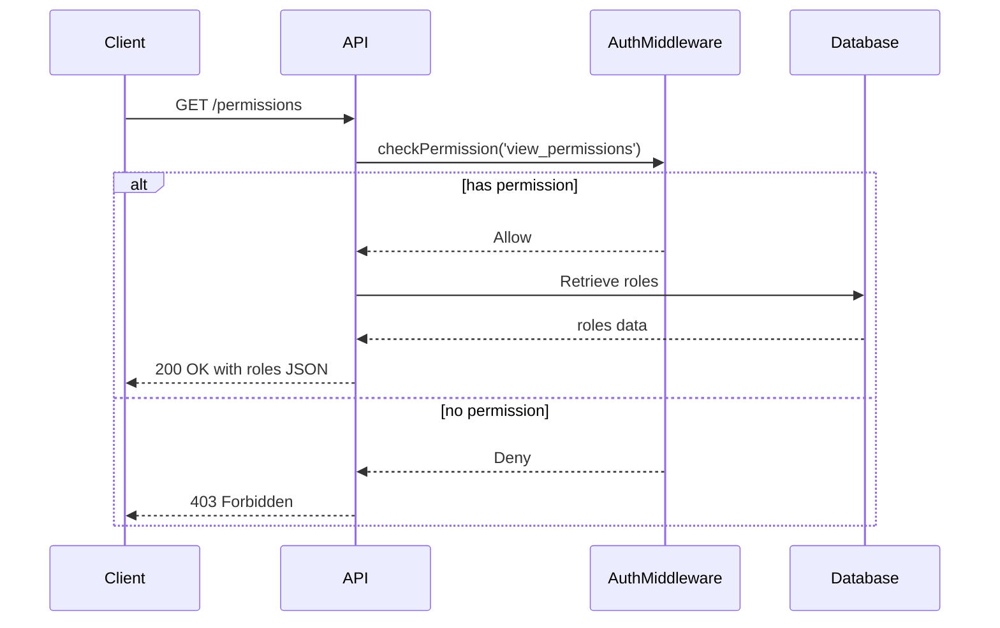
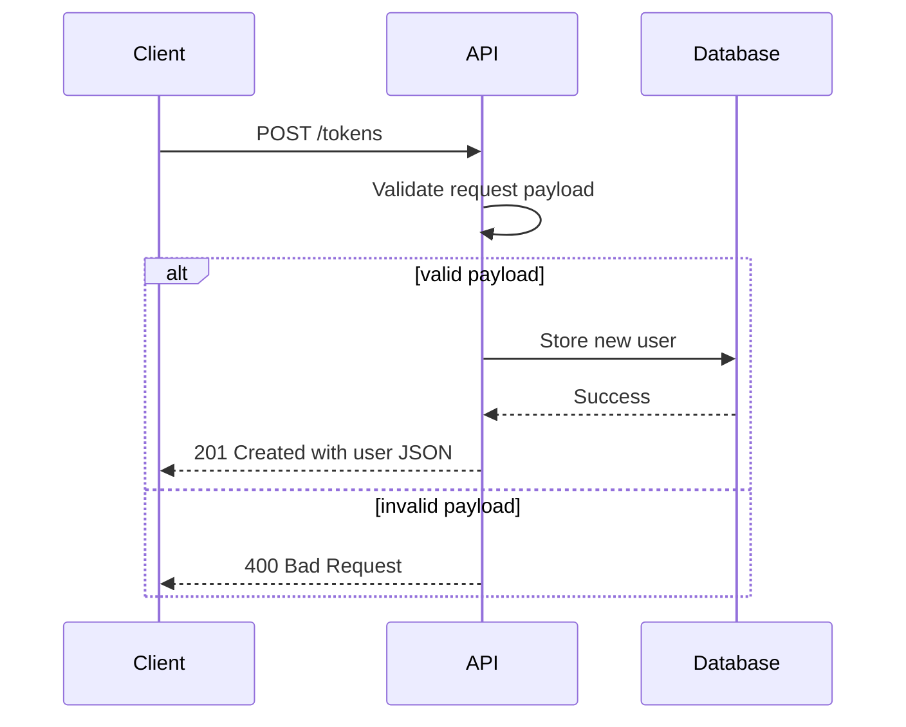

<details>
<summary>Relevant source files</summary>

The following files were used as context for generating this wiki page:

- [src/routes.js](https://github.com/aanickode/access-control-service/blob/main/src/routes.js)
- [docs/api.md](https://github.com/aanickode/access-control-service/blob/main/docs/api.md)
- [src/authMiddleware.js](https://github.com/aanickode/access-control-service/blob/main/src/authMiddleware.js)
- [src/db.js](https://github.com/aanickode/access-control-service/blob/main/src/db.js)
- [src/app.js](https://github.com/aanickode/access-control-service/blob/main/src/app.js)

</details>

# API and Routes

## Introduction

This wiki page covers the API and routing architecture of the Access Control Service project. The service provides a set of RESTful API endpoints for managing user roles, permissions, and access tokens. It utilizes an in-memory data store to persist user and role information.

The API routes are defined using the Express.js framework and handle various operations related to user management, role creation, and permission viewing. The routes are secured using a custom middleware function that checks for the required permissions based on the requested operation.

Sources: [src/routes.js](), [docs/api.md]()

## API Routes

### GET /users

This route retrieves a list of all registered users and their associated roles.

#### Route Definition

```javascript
router.get('/users', checkPermission('view_users'), (req, res) => {
  res.json(Object.entries(db.users).map(([email, role]) => ({ email, role })));
});
```

- Requires the `view_users` permission, enforced by the `checkPermission` middleware.
- Retrieves the `users` object from the in-memory database (`db`).
- Maps the `users` object entries to an array of user objects with `email` and `role` properties.
- Sends the user array as a JSON response.

Sources: [src/routes.js:6-9]()

#### Sequence Diagram



Sources: [src/routes.js:6-9](), [src/authMiddleware.js](), [src/db.js]()

### POST /roles

This route allows creating a new role with a set of associated permissions.

#### Route Definition

```javascript
router.post('/roles', checkPermission('create_role'), (req, res) => {
  const { name, permissions } = req.body;
  if (!name || !Array.isArray(permissions)) {
    return res.status(400).json({ error: 'Invalid role definition' });
  }
  db.roles[name] = permissions;
  res.status(201).json({ role: name, permissions });
});
```

- Requires the `create_role` permission, enforced by the `checkPermission` middleware.
- Expects a JSON payload with `name` and `permissions` properties in the request body.
- Validates the request payload format.
- Stores the new role and its associated permissions in the `roles` object of the in-memory database (`db`).
- Sends a 201 Created response with the new role and permissions.

Sources: [src/routes.js:11-18]()

#### Sequence Diagram



Sources: [src/routes.js:11-18](), [src/authMiddleware.js](), [src/db.js]()

### GET /permissions

This route retrieves the list of all defined roles and their associated permissions.

#### Route Definition

```javascript
router.get('/permissions', checkPermission('view_permissions'), (req, res) => {
  res.json(db.roles);
});
```

- Requires the `view_permissions` permission, enforced by the `checkPermission` middleware.
- Retrieves the `roles` object from the in-memory database (`db`).
- Sends the `roles` object as a JSON response.

Sources: [src/routes.js:20-22]()

#### Sequence Diagram



Sources: [src/routes.js:20-22](), [src/authMiddleware.js](), [src/db.js]()

### POST /tokens

This route allows creating a new user and associating them with a specific role.

#### Route Definition

```javascript
router.post('/tokens', (req, res) => {
  const { user, role } = req.body;
  if (!user || !role) {
    return res.status(400).json({ error: 'Missing user or role' });
  }
  db.users[user] = role;
  res.status(201).json({ user, role });
});
```

- No permission check is required for this route.
- Expects a JSON payload with `user` and `role` properties in the request body.
- Validates the request payload format.
- Stores the new user and their associated role in the `users` object of the in-memory database (`db`).
- Sends a 201 Created response with the new user and role.

Sources: [src/routes.js:24-31]()

#### Sequence Diagram



Sources: [src/routes.js:24-31](), [src/db.js]()

## Data Models

### Users

The `users` object in the in-memory database stores user information, mapping user identifiers (e.g., email addresses) to their associated roles.

```javascript
const users = {
  'user1@example.com': 'admin',
  'user2@example.com': 'viewer',
  // ...
};
```

Sources: [src/db.js]()

### Roles

The `roles` object in the in-memory database stores the defined roles and their associated permissions.

```javascript
const roles = {
  'admin': ['view_users', 'create_role', 'view_permissions'],
  'viewer': ['view_users', 'view_permissions'],
  // ...
};
```

Sources: [src/db.js]()

## Authentication and Authorization

The Access Control Service uses a custom middleware function `checkPermission` to enforce authorization based on the requested operation and the user's associated role.

```javascript
import db from './db.js';

export function checkPermission(requiredPermission) {
  return (req, res, next) => {
    const userRole = db.users[req.user];
    if (!userRole) {
      return res.status(403).json({ error: 'Unauthorized' });
    }
    const permissions = db.roles[userRole];
    if (!permissions || !permissions.includes(requiredPermission)) {
      return res.status(403).json({ error: 'Forbidden' });
    }
    next();
  };
}
```

- The `checkPermission` function takes a `requiredPermission` string as an argument.
- It returns a middleware function that can be used in the route handlers.
- The middleware function retrieves the user's role from the `users` object in the database.
- If the user is not found or their role does not have the required permission, a 403 Forbidden response is sent.
- If the user has the required permission, the middleware calls `next()` to proceed to the route handler.

Sources: [src/authMiddleware.js]()

## Conclusion

The Access Control Service provides a set of RESTful API endpoints for managing user roles, permissions, and access tokens. It utilizes an in-memory data store to persist user and role information. The API routes are secured using a custom middleware function that checks for the required permissions based on the requested operation. The service follows a role-based access control (RBAC) model, where users are assigned roles, and roles are associated with specific permissions.