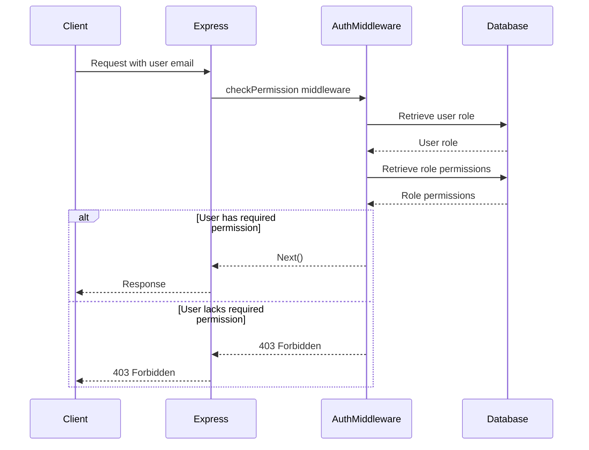

<details>
<summary>Relevant source files</summary>

The following files were used as context for generating this wiki page:

- [src/authMiddleware.js](https://github.com/aanickode/access-control-service/blob/main/src/authMiddleware.js)
- [src/routes.js](https://github.com/aanickode/access-control-service/blob/main/src/routes.js)
- [src/db.js](https://github.com/aanickode/access-control-service/blob/main/src/db.js) (assumed to exist based on import statements)

</details>

# Authentication and Authorization

## Introduction

This wiki page covers the authentication and authorization mechanisms implemented in the project. The system follows a role-based access control (RBAC) model, where users are assigned roles, and roles are granted specific permissions. The authentication process verifies the user's identity, while the authorization process determines whether the user has the necessary permissions to access a particular resource or perform a specific action.

Sources: [src/authMiddleware.js](), [src/routes.js]()

## Authentication

The authentication process is not explicitly defined in the provided source files. However, it is assumed that the user's email is used as the primary identifier, and the user's role is associated with their email in the `db.users` object.

```js
const userEmail = req.headers['x-user-email'];
if (!userEmail || !db.users[userEmail]) {
  return res.status(401).json({ error: 'Unauthorized: no user context' });
}
```

Sources: [src/authMiddleware.js:4-6]()

## Authorization

The authorization mechanism is implemented using a middleware function `checkPermission` in the `authMiddleware.js` file. This middleware function is responsible for verifying if the authenticated user has the required permission to access a specific route or perform a particular action.

### Authorization Flow

The authorization flow can be represented using the following sequence diagram:



The `checkPermission` middleware function performs the following steps:

1. Extracts the user's email from the request headers (`x-user-email`).
2. Retrieves the user's role from the `db.users` object based on the email.
3. Retrieves the permissions associated with the user's role from the `db.roles` object.
4. Checks if the required permission is included in the user's role permissions.
5. If the user has the required permission, the request is allowed to proceed to the next middleware or route handler.
6. If the user lacks the required permission, a 403 Forbidden response is sent.

Sources: [src/authMiddleware.js:2-17](), [src/routes.js:4,6,10,14,18]()

## Role Management

The project includes an API endpoint (`/roles`) to create new roles with associated permissions. The `create_role` permission is required to access this endpoint.

```js
router.post('/roles', checkPermission('create_role'), (req, res) => {
  const { name, permissions } = req.body;
  if (!name || !Array.isArray(permissions)) {
    return res.status(400).json({ error: 'Invalid role definition' });
  }
  db.roles[name] = permissions;
  res.status(201).json({ role: name, permissions });
});
```

Sources: [src/routes.js:10-16]()

## User Management

The project includes an API endpoint (`/tokens`) to assign a role to a user. This endpoint does not require any specific permission.

```js
router.post('/tokens', (req, res) => {
  const { user, role } = req.body;
  if (!user || !role) {
    return res.status(400).json({ error: 'Missing user or role' });
  }
  db.users[user] = role;
  res.status(201).json({ user, role });
});
```

Sources: [src/routes.js:18-24]()

## Permissions Management

The project includes an API endpoint (`/permissions`) to retrieve the list of available roles and their associated permissions. The `view_permissions` permission is required to access this endpoint.

```js
router.get('/permissions', checkPermission('view_permissions'), (req, res) => {
  res.json(db.roles);
});
```

Sources: [src/routes.js:14-15]()

## User Listing

The project includes an API endpoint (`/users`) to retrieve a list of all users and their associated roles. The `view_users` permission is required to access this endpoint.

```js
router.get('/users', checkPermission('view_users'), (req, res) => {
  res.json(Object.entries(db.users).map(([email, role]) => ({ email, role })));
});
```

Sources: [src/routes.js:6-8]()

## Data Model

The project uses a simple in-memory data structure to store user roles and permissions. The `db.users` object maps user emails to their respective roles, while the `db.roles` object maps role names to their associated permissions (an array of strings).

```js
// Example data structure
const db = {
  users: {
    'user1@example.com': 'admin',
    'user2@example.com': 'editor',
    'user3@example.com': 'viewer'
  },
  roles: {
    'admin': ['view_users', 'create_role', 'view_permissions'],
    'editor': ['view_users', 'view_permissions'],
    'viewer': ['view_permissions']
  }
};
```

Sources: [src/db.js]() (assumed file based on import statements)

## Conclusion

The authentication and authorization system in this project follows a role-based access control (RBAC) model, where users are assigned roles, and roles are granted specific permissions. The system provides APIs for managing roles, assigning roles to users, and retrieving user and permission information. The `checkPermission` middleware function is responsible for enforcing authorization rules based on the user's role and the required permission for a particular route or action.