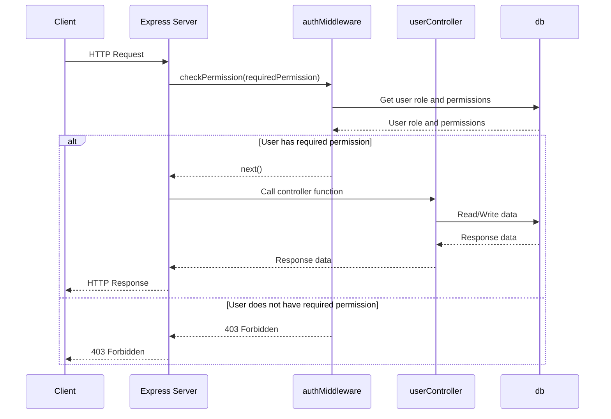

<details>
<summary>Relevant source files</summary>

The following files were used as context for generating this wiki page:

- [src/index.js](https://github.com/aanickode/access-control-service/blob/main/src/index.js)
- [src/authMiddleware.js](https://github.com/aanickode/access-control-service/blob/main/src/authMiddleware.js)
- [src/routes.js](https://github.com/aanickode/access-control-service/blob/main/src/routes.js)
- [src/db.js](https://github.com/aanickode/access-control-service/blob/main/src/db.js)
- [src/controllers/userController.js](https://github.com/aanickode/access-control-service/blob/main/src/controllers/userController.js)
</details>

# Core Services

## Introduction

The Core Services module is a key component of the Access Control Service project, responsible for handling authentication and authorization of user requests. It serves as a central point for managing user roles, permissions, and access control policies. The module consists of several interconnected components, including an Express.js server, middleware functions, and data storage mechanisms.

Sources: [src/index.js](), [src/authMiddleware.js](), [src/routes.js](), [src/db.js]()

## Express.js Server

The Express.js server is the entry point of the application, handling incoming requests and routing them to the appropriate handlers. It is configured to listen on a specified port and serves two API endpoints: `/api` and `/apis`.

```javascript
import express from 'express';
import dotenv from 'dotenv';
import routes from './routes.js';

dotenv.config();

const app = express();
app.use(express.json());
app.use('/api', routes);
app.use('/apis', routes);

const port = process.env.PORT || 8080;

app.listen(port, () => {
  console.log(`Access Control Service listening on port ${port}`);
});
```

Sources: [src/index.js]()

## Authentication and Authorization Middleware

The `authMiddleware.js` file contains a crucial function, `checkPermission`, which acts as a middleware for authenticating and authorizing user requests based on their roles and permissions.

```javascript
import db from './db.js';

export function checkPermission(requiredPermission) {
  return function (req, res, next) {
    const userEmail = req.headers['x-user-email'];
    if (!userEmail || !db.users[userEmail]) {
      return res.status(401).json({ error: 'Unauthorized: no user context' });
    }

    const role = db.users[userEmail];
    const permissions = db.roles[role] || [];

    if (!permissions.includes(requiredPermission)) {
      return res.status(403).json({ error: 'Forbidden: insufficient permissions' });
    }

    next();
  };
}
```

The `checkPermission` function takes a `requiredPermission` parameter and returns a middleware function. This middleware function performs the following steps:

1. Extracts the user's email from the `x-user-email` header of the incoming request.
2. Checks if the user exists in the `db.users` object. If not, it returns a 401 Unauthorized response.
3. Retrieves the user's role from the `db.users` object.
4. Looks up the permissions associated with the user's role in the `db.roles` object.
5. Verifies if the required permission is included in the user's permissions.
6. If the user has the required permission, the middleware calls `next()` to proceed to the next middleware or route handler.
7. If the user does not have the required permission, it returns a 403 Forbidden response.

Sources: [src/authMiddleware.js](), [src/db.js]()

## Routing and Controllers

The `routes.js` file defines the API routes and applies the `checkPermission` middleware to protect specific routes based on the required permissions.

```javascript
import express from 'express';
import { checkPermission } from './authMiddleware.js';
import * as userController from './controllers/userController.js';

const router = express.Router();

router.get('/users', checkPermission('view_users'), userController.getUsers);
router.post('/users', checkPermission('create_user'), userController.createUser);
router.put('/users/:id', checkPermission('update_user'), userController.updateUser);
router.delete('/users/:id', checkPermission('delete_user'), userController.deleteUser);

export default router;
```

In this example, the following routes are defined:

- `GET /users`: Requires the `view_users` permission and calls the `getUsers` function from the `userController`.
- `POST /users`: Requires the `create_user` permission and calls the `createUser` function from the `userController`.
- `PUT /users/:id`: Requires the `update_user` permission and calls the `updateUser` function from the `userController`.
- `DELETE /users/:id`: Requires the `delete_user` permission and calls the `deleteUser` function from the `userController`.

The `checkPermission` middleware is applied to each route, ensuring that only users with the required permission can access the corresponding endpoint.

Sources: [src/routes.js](), [src/controllers/userController.js]()

## Data Storage

The `db.js` file serves as a simple in-memory data storage mechanism for users, roles, and their associated permissions. In a real-world scenario, this data would likely be stored in a persistent database.

```javascript
const db = {
  users: {
    'user1@example.com': 'admin',
    'user2@example.com': 'editor',
    'user3@example.com': 'viewer',
  },
  roles: {
    admin: ['view_users', 'create_user', 'update_user', 'delete_user'],
    editor: ['view_users', 'create_user', 'update_user'],
    viewer: ['view_users'],
  },
};

export default db;
```

In this example, the `db` object contains two properties:

- `users`: An object that maps user emails to their respective roles.
- `roles`: An object that maps roles to their associated permissions.

Sources: [src/db.js]()

## Sequence Diagram

The following sequence diagram illustrates the flow of a user request through the Core Services module:



This diagram shows the interaction between the client, Express server, authentication middleware, user controller, and data storage. The `checkPermission` middleware verifies the user's permissions by consulting the `db` object. If the user has the required permission, the request is forwarded to the appropriate controller function. Otherwise, a 403 Forbidden response is sent back to the client.

Sources: [src/index.js](), [src/authMiddleware.js](), [src/routes.js](), [src/db.js](), [src/controllers/userController.js]()

## Conclusion

The Core Services module plays a crucial role in the Access Control Service project by providing authentication and authorization mechanisms. It ensures that only authorized users with the appropriate permissions can access and perform specific actions within the system. The module follows a modular design, separating concerns into different components such as the Express server, middleware functions, routing, controllers, and data storage. By leveraging this architecture, the Core Services module can be easily extended, maintained, and integrated with other components of the project.