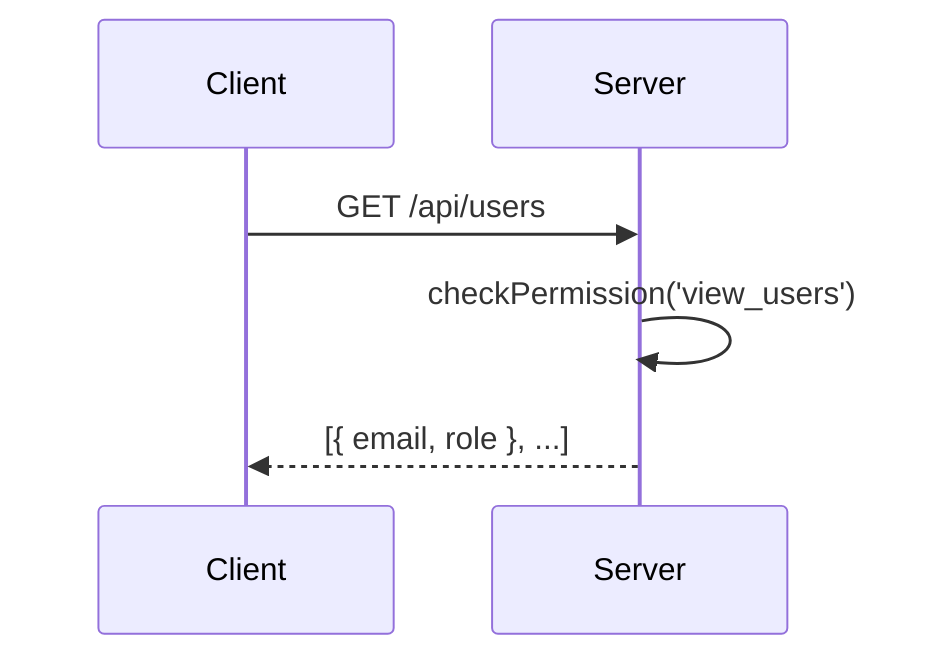
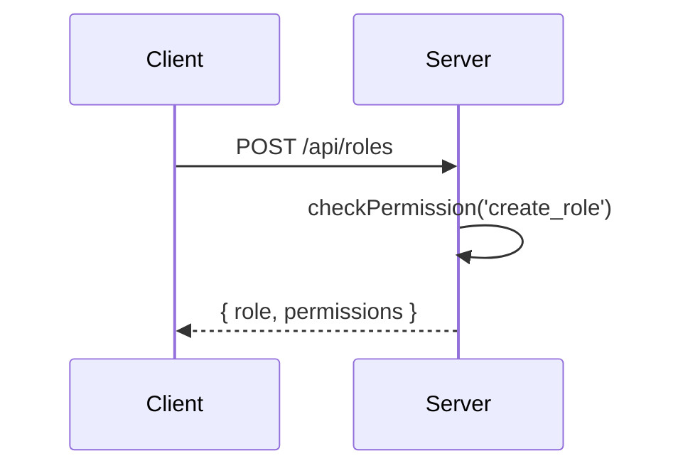
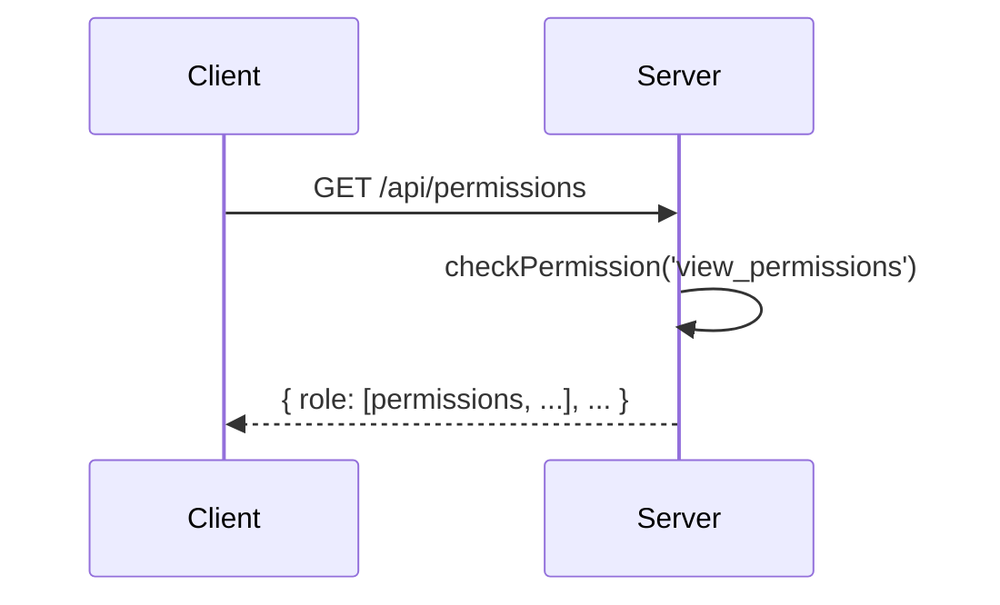
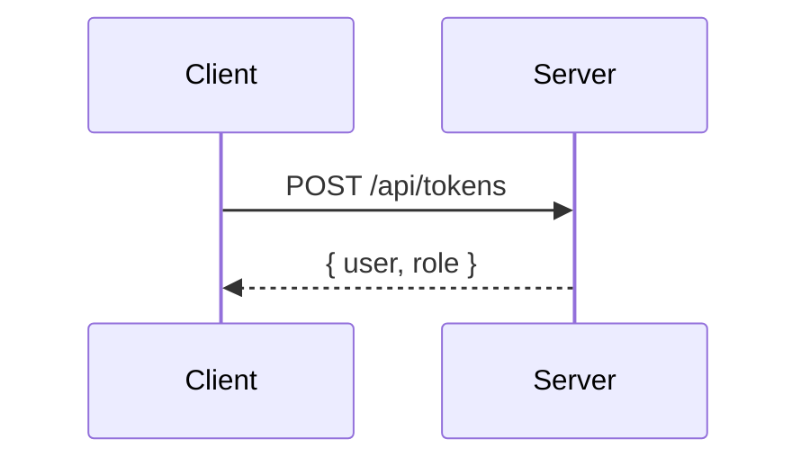

<details>
<summary>Relevant source files</summary>

The following files were used as context for generating this wiki page:

- [src/index.js](https://github.com/aanickode/access-control-service/blob/main/src/index.js)
- [src/routes.js](https://github.com/aanickode/access-control-service/blob/main/src/routes.js)
- [src/authMiddleware.js](https://github.com/aanickode/access-control-service/blob/main/src/authMiddleware.js)
- [src/db.js](https://github.com/aanickode/access-control-service/blob/main/src/db.js)

</details>

# Server-side Components

## Introduction

The provided source files represent a server-side component of an access control service, built using Node.js and Express.js. This service manages user roles, permissions, and authentication tokens. It exposes a set of API endpoints for retrieving user information, creating roles, viewing permissions, and generating authentication tokens.

The main components of this service include:

- **Express.js Server**: The entry point of the application, responsible for setting up the Express server and handling incoming requests.
- **Routes**: Defines the API endpoints and their corresponding handlers.
- **Authentication Middleware**: Implements the logic for checking user permissions based on their assigned roles.
- **In-Memory Database**: A simple in-memory data store for storing user roles, permissions, and authentication tokens.

Sources: [src/index.js](), [src/routes.js](), [src/authMiddleware.js](), [src/db.js]()

## Express.js Server

The `src/index.js` file sets up the Express.js server and configures it to use JSON request bodies and the defined routes.

```mermaid
graph TD
    A[index.js] -->|import| B[express]
    A -->|import| C[dotenv]
    A -->|import| D[routes.js]
    B -->|create instance| E[app]
    E -->|use json parser| F[app.use(express.json())]
    F -->|mount routes| G[app.use('/api', routes)]
    G -->|listen on port| H[app.listen(port)]
```

The server listens on the specified `PORT` environment variable or defaults to port 8080.

Sources: [src/index.js]()

## Routes

The `src/routes.js` file defines the API endpoints and their corresponding handlers. It imports the `checkPermission` middleware from `src/authMiddleware.js` and the in-memory database `db` from `src/db.js`.

### API Endpoints

#### GET /api/users

Retrieves a list of user emails and their associated roles.

- **Middleware**: `checkPermission('view_users')`
- **Response**: JSON array of `{ email, role }` objects



Sources: [src/routes.js:5-8]()

#### POST /api/roles

Creates a new role with the specified name and permissions.

- **Middleware**: `checkPermission('create_role')`
- **Request Body**: `{ name, permissions: [] }`
- **Response**: `{ role: name, permissions }`



Sources: [src/routes.js:10-16]()

#### GET /api/permissions

Retrieves a mapping of role names to their associated permissions.

- **Middleware**: `checkPermission('view_permissions')`
- **Response**: JSON object mapping roles to permission arrays



Sources: [src/routes.js:18-20]()

#### POST /api/tokens

Generates an authentication token by associating a user with a role.

- **Request Body**: `{ user, role }`
- **Response**: `{ user, role }`



Sources: [src/routes.js:22-28]()

## Authentication Middleware

The `src/authMiddleware.js` file exports a `checkPermission` function that serves as a middleware for checking user permissions based on their assigned roles.

```mermaid
graph TD
    A[checkPermission] -->|1. Get user email| B[req.headers['x-user-email']]
    B -->|2. Get user role| C[db.users[userEmail]]
    C -->|3. Get role permissions| D[db.roles[role]]
    D -->|4. Check permission| E[permissions.includes(requiredPermission)]
    E -->|true| F[next()]
    E -->|false| G[res.status(403).json({ error: 'Forbidden' })]
```

The middleware checks the `x-user-email` header for the user's email, retrieves the user's role from the in-memory database, and then checks if the role has the required permission. If the user has the necessary permission, the request is allowed to proceed; otherwise, a 403 Forbidden response is sent.

Sources: [src/authMiddleware.js]()

## In-Memory Database

The `src/db.js` file exports an in-memory data store for storing user roles, permissions, and authentication tokens.

```javascript
const db = {
  users: {
    // 'user@example.com': 'admin',
    // 'another@example.com': 'viewer',
  },
  roles: {
    // 'admin': ['view_users', 'create_role', 'view_permissions'],
    // 'viewer': ['view_users', 'view_permissions'],
  },
};

export default db;
```

The `users` object maps user emails to their assigned roles, while the `roles` object maps role names to their associated permissions.

Sources: [src/db.js]()

## Conclusion

This server-side component provides a basic access control service for managing user roles, permissions, and authentication tokens. It exposes a set of API endpoints for retrieving user information, creating roles, viewing permissions, and generating authentication tokens. The service uses an in-memory database to store user roles, permissions, and authentication tokens, and implements an authentication middleware to check user permissions based on their assigned roles.