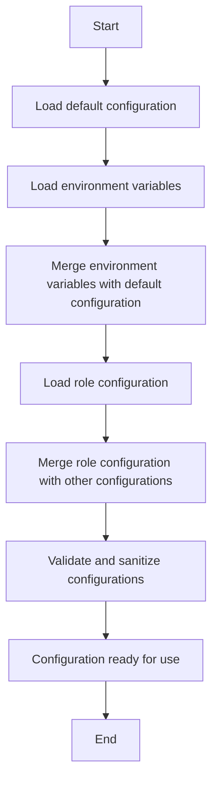

<details>
<summary>Relevant source files</summary>

The following files were used as context for generating this wiki page:

- [.env.example](https://github.com/aanickode/access-control-service/blob/main/.env.example)
- [config/roles.json](https://github.com/aanickode/access-control-service/blob/main/config/roles.json)
- [src/config/index.js](https://github.com/aanickode/access-control-service/blob/main/src/config/index.js)
- [src/utils/logger.js](https://github.com/aanickode/access-control-service/blob/main/src/utils/logger.js)
- [src/utils/env.js](https://github.com/aanickode/access-control-service/blob/main/src/utils/env.js)
</details>

# Configuration and Environment Variables

## Introduction

The Access Control Service project relies on various configuration settings and environment variables to control its behavior, security, and integration with external services. This wiki page provides an overview of the configuration system, explains the different types of configurations, and documents the available environment variables and their purposes.

The configuration system is designed to load settings from multiple sources, with environment variables taking precedence over default values. This allows for flexible deployment scenarios and easy overriding of default configurations based on the environment (e.g., development, staging, production).

Sources: [src/config/index.js](https://github.com/aanickode/access-control-service/blob/main/src/config/index.js), [src/utils/env.js](https://github.com/aanickode/access-control-service/blob/main/src/utils/env.js)

## Configuration Sources

The project loads configurations from the following sources:

### 1. Default Configuration

The default configuration values are defined within the `src/config/index.js` file. These values serve as a fallback when no other configuration source is provided.

Source: [src/config/index.js](https://github.com/aanickode/access-control-service/blob/main/src/config/index.js)

### 2. Environment Variables

Environment variables take precedence over the default configuration values. The project uses the `dotenv` library to load environment variables from a `.env` file located in the project root directory.

The `.env.example` file provides a template for the required environment variables, along with descriptions and default values.

Source: [.env.example](https://github.com/aanickode/access-control-service/blob/main/.env.example)

### 3. Role Configuration

The project includes a `roles.json` file in the `config` directory, which defines the roles and their associated permissions. This configuration is loaded and used by the access control system.

Source: [config/roles.json](https://github.com/aanickode/access-control-service/blob/main/config/roles.json)

## Configuration Loading Process

The configuration loading process follows these steps:



1. The default configuration values are loaded from `src/config/index.js`.
2. Environment variables are loaded from the `.env` file using the `dotenv` library.
3. Environment variables are merged with the default configuration, overriding any conflicting values.
4. The role configuration is loaded from the `config/roles.json` file.
5. The role configuration is merged with the existing configuration.
6. The final configuration is validated and sanitized to ensure consistency and security.
7. The configuration is ready to be used throughout the application.

Sources: [src/config/index.js](https://github.com/aanickode/access-control-service/blob/main/src/config/index.js), [src/utils/env.js](https://github.com/aanickode/access-control-service/blob/main/src/utils/env.js)

## Environment Variables

The following table lists the available environment variables and their descriptions:

| Environment Variable | Type | Description | Default Value |
| -------------------- | ---- | ----------- | ------------- |
| `NODE_ENV` | string | The environment mode (e.g., `development`, `production`) | `development` |
| `PORT` | number | The port on which the server should listen | `3000` |
| `LOG_LEVEL` | string | The logging level (`error`, `warn`, `info`, `http`, `verbose`, `debug`, `silly`) | `info` |
| `JWT_SECRET` | string | The secret key used for signing JSON Web Tokens | `changeme` |
| `JWT_EXPIRY` | string | The expiration time for JSON Web Tokens (e.g., `1d`, `2h`, `30m`) | `1d` |
| `MONGODB_URI` | string | The MongoDB connection URI | `mongodb://localhost:27017/access-control` |

Sources: [.env.example](https://github.com/aanickode/access-control-service/blob/main/.env.example), [src/config/index.js](https://github.com/aanickode/access-control-service/blob/main/src/config/index.js)

## Role Configuration

The `roles.json` file defines the roles and their associated permissions within the access control system. The file structure is as follows:

```json
{
  "roles": [
    {
      "name": "admin",
      "permissions": [
        "read:users",
        "write:users",
        "delete:users",
        "read:roles",
        "write:roles",
        "delete:roles"
      ]
    },
    {
      "name": "user",
      "permissions": [
        "read:users"
      ]
    }
  ]
}
```

- The `roles` array contains objects representing each role.
- Each role object has a `name` property and a `permissions` array.
- The `permissions` array lists the permissions granted to the role, following the format `<action>:<resource>`.

This configuration is loaded and used by the access control system to manage user permissions and authorize requests based on the assigned roles.

Source: [config/roles.json](https://github.com/aanickode/access-control-service/blob/main/config/roles.json)

## Logging Configuration

The project uses the `winston` logging library for logging purposes. The logging level is controlled by the `LOG_LEVEL` environment variable, which can be set to one of the following values: `error`, `warn`, `info`, `http`, `verbose`, `debug`, or `silly`.

The logging configuration is defined in the `src/utils/logger.js` file, where the logger instance is created and configured based on the `LOG_LEVEL` value.

```javascript
const logger = winston.createLogger({
  level: env.LOG_LEVEL,
  format: winston.format.json(),
  transports: [
    new winston.transports.Console({
      format: winston.format.combine(
        winston.format.colorize(),
        winston.format.simple()
      )
    })
  ]
});
```

This configuration sets up a console transport for logging, with colorized and simple formatting. The logging level is set based on the `LOG_LEVEL` environment variable, which is loaded from the `.env` file using the `env` utility module.

Sources: [src/utils/logger.js](https://github.com/aanickode/access-control-service/blob/main/src/utils/logger.js), [src/utils/env.js](https://github.com/aanickode/access-control-service/blob/main/src/utils/env.js)

## Configuration Management Best Practices

To ensure secure and reliable configuration management, the following best practices are recommended:

- Use environment variables for sensitive or environment-specific configurations (e.g., database credentials, API keys, secret keys).
- Store environment variables securely (e.g., using a secrets management service or encrypted files) and never commit them to version control.
- Validate and sanitize configuration values to prevent security vulnerabilities and ensure consistency.
- Implement a configuration hierarchy, allowing environment-specific configurations to override default values.
- Use configuration files for non-sensitive, environment-agnostic settings (e.g., feature flags, role definitions).
- Regularly review and update configurations to align with security best practices and project requirements.
- Maintain clear documentation and version control for configuration files and their changes.

By following these best practices, you can ensure secure, maintainable, and scalable configuration management for your project.

Sources: [src/config/index.js](https://github.com/aanickode/access-control-service/blob/main/src/config/index.js), [src/utils/env.js](https://github.com/aanickode/access-control-service/blob/main/src/utils/env.js), [.env.example](https://github.com/aanickode/access-control-service/blob/main/.env.example)