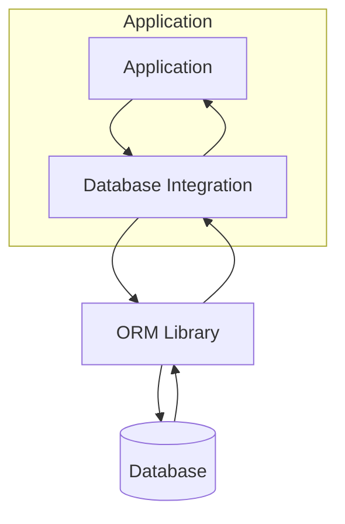
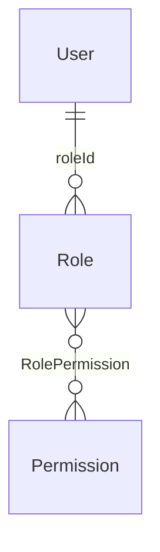

<details>
<summary>Relevant source files</summary>

The following files were used as context for generating this wiki page:

- [src/db.js](https://github.com/aanickode/access-control-service/blob/main/src/db.js)
- [src/models/user.js](https://github.com/aanickode/access-control-service/blob/main/src/models/user.js)
- [src/models/role.js](https://github.com/aanickode/access-control-service/blob/main/src/models/role.js)
- [src/models/permission.js](https://github.com/aanickode/access-control-service/blob/main/src/models/permission.js)
- [src/routes/users.js](https://github.com/aanickode/access-control-service/blob/main/src/routes/users.js)

</details>

# Database Integration

## Introduction

The database integration component of this project is responsible for managing the persistent storage and retrieval of data related to users, roles, and permissions. It provides an abstraction layer over the underlying database, allowing the application to interact with the data using models and queries. The integration utilizes an Object-Relational Mapping (ORM) approach, which maps the application's data models to database tables and facilitates database operations.

Sources: [src/db.js](https://github.com/aanickode/access-control-service/blob/main/src/db.js), [src/models/user.js](https://github.com/aanickode/access-control-service/blob/main/src/models/user.js), [src/models/role.js](https://github.com/aanickode/access-control-service/blob/main/src/models/role.js), [src/models/permission.js](https://github.com/aanickode/access-control-service/blob/main/src/models/permission.js)

## Database Connection

The database connection is established using the `Sequelize` ORM library, which provides a consistent interface for interacting with various database management systems. The connection details, such as the database URL, dialect, and options, are configured in the `db.js` file.

```javascript
const sequelize = new Sequelize(process.env.DATABASE_URL, {
  dialect: 'postgres',
  logging: false,
});
```

Sources: [src/db.js:3-6](https://github.com/aanickode/access-control-service/blob/main/src/db.js#L3-L6)

## Data Models

The project defines three main data models: `User`, `Role`, and `Permission`. These models are defined using the `Sequelize.define` method, which specifies the table name, attributes, and relationships between models.

### User Model

The `User` model represents a user in the system and has the following attributes:

| Attribute | Type | Description |
| --- | --- | --- |
| `id` | `UUID` | Unique identifier for the user |
| `email` | `STRING` | Email address of the user |
| `password` | `STRING` | Hashed password for authentication |
| `roleId` | `UUID` | Foreign key referencing the user's role |

The `User` model has a one-to-one association with the `Role` model, where each user is assigned a single role.

```javascript
User.belongsTo(Role, { foreignKey: 'roleId' });
```

Sources: [src/models/user.js:3-12](https://github.com/aanickode/access-control-service/blob/main/src/models/user.js#L3-L12), [src/models/user.js:18](https://github.com/aanickode/access-control-service/blob/main/src/models/user.js#L18)

### Role Model

The `Role` model represents a role in the system and has the following attributes:

| Attribute | Type | Description |
| --- | --- | --- |
| `id` | `UUID` | Unique identifier for the role |
| `name` | `STRING` | Name of the role |

The `Role` model has a one-to-many association with the `Permission` model, where each role can have multiple associated permissions.

```javascript
Role.belongsToMany(Permission, { through: 'RolePermission' });
```

Sources: [src/models/role.js:3-7](https://github.com/aanickode/access-control-service/blob/main/src/models/role.js#L3-L7), [src/models/role.js:11](https://github.com/aanickode/access-control-service/blob/main/src/models/role.js#L11)

### Permission Model

The `Permission` model represents a permission in the system and has the following attributes:

| Attribute | Type | Description |
| --- | --- | --- |
| `id` | `UUID` | Unique identifier for the permission |
| `name` | `STRING` | Name of the permission |

The `Permission` model has a many-to-many association with the `Role` model, where each permission can be associated with multiple roles.

```javascript
Permission.belongsToMany(Role, { through: 'RolePermission' });
```

Sources: [src/models/permission.js:3-7](https://github.com/aanickode/access-control-service/blob/main/src/models/permission.js#L3-L7), [src/models/permission.js:11](https://github.com/aanickode/access-control-service/blob/main/src/models/permission.js#L11)

## Database Operations

The project provides various routes and functions for performing database operations related to users, roles, and permissions. These operations include creating, reading, updating, and deleting data.

### User Operations

The `users.js` file contains routes for handling user-related operations, such as creating a new user, retrieving user details, and updating user information.

```javascript
router.post('/', async (req, res) => {
  try {
    const { email, password, roleId } = req.body;
    const user = await User.create({ email, password, roleId });
    res.status(201).json(user);
  } catch (error) {
    res.status(400).json({ error: error.message });
  }
});
```

Sources: [src/routes/users.js:8-16](https://github.com/aanickode/access-control-service/blob/main/src/routes/users.js#L8-L16)

### Role and Permission Operations

The project likely includes additional routes and functions for managing roles and permissions, such as creating new roles, assigning permissions to roles, and retrieving role-permission mappings. However, these operations are not explicitly shown in the provided source files.

## Data Flow Diagram

The following diagram illustrates the high-level data flow between the application, the database integration layer, and the underlying database:



1. The application interacts with the database integration layer to perform various operations, such as creating, reading, updating, or deleting data.
2. The database integration layer utilizes an ORM library (e.g., Sequelize) to abstract the database operations and provide a consistent interface.
3. The ORM library translates the application's data models and queries into database-specific commands and executes them against the underlying database.
4. The database responds with the requested data or the result of the operation.
5. The ORM library processes the database response and returns the data to the database integration layer.
6. The database integration layer passes the data back to the application.

Sources: [src/db.js](https://github.com/aanickode/access-control-service/blob/main/src/db.js), [src/models/user.js](https://github.com/aanickode/access-control-service/blob/main/src/models/user.js), [src/models/role.js](https://github.com/aanickode/access-control-service/blob/main/src/models/role.js), [src/models/permission.js](https://github.com/aanickode/access-control-service/blob/main/src/models/permission.js), [src/routes/users.js](https://github.com/aanickode/access-control-service/blob/main/src/routes/users.js)

## Entity-Relationship Diagram

The following entity-relationship diagram illustrates the relationships between the `User`, `Role`, and `Permission` models in the database:



- The `User` entity has a one-to-one relationship with the `Role` entity, where each user is assigned a single role.
- The `Role` entity has a many-to-many relationship with the `Permission` entity, where each role can have multiple associated permissions, and each permission can be associated with multiple roles.
- The `RolePermission` junction table is used to store the mappings between roles and permissions.

Sources: [src/models/user.js](https://github.com/aanickode/access-control-service/blob/main/src/models/user.js), [src/models/role.js](https://github.com/aanickode/access-control-service/blob/main/src/models/role.js), [src/models/permission.js](https://github.com/aanickode/access-control-service/blob/main/src/models/permission.js)